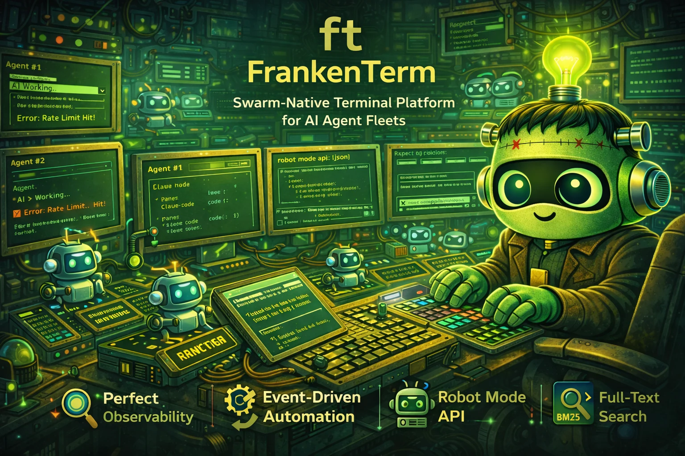

# ft — FrankenTerm

<div align="center">
  
</div>

<!-- ft-jjvxg + ft-xl2kc: Reality-check live demos.
       - assets/demo.gif (tour) — CLI surface tour, synthetic. Render
         with `vhs scripts/demo.tape`. Authored under ft-jjvxg.
       - assets/demo-full.gif (swarm) — 5-min real-swarm scenario.
         Render with `vhs scripts/demo-full.tape` AFTER staging the
         10-pane NTM swarm per ft-xl2kc.1's runbook so the recording
         captures real rate limits, real workflow auto-handling, real
         search recoveries, and real mission orchestration.
     Re-record both per major release per the release-checklist entry. -->
<div align="center">
  
  <br>
  <em>30-second tour of the <code>ft</code> CLI surface
  (<a href="scripts/demo.tape">scripts/demo.tape</a>).</em>
</div>

<div align="center">
  
  <br>
  <em>5-minute swarm scenario — 10 live agents, real detections, no mocks
  (<a href="scripts/demo-full.tape">scripts/demo-full.tape</a>).</em>
</div>

<div align="center">

[](./LICENSE)
[](https://www.rust-lang.org/)
[-purple.svg)](#engineering-discipline)
[](#engineering-discipline)
[](#workspace-structure)
[](#testing)

</div>

### What's here

| If you're... | Start with |
|---|---|
| Trying it out | [10-Minute Tour](#10-minute-tour) → [Commands](#commands) → [Robot Mode](#robot-mode-json-api) |
| Building a meta-agent | [Robot Mode](#robot-mode-json-api) → [Sample Mission/Tx Contracts](#deep-dive-sample-mission-and-tx-contracts) → [Operating Envelope](#operating-envelope) |
| Operating at scale | [Capacity Planning](#deep-dive-capacity-planning) → [Operator Playbook](#operator-playbook-excerpts) → [Troubleshooting](#troubleshooting) |
| Understanding how it works | [Architecture](#architecture) → [System Components](#system-components-and-responsibilities) → [Deep Dives](#deep-dive-the-watcher-capture-loop) |
| Auditing the claims | [Trust & Attestation](#trust--attestation) → [Threat Model](#deep-dive-threat-model) → [Formal Methods](#deep-dive-formal-methods-in-this-repo) |
| Reading the algorithms | [Algorithm & Data Structure Catalog](#algorithm--data-structure-catalog) → [Pattern Engine](#deep-dive-pattern-engine-architecture) → [Cx Cancellation Model](#deep-dive-the-cx-cancellation-model) |

**A swarm-native terminal platform that observes, controls, and audits fleets of 200+ concurrent AI coding agents.** <!--count:workspace_members-->77<!--/count--> workspace crates, <!--count:core_subcrates-->19<!--/count--> sub-crates carved out of the core, <!--count:core_top_level_modules-->509<!--/count--> core-library modules, <!--count:core_loc-->1012656<!--/count-->+ lines of Rust, <!--count:test_count-->55330<!--/count-->+ test annotations across <!--count:core_rust_test_files-->952<!--/count--> integration test files.

_Counts are auto-stamped by `scripts/stamp-readme-counts.sh` and drift fast. See [Maintainers: how counts stay honest](#maintainers-how-counts-stay-honest) at the bottom for the exact recipe; everything cited above is whatever the live `find`/`awk` returns at HEAD._

<div align="center">
<h3>Quick Install</h3>

```bash
cargo install --git https://github.com/Dicklesworthstone/frankenterm.git --bin ft frankenterm
```

`ft --version` works immediately after install. `ft doctor` / `ft doctor --json` run immediately. Pane/session operations that talk to the live mux require WezTerm CLI in `PATH` and a reachable mux/GUI for `wezterm cli list`.

</div>

---

## TL;DR

**The Problem.** Running large AI coding swarms across ad-hoc terminal panes is chaos. When you're driving 50–200 Claude Code / Codex / Gemini agents at once, a single undetected rate limit wastes hours of compute. A stuck agent silently burns tokens. An auth failure goes unnoticed for thirty minutes. You have no search across agent output, no audit trail, no way for one AI to safely control another, and no way to know whether your swarm is operating inside or outside its safe envelope.

**The Solution.** `ft` is a **full terminal platform for agent swarms** with deep observability, deterministic eventing, policy-gated automation, machine-native control surfaces (Robot Mode + MCP), and a fail-closed operating-envelope contract. It captures every byte of terminal output across every pane, detects state transitions via multi-pattern matching plus Bayesian change-point detection, triggers transactional workflows in response, and exposes all of it through a JSON API built for AI-to-AI orchestration. The closest analogy is Kubernetes for terminal-based AI agents: observe, detect, react, audit, and refuse to drive the swarm outside its proven safe envelope.

**Runtime model.** Fully `Cx`-aware, structured, cancel-correct async on **asupersync**. Direct `tokio` usage is **banned at the dependency level** via `cargo-deny` and at the type level via the `RuntimeProof` sealed trait. The `runtime_async` module is the canonical asupersync wrapper that every first-party crate imports. The dual-runtime era is over.

If you'd rather see commands than prose, jump straight to the [10-Minute Tour](#10-minute-tour) below.

---

## 10-Minute Tour

A guided walkthrough from "I cloned this" to "I have an AI driving an AI." Each step builds on the previous one.

### 1 · Install + verify (1 minute)

```bash
cargo install --git https://github.com/Dicklesworthstone/frankenterm.git --bin ft frankenterm

ft --version       # smoke test — should print version + git commit
ft doctor          # environment check — exits non-zero on missing prerequisites
```

`ft` talks to a live mux through the WezTerm interop boundary, so `wezterm` must be in `PATH`. `ft doctor` will tell you if it isn't. If you need from-source builds or optional features (`mcp`, `web`, `distributed`, `semantic-search`, `ftui`), see [Installation](#installation) below.

### 2 · See the fleet (1 minute, no daemon yet)

`ft robot state` gives an AI-readable snapshot of every pane the mux can see, *without* starting a long-running daemon. This is the call a meta-agent makes when it wants a one-shot view. The full `RobotResponse` envelope wraps every response with `ok`, `data`, `elapsed_ms`, `version`, `now`, and `schema_version` (the MCP transport adds `mcp_version` on top of that); `data` for the `state` endpoint is a bare array of pane records (truncated below for clarity):

```bash
$ ft robot state
{
  "ok": true,
  "data": [
    {"pane_id": 0, "title": "claude-code", "domain": "local", "cwd": "/project"},
    {"pane_id": 1, "title": "codex",       "domain": "local", "cwd": "/project"},
    {"pane_id": 2, "title": "build",       "domain": "local", "cwd": "/project"}
  ],
  "elapsed_ms": 4,
  "version": "0.2.0",
  "now": 1747371642000,
  "schema_version": 1
}
```

For AI-to-AI use, add `--format toon` to swap the JSON encoder for the lower-token [TOON](#deep-dive-toon-encoding) serialization. Exact byte savings depend on payload shape; the CLI prints JSON-vs-TOON byte counts to stderr if you pass `--stats`.

### 3 · Start observing (2 minutes)

Now start the watcher so capture, pattern detection, and workflow execution kick in. Run it in the foreground for the tour:

```bash
ft watch --foreground
# (leave this running; new terminal for the next steps)
```

In a second shell, peek at what the watcher is seeing. `ft robot events` returns an `EventsData` envelope that wraps the event list with filter + count metadata:

```bash
$ ft status                                     # human-readable fleet overview
$ ft robot events --limit 5                     # recent pattern-triggered detections
{
  "ok": true,
  "data": {
    "events": [
      {
        "id": 1247,
        "pane_id": 1,
        "rule_id": "codex.usage.reached",
        "pack_id": "builtin:core",
        "event_type": "detection",
        "severity": "warn",
        "confidence": 0.95,
        "captured_at": 1747371642000
      }
    ],
    "total_count": 1,
    "limit": 5,
    "unhandled_only": false
  },
  "elapsed_ms": 3,
  "version": "0.2.0",
  "now": 1747371643000,
  "schema_version": 1
}
```

The watcher's pattern engine has already noticed pane 1 hit a rate limit; the event is queued for any registered workflow handler to react.

### 4 · React safely (2 minutes — send + wait-for + policy gate)

Send a `/compact` to the stuck codex pane, but block until the recovery confirms. The response `data` is a `SendData` with an `injection` blob (the wire-level bytes-sent record, an unstructured `serde_json::Value`) and a `wait_for` field carrying `WaitForData { pane_id, pattern, matched, elapsed_ms, polls, is_regex }`:

```bash
$ ft robot send 1 "/compact" --wait-for "compaction complete" --timeout-secs 30
{
  "ok": true,
  "data": {
    "pane_id": 1,
    "injection": { /* wire-level injection record */ },
    "wait_for": {
      "pane_id": 1,
      "pattern": "compaction complete",
      "matched": true,
      "elapsed_ms": 4823,
      "polls": 96,
      "is_regex": false
    }
  },
  "elapsed_ms": 4829,
  "version": "0.2.0",
  "now": 1747371646829,
  "schema_version": 1
}
```

Notice three things: (1) **`ft robot send` is policy-gated** — if you try to send something that violates a policy rule, you get a structured `RequireApproval` envelope with an 8-char approval code, not a silent error. (2) **`--wait-for` is condition-based**, not `sleep`-based — it polls until the pattern shows up or the timeout fires. (3) The response is **structured JSON** the calling agent can route on.

When `ok=false`, the error fields live at the top level of the envelope (not nested under `error`):

```json
{
  "ok": false,
  "error": "Action requires approval",
  "error_code": "robot.require_approval",
  "hint": "Run: ft approve AB12CD34",
  "elapsed_ms": 1,
  "version": "0.2.0",
  "now": 1747371646830,
  "schema_version": 1
}
```

### 5 · Search the past (1 minute)

Every byte of pane output the watcher captured is FTS5-indexed. `ft robot search` returns a `SearchData` wrapping the result list:

```bash
$ ft robot search "error: compilation failed" --limit 3
{
  "ok": true,
  "data": {
    "query": "error: compilation failed",
    "results": [
      {
        "segment_id": 41827,
        "pane_id": 1,
        "seq": 5821,
        "captured_at": 1747370104000,
        "score": 1.2845,
        "snippet": "  --> services/billing/pricing.rs:142:12\n  error: compilation failed: type mismatch"
      }
    ],
    "total_hits": 1,
    "limit": 3,
    "mode": "lexical"
  },
  "elapsed_ms": 7,
  "version": "0.2.0",
  "now": 1747371700000,
  "schema_version": 1
}
```

Add `--mode hybrid` for semantic-ranked results (requires `--features semantic-search` build); hits then carry `semantic_score` and `fusion_rank` fields alongside `score`.

### 6 · Orchestrate transactionally (2 minutes — mission + tx)

For multi-pane operations that need rollback semantics, use the Tx engine:

```bash
$ ft tx plan --contract-file deploy-staging.json     # validate the contract
$ ft tx run                                          # prepare + commit, with auto-compensation on failure
$ ft tx show --include-contract                      # full receipt with per-step audit
```

For a free-text operator goal that respects the safety envelope:

```bash
$ ft mission objective-plan --objective "spawn 5 codex panes for the pricing refactor"
```

This invokes the capacity-aware objective planner, which asks the operating envelope whether 5 new panes are safe given current RCH pressure, fleet memory, etc. — and returns a plan only if it fits. See [Sample Mission and Tx Contracts](#deep-dive-sample-mission-and-tx-contracts) for the JSON shapes.

### 7 · Verify the release attestation (1 minute)

Every load-bearing claim links to a signed artifact slot. The CLI re-hashes every artifact from disk, recomputes the canonical signing payload, checks the recorded `.sigstore` file hash + size, and verifies the Sigstore signature. Exits 0 on full pass, non-zero on any failure.

```bash
ft attestation verify docs/attestations/0.2.0.json          # human-readable verdict
ft attestation verify docs/attestations/0.2.0.json --json   # machine-readable verdict
ft attestation show docs/attestations/0.2.0.json            # pretty-print without re-verifying
```

`ft attestation` is a thin Rust wrapper over `scripts/attestation-verify.sh`; third parties without the `ft` binary can run the script directly.

### Where to go next

- **[Robot Mode (JSON API)](#robot-mode-json-api)** — the full call contract AI agents use to drive other AI agents
- **[Operating Envelope](#operating-envelope)** — the fail-closed safety surface that gates new pane admission
- **[Commands](#commands)** — every `ft` subcommand with examples
- **[Configuration](#configuration)** — `ft.toml` reference for tuning poll intervals, retention, redaction tiers
- **[Operator Playbook](#operator-playbook-excerpts)** — what to do when things break

Read/query interfaces (`ft get-text`, `ft search`, `ft robot get-text`, `ft robot search`, and MCP `wa.get_text` / `wa.search`) are policy-evaluated and redact secret material in returned text/snippets — you won't accidentally leak a JWT into a notification or an event payload.

---

## Why use ft?

Now that you've seen it run, here's the full capability surface:

| Capability | What it does |
|---|---|
| **Full Observability** | Captures terminal output across panes with low-latency delta extraction; sub-50 ms lag is the benchmark-lane target ([attestation](#trust--attestation))[^ft-attest-perf-headline][^ft-attest-lindley] |
| **Multi-Agent Detection** | Aho-Corasick multi-pattern engine + Bloom prefilter + BOCPD change-point detection. Native rule packs for Codex, Claude Code, and Gemini |
| **Event-Driven Automation** | Workflows trigger on detected patterns with per-workflow trigger-policy allowlists (ft-j0ufc), never on `sleep` loops |
| **Robot Mode API** | JSON / TOON envelopes optimized for AI-to-AI control[^ft-attest-robot-contracts] |
| **Lexical + Hybrid Search** | FTS5 + Tantivy + optional ML embeddings via FrankenSearch; lexical, semantic, and hybrid modes across captured output |
| **Operating Envelope Contract** | `ft.operating_envelope.v1` planner module decides whether new pane work is admitted based on system pressure; fails closed when telemetry is missing |
| **Policy Engine** | 14-subsystem policy framework with per-subsystem health verdicts, capability gates, rate limiting, audit trails, and approval tokens |
| **Transactional Mission Orchestration** | Prepare/commit/compensate lifecycle, idempotency ledger, deterministic replay, kill switches, capacity-aware objective planner |
| **Tiered Scrollback** | Three-tier memory management (hot/warm/cold) with worst-of fleet memory controller for 200+ pane fleets[^ft-attest-perf-headline] |
| **Incident Bundles** | Crash and swarm-incident bundles wire to live collectors (process tree, GPU state, mux state, render state, beads coordination snapshot) |
| **Replay & Forensics** | Capture, replay, and diff decision graphs for post-incident analysis and regression testing |
| **Distributed Mode** | Optional agent-to-aggregator streaming with per-agent dedup, versioned wire protocol, and stale-session pruning[^ft-attest-distributed-threat] |
| **Reality-check + Attestation** | Every headline claim links to a signed artifact slot in `docs/attestations/manifest.json`. Verify offline with `ft attestation verify` |

[^ft-attest-perf-headline]: Verified via the populated [`perf/headline-claims`](docs/perf/headline-claims.json) attestation slot in [`docs/attestations/manifest.json`](docs/attestations/manifest.json); this covers benchmark-lane capture latency, Bloom prefilter speedup, and pane/memory capacity rows. Target-class caveats remain governed by their linked artifacts and the fail-closed [`swarm-capacity-envelope`](docs/attestations/perf/swarm-capacity-envelope.json) adjunct.
[^ft-attest-lindley]: Verified via the populated [`perf/lindley-bounds`](docs/attestations/perf/lindley-bounds.json) attestation slot for the capture-path Lindley / min-plus latency model.
[^ft-attest-robot-contracts]: Verified via the populated [`proofs/robot-contracts`](crates/frankenterm-core/tests/golden_robot_envelope/control_plane_golden_matrix.json) attestation slot for JSON/TOON control-plane envelope contracts.
[^ft-attest-distributed-threat]: Verified via the populated [`security/distributed-threat-model`](docs/security/distributed-threat-model.md) attestation slot for distributed wire-protocol safety review and diff-fuzz coverage.

### What "swarm-native" actually means

The phrase has a concrete meaning here:

1. **The minimum-useful-unit is the fleet, not the pane.** Every primary subsystem (storage, search, policy, workflows, mission, tx, distributed) assumes there are dozens to hundreds of panes and was engineered for that scale from the start, rather than retrofitted from a single-pane assumption.
2. **Fleet pressure is a first-class signal.** The operating envelope, fleet memory controller, and backpressure tiers compose pressure across the entire fleet, not per-pane in isolation. A single hot pane can throttle the rest of the fleet's poll cadence; a healthy fleet runs at full speed.
3. **One AI can drive another safely.** Robot Mode, MCP, and the policy gate exist specifically so AI agents can control other AI agents without writing brittle text-parsing glue. The JSON envelopes are the contract.
4. **Coordination primitives are built in.** Beads issue tracking, Agent Mail file reservations, work claim queues (`ft robot work`), and tx idempotency ledgers exist because swarm work needs coordination, not just observation.
5. **Failure isolation is per-pane, but recovery is per-fleet.** A stuck pane doesn't take down the watcher. An auth failure on one agent doesn't pause the other 49. But the fleet memory controller throttles uniformly when pressure is real.

### Who is this for?

- **Anyone running 2+ AI coding agents in parallel** and tired of writing bash glue to coordinate them
- **Anyone building meta-agents** (one AI driving N specialized AIs) who needs a structured control plane
- **Operators of large swarms (50–200+ panes)** who need fleet-wide observability, memory bounds, and capacity admission
- **Anyone who has to audit what an AI did** in a terminal session after the fact
- **Anyone who has lost work to a rate limit they didn't notice for 30 minutes**
- **Anyone who wants their multi-agent infrastructure to fail closed rather than silently degrade**

---

## Supported Surface Matrix

Honest status of every shipped surface, without migration-era hand-waving.

| Surface | Status | Notes |
|---|---|---|
| Watch / status / triage / doctor / reproduce | **Supported** | Native operator surfaces; `ft doctor`, `ft status --health`, and `ft triage` are the first-run and incident entrypoints |
| Search / events / audit / workflows / mission / tx | **Supported** | Backed by local storage, policy, and workflow subsystems |
| Robot mode | **Supported** | All core families: `state`, `get-text`, `send`, `wait-for`, `search`, `events`, `rules`, `workflows`, `agents`, `accounts`, `reservations`, `mission`, `tx`, `health`, `approvals`, `checkpoint`, `context`, `work`, `fleet`, `profile`. NTM-gap fallback retired |
| Operating envelope | **Supported** | `ft.operating_envelope.v1` planner contract + golden fixtures; fails closed on missing or critical-pressure telemetry |
| Mission objective planner | **Supported** | Capacity-aware planner for safe swarm orchestration (ft-auy2g) |
| Incident bundles | **Supported** | Wired to live collectors; publish-side snapshot path; beads coordination snapshot included |
| Session persistence | **Supported with backend prerequisite** | Snapshots, session inspection, and `ft session doctor` are cross-platform; live restore (`ft restart`, `ft snapshot restore`) is currently Unix-only |
| Reality-check + attestation | **Supported** | `ft attestation verify` / `show` ship as a thin Rust wrapper over `scripts/attestation-verify.sh`. Signed bundles live in `docs/attestations/` |
| Web API / SSE | **Supported behind `--features web`** | `/health`, `/panes`, `/events`, `/search`, `/stream/events`, `/stream/deltas` |
| Distributed mode | **Supported behind `--features distributed`** | Remote panes persist into the same DB and surface through status/search/state; live `get-text` for distributed panes is intentionally unavailable |
| MCP server | **Supported behind `--features mcp`** | stdio + tool surface mirroring Robot Mode |
| Semantic search | **Supported behind `--features semantic-search`** | fastembed-backed embeddings + FrankenSearch hybrid mode |
| Browser auth tooling | **Feature-gated** | `ft auth` is real, but only in builds that include the browser feature and a usable browser stack |
| GUI (FrankenTerm.app) | **Supported on macOS** | Native macOS bundle; live render-state plumbing, BSU/ESU sync-output, classified drag handlers, command-palette domain labels |

---

## Design Philosophy

### 1. Passive-First Architecture

The observation loop (discovery, capture, pattern detection) has **no side effects**. It only reads and stores. The action loop (sending input, running workflows, mission/tx execution) is strictly separated with explicit policy gates. In practice, `ft watch` can never accidentally send input or modify agent state; it is a pure observer.

### 2. Event-Driven, Not Time-Based

No `sleep(5)` loops hoping the agent is ready. Every wait is condition-based: wait for a pattern match, wait for pane idle, wait for an external signal. Deterministic, not probabilistic. `ft robot wait-for` blocks until a specific pattern appears in pane output, not until a timer expires.

### 3. Delta Extraction Over Full Capture

Instead of repeatedly capturing entire scrollback buffers, `ft` uses 4 KB overlap matching to extract only new content. This produces efficient storage, minimal latency, and explicit gap markers for discontinuities. When the overlap match fails (terminal reset, scrollback clear), the gap is recorded as an explicit event rather than silently dropped.

### 4. Single-Writer Integrity

A filesystem lock (via `fs2`) ensures only one watcher can write to the database. No corruption from concurrent mutations. Graceful fallback for read-only introspection. The lock metadata records PID and start time for diagnostics.

### 5. Agent-First Interface

Robot Mode returns structured JSON with consistent schemas. Every response includes `ok`, `data`, `error`, `elapsed_ms`, and `version`. TOON (Token-Optimized Object Notation) is the lower-token machine format; payload shape controls savings, and the benchmark substrate lives at [`docs/perf-ledger/toon-encoding.md`](docs/perf-ledger/toon-encoding.md). The format is built for machines to parse, not humans to read.

### 6. Transactional Safety

Multi-pane operations use a prepare/commit/compensate lifecycle borrowed from distributed transaction protocols. If a commit step fails, compensation rolls back the committed steps. Kill switches and pause controls provide emergency intervention. Every transition emits an observability event with a reason code and decision path.

### 7. Defense in Depth for Memory

The fleet memory controller synthesizes pressure signals from three independent subsystems: pipeline backpressure (queue depths), system memory utilization, and per-pane memory budgets. These feed a unified 4-tier pressure model (Normal, Elevated, Critical, Emergency) with asymmetric hysteresis that escalates fast and de-escalates slow. During incidents, operators use the [resource-pressure cockpit contract](docs/resource-pressure-cockpit-contract.md) to separate `rust_heap`, `mmap_file_backed`, `sqlite_page_cache`, `graphics_media`, `scrollback_cache`, `child_processes`, and `unknown` resident memory before calling anything a leak.

### 8. Fail Closed on Missing Telemetry

The operating envelope, network-pressure selector, process-snapshot pipeline, and RCH critical-pressure gate **all refuse to advance when their measurement source is absent or unhealthy**. A swarm controller that doesn't know what state the system is in must not pretend to know. This is enforced at the call sites of every component that consumes pressure or health telemetry.

### 9. Layered via Extraction

Layering is enforced through sub-crate extraction, not just discipline. `frankenterm-core` has 19 sibling sub-crates carved out. Leaf type crates declare **zero first-party dependencies**; cluster sub-crates depend on `frankenterm-core` only; **there are zero core → sub-crate edges**. Cycles can't sneak in because the build refuses to compile them.

### 10. Reality-Check Discipline

Every headline claim links to a signed attestation slot. The quarterly `/reality-check-for-project` discipline produces a bridge plan, a substrate of proof slots, and a per-release bundle. The current round (ft-tf6g3, opened 2026-05-12) is closing the final-mile gaps: attestation graph completeness, renderer SLO suite, round-3 statistical elevations (Lindley, Fano, SPRT, conformal bands, Mazurkiewicz cancel-traces, TLA+ TX-killswitch, Stateright work-family atomicity). See [`docs/reality-check-bridge-plan.md`](docs/reality-check-bridge-plan.md).

---

## Glossary of Terms

Terminology used throughout this document and the codebase. Reading these once saves grepping later.

| Term | Meaning |
|---|---|
| **Mux** | The terminal multiplexer process. `ft` talks to the WezTerm/FrankenTerm mux. |
| **Domain** | A backend that hosts panes — `local`, `SSH:<host>`, `tmux:<socket>`, or a custom domain. Each pane has one. |
| **Window / Tab / Pane** | Mux topology unit, in increasing granularity. A window holds tabs; a tab holds panes. |
| **Session** | An `ft` concept: a coherent run of the watcher with persistent identity. Sessions outlive individual mux restarts. |
| **Snapshot** | A point-in-time capture of the mux topology + per-pane state, persisted to the DB. |
| **Checkpoint** | A persisted session-progress marker; checkpoints accumulate within a session. |
| **Backup** | A portable archive of the entire `ft` database, separate from snapshots. |
| **Capture** | The act of reading current scrollback from a pane and persisting any new bytes. |
| **Delta** | The new bytes a capture produced after the 4 KB overlap match. |
| **Gap** | Captured discontinuity (the previous tail didn't match anywhere in the new capture). Recorded as an event. |
| **Rule** | A pattern with stable ID, anchor strings, regex, severity, and agent type. |
| **Rule pack** | A versioned collection of rules; the default is `builtin:core`. |
| **Detection** | A rule firing on captured text; emitted as an event with the originating `pane_id` and `rule_id`. |
| **Event** | A typed message on the event bus — detections, gaps, lifecycle changes, system events. |
| **Workflow** | A registered handler that runs in response to detected events (or on demand). |
| **Mission** | A planned multi-pane operation with a contract, lifecycle state machine, and audit trail. |
| **Tx (transaction)** | The execution engine for missions; prepare → commit → compensate with idempotency receipts. |
| **Operating envelope** | The fail-closed admission contract that decides whether new pane/workflow work is safe right now. |
| **Profile** | A reusable pane specification (agent + cwd + env + session settings). |
| **Persona** | Behavioral defaults a profile inherits (skill mix, prompt preludes, tool palette). |
| **Fleet template** | A composition of profiles with counts and dependencies. |
| **Reservation** | An advisory lease on a pane (or file path) preventing concurrent edits. |
| **Approval token** | A one-shot, scope-pinned 8-char code that lets a specific action through the policy gate. |
| **Robot Mode** | The JSON / TOON API surface AI agents use to drive `ft`. |
| **TOON** | Token-Optimized Object Notation — a compact tree serialization for AI-to-AI envelopes. |
| **Cx** | asupersync's cancellation context; propagates cancel signals through structured concurrency. |
| **RuntimeProof** | A sealed trait that makes `tokio::*` types refuse to compile in bounded API surfaces. |
| **Aggregator** | In distributed mode, the host running `ft watch` with the listener; it receives streams from `ft distributed agent` peers. |
| **Cockpit** | The resource-pressure cockpit contract; classifies resident memory before any "leak" claim. |
| **Reality-check** | The quarterly discipline that produces a bridge plan + substrate + signed per-release attestation bundle. |
| **Bead** | A unit of tracked work in `beads_rust` (`br`); IDs prefix `ft-*` for this project. |
| **PDU** | Protocol Data Unit — the codec layer's wire message envelope between mux client and mux server. |

---

## Safety Guarantees

- **Observe vs act split**: `ft watch` is read-only; mutating actions must pass the Policy Engine.
- **No silent gaps**: capture gaps are recorded explicitly and surfaced in events/diagnostics.
- **Policy-gated sending**: `ft send` and workflows enforce prompt/alt-screen checks, rate limits, and approvals.
- **Policy-gated reads**: `get-text`/`search` surfaces enforce policy checks and return redacted text payloads.
- **Transactional operations**: `ft tx run` uses prepare/commit/compensate phases with idempotency guards and deterministic replay.
- **Approval tokens**: allow-once approval codes scoped to specific action + pane + fingerprint combinations.
- **Secret redaction**: captured output is redacted before being returned through any API surface, with configurable sensitivity tiers (T1/T2/T3) and retention policies. Token redactor coverage was expanded in 2026-05 to include JWT, GitLab, Twilio, SendGrid, and Datadog patterns.
- **Workflow trigger-policy allowlists** (ft-j0ufc): high-trust workflows declare allowlisted source panes to prevent low-trust panes from triggering them via output injection.
- **Public-field bypass class eliminated**: ~6 audit findings closed where `pub` struct fields let callers bypass clamping or validation. Constructors/builders now own the invariants for `ErasureShard`, `CircuitBreaker::Config`, `QuantileBudgetMs`, `ArrivalCurve`, `ServiceCurve`, `ApprovalScope`/`AuditContext`, `ScaleFactor`, and `AxisValue`.
- **Rubber-stamp `is_safe()` class eliminated**: ~17 audit findings closed where `is_safe()` returned `true` on cold start or before measurements were recorded. Every release-gate `is_safe` now requires evidence before reporting safe.
- **Release attestation bundles**: every reality-check claim is published through a content-addressed, Sigstore-signed JSON bundle in [`docs/attestations/`](docs/attestations/). Verify any release offline with `ft attestation verify docs/attestations/<version>.json`.

### Trust & Attestation

<!-- reality-check-drumbeat:auto -->
_Latest weekly reality-check drumbeat: [`docs/reports/reality-check-2026-05-02.md`](docs/reports/reality-check-2026-05-02.md) (2026-05-02). Round-2 epic (ft-tf6g3) opened 2026-05-12 — next drumbeat publishes when the next pass closes._
<!-- reality-check-drumbeat:auto:end -->

The canonical manifest is [`docs/attestations/manifest.json`](docs/attestations/manifest.json); each slot maps a claim category to its producing-bead artifact, and the per-release bundle signs those slot hashes.

The README claim-to-slot map is intentionally limited to populated manifest slots:

<!-- attestation-claim-map:start -->
| README claim | Manifest slot | Producing bead |
|---|---|---|
| Capture latency benchmark lane | [`perf/headline-claims`](docs/perf/headline-claims.json) | `ft-syqcz.3` |
| Capture-path Lindley / min-plus bound | [`perf/lindley-bounds`](docs/attestations/perf/lindley-bounds.json) | `ft-43x69` |
| Bloom prefilter search speedup | [`perf/headline-claims`](docs/perf/headline-claims.json) | `ft-syqcz.3` |
| 200-pane capacity and memory-budget benchmark lane | [`perf/headline-claims`](docs/perf/headline-claims.json) | `ft-syqcz.3` |
| Robot JSON/TOON envelope contract | [`proofs/robot-contracts`](crates/frankenterm-core/tests/golden_robot_envelope/control_plane_golden_matrix.json) | `ft-0elb9` |
| Redactor coverage matrix | [`security/redactor-coverage`](docs/security/redactor-coverage.json) | `ft-x0666.2` |
| Distributed wire-protocol safety | [`security/distributed-threat-model`](docs/security/distributed-threat-model.md) | `ft-x0666.3` |
| `runtime_async` Loom model | [`proofs/loom-runtime-async`](docs/attestations/proofs/loom-runtime-async.json) | `ft-e87u6.12` |
| `RuntimeProof` sealed-trait guard | [`proofs/runtime-proof-trait`](docs/attestations/proofs/runtime-proof-trait.json) | `ft-i2eni.1` |
| Transaction kill-switch proof | [`proofs/tx-killswitch`](docs/attestations/proofs/tx-killswitch.json) | `ft-tf6g3.12` |
<!-- attestation-claim-map:end -->

The operating-envelope contract (`ft.operating_envelope.v1`) and the renderer SLO suite are tracked under [ft-tf6g3](#engineering-discipline) for inclusion in a future bundle; they don't yet have populated manifest slots.

Verify a release attestation bundle in one command, offline, without trusting GitHub or any registry:

```bash
ft attestation verify docs/attestations/0.2.0.json
```

The CLI re-derives every artifact's SHA-256 from disk, recomputes the canonical signing payload, checks the recorded `.sigstore` file hash and size, and verifies the Sigstore signature. Exits 0 on full pass; non-zero on any failure. For machine-readable output:

```bash
ft attestation verify docs/attestations/0.2.0.json --json
ft attestation show docs/attestations/0.2.0.json
```

Use `--strict-required` on `verify` to fail when the bundle's `required_categories` list does not match the canonical manifest. Release CI runs the shell verifier with `--strict-deferred` so tagged releases cannot ship intentionally deferred slots.

The `ft attestation` family is a thin Rust wrapper over [`scripts/attestation-verify.sh`](scripts/attestation-verify.sh); third parties without an `ft` binary can run the script directly with the same arguments. For Sigstore signing identity, Fulcio/Rekor trust-root details, and manual `cosign verify-blob` commands, see [`docs/attestations/SIGNING.md`](docs/attestations/SIGNING.md). For the per-release closure procedure (when to run, how to file regressions on hash mismatch), see [`docs/release/attestation-checklist.md`](docs/release/attestation-checklist.md).

---

## How ft Compares

| Feature | ft | WezTerm | Zellij | Ghostty |
|---|---|---|---|---|
| Swarm-native orchestration | First-class (200+ panes) | External glue required | External glue required | External glue required |
| Event-driven automation | Built-in workflows + policy gate | Not native | Not native | Not native |
| Machine API for agents | Robot Mode + MCP + TOON | None | None | None |
| Operating-envelope safety | Native fail-closed contract | None | None | None |
| Cross-session state + recovery | Built-in snapshots + sessions | Partial / manual | Session-centric, not swarm-centric | Minimal |
| Agent-safe control plane | 14-subsystem policy diagnostics surface | Not native | Not native | Not native |
| Transactional multi-pane ops | Prepare/commit/compensate + idempotency ledger | None | None | None |
| Full-text search over output | FTS5 + Tantivy + hybrid modes | None | None | None |
| Memory management at scale | Three-tier scrollback + fleet controller | Single tier | Single tier | Single tier |
| Replay and forensics | Decision graph + diff + provenance | None | None | None |
| Reality-check attestation bundles | Sigstore-signed slot manifest | None | None | None |
| Incident bundles | Live collectors + publish-side snapshot | None | None | None |
| Async runtime guarantees | asupersync, `Cx`-first, cancel-correct, `tokio` banned | tokio (no `Cx` model) | smol (no `Cx` model) | none of these guarantees |
| Unsafe code | `#![forbid(unsafe_code)]` workspace-wide | unsafe present | unsafe present | unsafe present |

**When to use ft:**
- Running 2+ AI coding agents that need coordination
- Building automation that reacts to terminal output
- Debugging multi-agent workflows with full observability
- Operating large agent swarms (50–200+ panes) with memory and backpressure control
- Anywhere a swarm controller needs *attestable* safety bounds

**When ft might not be ideal:**
- Single-shell / single-agent usage where orchestration is unnecessary
- Environments that only need a lightweight interactive terminal and no swarm control plane
- Use cases that require a non-WezTerm mux backend (by design, `ft` is a wezterm-fork)

---

## Real-World Scenarios

These are the workloads `ft` was built for. Each scenario describes the operator pain *without* `ft`, then how the platform addresses it.

### Scenario 1 — Detect and recover from rate limits across a 50-pane swarm

**Without `ft`:** You're driving 50 Codex/Claude Code panes in parallel. One agent hits its usage limit and silently stops making progress. You don't notice for 30 minutes. The other 49 agents continue burning tokens until they hit *their* limits.

**With `ft`:** the native rule packs detect every form of "usage reached" / "rate limit" output across all three CLIs without operator config. The matched event includes the originating `pane_id` and the `rule_id`. Two approaches:

```bash
# A) Let the built-in workflow handle it (preferred)
ft watch --foreground --auto-handle    # registers handle_usage_limits, handle_compaction, …

# B) Poll the unhandled-events queue and react in shell
while sleep 5; do
  ft robot --format json events --unhandled --limit 50 | \
    jq -c '.data[]' | while read -r event; do
      pane=$(echo "$event" | jq -r .pane_id)
      rule=$(echo "$event" | jq -r .rule_id)
      case "$rule" in
        codex.usage.reached)        ft robot send "$pane" "/compact" ;;
        claude_code.usage.reached)  ft robot send "$pane" "/clear" ;;
        gemini.usage.reached)       ft robot send "$pane" "/reset" ;;
      esac
    done
done

# C) Block on a single pane until a specific rule fires (good for tight feedback loops)
ft robot wait-for 7 "codex.usage.reached" --timeout-secs 3600 && \
  ft robot send 7 "/compact"
```

`ft robot wait-for` takes a single `pane_id` and a substring (or regex with `--regex`). For fleet-wide reactions, poll `ft robot events --unhandled` or use `--auto-handle`.

### Scenario 2 — Coordinate a multi-pane mission with safe rollback

**Without `ft`:** You need to run a 5-step refactor across 4 panes (e.g., "pane 1 rewrites tests, panes 2–4 update implementations in parallel, then pane 1 verifies"). You wire this with bash, shell sleeps, and prayer. When step 3 fails halfway, you have no way to roll back the partial work.

**With `ft`:**
```bash
ft mission plan --mission-file refactor.json    # validate the contract
ft mission status                               # see the dispatch summary
ft tx run --contract-file refactor-tx.json      # prepare + commit deterministically
# if a step fails mid-commit, ft tx automatically runs compensation
ft tx show --include-contract                   # see the receipt + per-step audit
```

The tx engine uses prepare/commit/compensate phases with an idempotency ledger. A mid-flight crash can be safely resumed; a mid-flight failure runs compensation automatically.

### Scenario 3 — Reconstruct what an agent did six hours ago

**Without `ft`:** A coding agent did something destructive at 02:14 AM and you find out at 08:00. The terminal scrollback rolled. The pane process exited. You have no record.

**With `ft`:** every byte of pane output is delta-extracted and stored in SQLite with FTS5 indexing. The audit trail records every action that went through the Policy Engine, including denials, approvals, and rate-limited blocks.

```bash
# Search captured output for the timeframe (--since takes epoch ms)
SIX_HOURS_AGO_MS=$(( $(date +%s) * 1000 - 6 * 3600 * 1000 ))
ft search "the suspicious string" --pane 7 --since $SIX_HOURS_AGO_MS

# `ft history` accepts human-readable since strings
ft history --pane 7 --since "6 hours ago"
ft history --pane 7 --since "2026-05-16T02:00:00" --until "2026-05-16T03:00:00"

# Check the audit trail for actions ft itself took (--since takes epoch ms)
ft audit --pane 7 --since $SIX_HOURS_AGO_MS

# Pull a long tail of the pane's current buffer (audit history covers the rest)
ft robot get-text 7 --tail 5000
```

### Scenario 4 — Stand up a fresh swarm host with a known-safe envelope

**Without `ft`:** You provision a new VPS, install your CLI tools, kick off 100 agents, and the box OOMs at 87. You have no model of what "safe" capacity is for this hardware.

**With `ft`:** The operating-envelope planner reads RCH cluster pressure, network pressure, process snapshots, fleet memory tier, and SQLite write-queue depth. When the planner admits N panes, you know the platform has *agreed* that N is safe. If you ask for more than the envelope allows, the planner returns `envelope.shed` with `capacity.red` / `capacity.black` reason codes citing the responsible input.

```bash
ft mission objective-plan --objective "spawn 100 codex panes" --strictness strict
# returns a plan that's been validated against the envelope, OR
# a deny verdict naming the limiting input
```

### Scenario 5 — Drive one AI by another, safely

**Without `ft`:** You want Claude Code (the meta-agent) to control 10 specialist Codex panes. You build glue with `tmux send-keys`, regex parsing of scrollback, and brittle sleep loops. Three weeks later you have a 2000-line Python script with seven race conditions.

**With `ft`:** The meta-agent runs `ft robot --format toon state` for fleet snapshots, `ft robot wait-for` for condition-based blocking, `ft robot send` for input (with policy gates), and `ft robot search` for cross-pane retrieval. Every call returns a structured envelope. The meta-agent never sees raw scrollback unless it explicitly asks.

```bash
# Snapshot every pane the mux can see (use TOON to save tokens)
ft robot --format toon state

# Wait for a specific condition on a single pane
ft robot wait-for 7 "Press Enter to continue" --timeout-secs 600
ft robot send 7 ""    # respond

# Pull unhandled events across the fleet, react per rule_id
ft robot --format json events --unhandled --limit 50 | \
  jq -c '.data[]' | while read -r e; do
    rule=$(echo "$e" | jq -r .rule_id); pane=$(echo "$e" | jq -r .pane_id)
    case "$rule" in
      *.usage.reached) ft robot send "$pane" "/compact" ;;
      *.approval_needed) ft approve "$(echo "$e" | jq -r .approval_code)" ;;
    esac
  done
```

### Scenario 6 — Investigate a crash without losing context

**Without `ft`:** A pane crashes. You have a core file maybe, scrollback definitely gone, no way to correlate with the other panes' state at the moment of failure.

**With `ft`:**
```bash
ft reproduce --kind crash --output /tmp/incident
# Bundle includes: process tree, GPU state, mux topology, render state,
# BSU/ESU drain telemetry, SQLite WAL state, recent events, audit tail,
# beads coordination snapshot
ft proof-doctor /tmp/incident
```

Live collectors snapshot the world at the moment of failure. The bundle is portable; you can attach it to a bug report and a reviewer can reconstruct the incident without the original host.

---

## Why a WezTerm Fork

`ft` is a **wezterm-fork mux runtime**, not an abstraction layer over arbitrary terminal multiplexers. This is a deliberate architectural decision; understanding the rationale clarifies the project's scope.

### The decision

The vendored `frankenterm/<crate>/` workspace members are first-class. There are currently <!--count:vendored_top_level-->42<!--/count--> top-level vendored crate directories and <!--count:vendored_members-->47<!--/count--> Cargo workspace members when nested derive/lua crates are included. No "implementation boundary" exists between `ft` and "the mux"; the in-process mux session API is the `MuxInterface` trait, and the audit under [`docs/proposals/ft-zoxxq-mux-boundary-truth.md`](docs/proposals/ft-zoxxq-mux-boundary-truth.md) (7,803 LOC examined, 31 importers, 192 concrete-type refs, 0 trait-object consumers) confirmed that nobody actually treats the boundary as polymorphic.

### Why not abstract over both WezTerm and (say) Zellij?

1. **Mux semantics aren't interchangeable.** WezTerm's pane lifecycle, scrollback model, alt-screen handling, and PDU schema are concretely different from Zellij's or tmux's. Pretending otherwise produces an abstraction that's a worst-of-all-worlds compromise.
2. **The asupersync runtime contract is tighter than upstream WezTerm assumes.** `ft` owns its own async story (Cx-first, cancel-correct, structured concurrency). Reusing the vendored crates means we can (and do) patch them when their runtime assumptions don't fit ours.
3. **Test/proof surfaces are easier on owned code.** RuntimeProof, the `asupersync_test!` macro, the Loom model, and the cargo-deny tokio ban only work because we control the entire dependency graph.
4. **Bundle identity matters.** FrankenTerm.app is a distinct macOS bundle (separate bundle ID, separate icon, separate update channel). Side-by-side install with upstream WezTerm is intentional.

### Weekly upstream backport workflow

We **never** blindly merge upstream WezTerm. Upstream is treated as a read-only patch source:

1. Find the upstream baseline from `frankenterm/PROVENANCE.json` (`divergence_point.subject` records the imported WezTerm commit).
2. Fetch upstream into a read-only tracking ref.
3. Build an inventory of upstream commits since the baseline, grouped by subsystem: `term`, `termwiz`, `window`, `config`, `mux`, `pty`, `font`, `ssh`, `codec`, GUI, mux-server.
4. Prioritize security, crash, data-loss, terminal-correctness, macOS/windowing, PTY, SSH, and font fixes before cosmetic changes.
5. For each accepted upstream commit, port the smallest coherent slice manually into the renamed FrankenTerm paths (no regex-based code rewrites). Include the upstream SHA in the commit body as `Upstream-WezTerm: <sha>`.
6. Validate package-scoped first (e.g., `cargo check -p mux --lib`), then broader workspace checks.
7. Update provenance/backport notes at the end of each batch.

Good backports feel like FrankenTerm-native fixes with traceable upstream provenance, not like a partial re-import of WezTerm.

---

## Installation

### Via Cargo (fastest)

```bash
cargo install --git https://github.com/Dicklesworthstone/frankenterm.git --bin ft frankenterm
```

Post-install expectations:
- `ft --version` succeeds immediately
- `ft doctor` / `ft doctor --json` emit diagnostics immediately
- On a clean host, doctor reports backend-prerequisite errors until WezTerm is available (`wezterm --version` and `wezterm cli list --format json` must succeed)
- `.ft`, logs, and the SQLite database are created on first daemon/watch startup

### From source

```bash
git clone https://github.com/Dicklesworthstone/frankenterm.git
cd frankenterm
cargo build --release
cp target/release/ft ~/.local/bin/
```

### With optional features

```bash
# MCP server support
cargo build -p frankenterm --release --features mcp

# Web API with SSE event/delta streaming
cargo build -p frankenterm --release --features web

# Distributed mode (agent streaming)
cargo build -p frankenterm --release --features distributed

# Semantic search (ML embeddings)
cargo build -p frankenterm --release --features semantic-search

# TUI dashboard (FrankenTUI backend)
cargo build -p frankenterm --release --features ftui

# Legacy ratatui parity oracle for development/regression checks
cargo build -p frankenterm --features tui-oracle

# Everything
cargo build -p frankenterm --release --all-features
```

### Requirements

- **Rust nightly** (Rust 2024 edition; see `rust-toolchain.toml`)
- **WezTerm CLI + reachable mux/GUI** for pane discovery, live read/write, and snapshot restore
- **SQLite** (bundled via `rusqlite` — no system dependency)

---

## Setup & First-Run Checklist

For *setting up a new host* (font, daemon, persistent config). For *learning the tool*, see the [10-Minute Tour](#10-minute-tour) above.

### 1. Run setup (recommended)

```bash
ft setup
ft setup font --apply               # Pragmasevka Nerd Font (auto-installs on normal usage)
FT_SKIP_BUNDLED_FONT_INSTALL=1 ft status   # opt out of automatic font install
```

### 2. Verify first-run health

```bash
ft doctor
ft status --health
wezterm cli list
```

### 3. Start the watcher

```bash
ft watch                     # daemonized
ft -v watch --foreground     # foreground for debugging
```

### 4. Check status

```bash
ft status                    # human-readable
ft robot state               # JSON
```

### 5. Search captured output

```bash
ft search "error"                     # full-text search (alias: ft query)
ft events                             # recent detections
ft events annotate 123 --note "Investigating"
ft events triage 123 --state investigating
ft events label 123 --add urgent
ft robot search "compilation failed" --limit 20
```

### 6. React to events

```bash
ft robot wait-for 0 "codex.usage.reached"
ft robot send 0 "/compact"
```

### 7. Stream live updates (`web` feature)

```bash
ft web                                                          # start local server
curl -N http://127.0.0.1:8000/stream/events
curl -N "http://127.0.0.1:8000/stream/events?channel=detections&pane_id=7&max_hz=25"
curl -N "http://127.0.0.1:8000/stream/deltas?pane_id=7&max_hz=50"
```

- `/stream/events` streams live `EventBus` traffic as `text/event-stream`.
- `/stream/deltas` streams redacted pane output deltas and gap markers from storage.
- `max_hz` bounds fan-out rate; `pane_id` narrows to one pane; `channel` accepts `all`, `deltas`, `detections`, or `signals`.

---

## Commands

### Watcher management

```bash
ft watch                     # start watcher in background
ft watch --foreground        # run in foreground
ft watch --auto-handle       # enable auto workflows
ft stop                      # stop running watcher
```

### Pane inspection

```bash
ft status                    # overview of observed panes
ft status --health           # health view with operator next steps
ft show <pane_id>            # detailed pane info for a live pane
ft get-text <pane_id>        # recent output from pane
```

### Pane actions

```bash
ft send <pane_id> "<text>"                  # send input (policy-gated)
ft send <pane_id> "<text>" --dry-run        # preview without executing
ft send <pane_id> "<text>" --wait-for "ok"  # verify via wait-for
ft send <pane_id> "<text>" --no-paste --no-newline
```

### Search

```bash
ft search "<query>"          # full-text search
ft search "<query>" --pane 0
ft search "<query>" --limit 50
```

### Explainability

```bash
ft why --list                # list explanation templates
ft why deny.alt_screen       # explain a common policy denial
```

### Workflows

```bash
ft workflow list
ft workflow run handle_usage_limits --pane 0
ft workflow run handle_usage_limits --pane 0 --dry-run
ft workflow status <execution_id> -v
```

**Security model: source-pane trust scope (ft-j0ufc).** Workflows fire when a detection pattern matches a pane's output. By default any pane may fire any workflow. That default is convenient when every pane is operated by the same trust principal and dangerous when a low-trust pane shares a runtime with a high-trust pane. Workflows that act on high-trust panes should declare an allowlist via `Workflow::trigger_policy()`:

```rust
fn trigger_policy(&self) -> WorkflowTriggerPolicy {
    WorkflowTriggerPolicy::allowlist([trusted_pane_id])
}
```

The runner enforces the allowlist before any lock, audit row, or engine state is created; refused triggers surface as `WorkflowStartResult::SourcePaneNotTrusted` and the originating `source_pane_id` is recorded on the workflow's persisted trigger context for post-incident forensics. The default policy (`allow_all()`) preserves pre-ft-j0ufc behavior.

### Mission & Tx control

```bash
ft mission plan                                # validate mission contract + compute hash
ft mission run                                 # advance lifecycle into execution
ft mission status                              # lifecycle + assignment summary
ft mission explain                             # legal lifecycle transitions
ft mission pause / resume / abort              # canonical lifecycle transitions
ft mission objective-plan --objective "<text>" # capacity-aware objective planner (ft-auy2g)
ft tx plan                                     # validate tx contract + summarize lifecycle
ft tx run                                      # prepare + commit, deterministically
ft tx run --fail-step tx-step:commit
ft tx rollback                                 # compensation for committed steps
ft tx show --include-contract                  # receipts and full tx payload
```

The mission objective planner reads the requested objective, queries the operating-envelope planner for the current admission verdict, builds a plan that fits inside the envelope, and emits a deterministic plan artifact. Planning is side-effect-free; execution is a separate step that re-validates the plan against the live envelope. See [Operating Envelope](#operating-envelope) below.

### Rules

```bash
ft rules list                            # list detection rules
ft rules test "Usage limit reached"      # test text against rules
ft rules show codex.usage_reached        # show rule details
ft robot rules lint --fixtures --strict  # validate the pack (naming + regex safety + fixture coverage)
```

### Audit & approvals

```bash
ft approve AB12CD34 --dry-run            # check approval status
ft audit --limit 50 --pane 3             # filter audit history
ft audit --decision deny                 # only denied decisions
```

### Diagnostics

```bash
ft triage                               # summarize issues (health/crashes/events)
ft diag bundle --output /tmp/ft-diag    # collect diagnostic bundle
ft reproduce --kind crash               # export latest crash bundle
ft doctor                               # environment health check
ft doctor --json                        # machine-readable diagnostics
ft proof-doctor                         # validate evidence artifacts in docs/attestations/
```

### Attestation

```bash
ft attestation verify docs/attestations/0.2.0.json
ft attestation verify docs/attestations/0.2.0.json --json
ft attestation verify docs/attestations/0.2.0.json --strict-required
ft attestation show docs/attestations/0.2.0.json
```

### Web API (feature-gated)

Build with `--features web`, then run `ft web` to expose a local HTTP surface on `127.0.0.1:8000` by default.

```bash
ft web
curl http://127.0.0.1:8000/health
curl http://127.0.0.1:8000/panes
curl -N http://127.0.0.1:8000/stream/events
curl -N "http://127.0.0.1:8000/stream/deltas?pane_id=3&max_hz=50"
```

Streaming query parameters: `pane_id` filters to one pane; `max_hz` caps delivery rate for backpressure control; `/stream/events` also accepts `channel=all|deltas|detections|signals`. Streaming responses use schema `ft.stream.v1`, send keepalive comments when idle, and redact secret material before emission.

### Session persistence

```bash
ft snapshot save                 # capture current mux state
ft snapshot list                 # list recent snapshots
ft snapshot inspect <id>         # inspect snapshot contents
ft snapshot diff <id1> <id2>     # compare two snapshots
ft session list                  # list saved sessions
ft session show <session_id>     # show session + checkpoints
ft session doctor                # health check for session persistence
ft watch                         # startup detection + restore prompt for unclean shutdowns
```

`ft snapshot restore` and `ft restart` are wired (Unix-only currently). Use `--layout-only` to skip scrollback replay; use `ft watch` to get restore-on-startup behavior after an unclean shutdown.

### Configuration

```bash
ft config show
ft config validate
ft config set <key> <value>
ft config export                 # TOML or JSON
```

For the full command matrix (human + robot + MCP), see [`docs/cli-reference.md`](docs/cli-reference.md). For the evidence model behind these support claims, see [`docs/ft-xbnl0-verification-contract.md`](docs/ft-xbnl0-verification-contract.md). For GUI onboarding and WezTerm migration, see [`docs/frankenterm-gui-user-guide.md`](docs/frankenterm-gui-user-guide.md).

---

## Robot Mode (JSON API)

The `ft robot` subcommand provides machine-optimized output for AI agents. Always use `--format toon` for token-efficient output when piping results to another AI.

### Output formats

| Flag | Format | Use case |
|---|---|---|
| `--format json` | JSON | Default, easy parsing |
| `--format toon` | TOON | Lower-token AI-to-AI envelopes |
| `--stats` | Stats on stderr | Token-savings visibility |

### Environment variables

| Variable | Purpose |
|---|---|
| `FT_OUTPUT_FORMAT` | Default format (`json` or `toon`) |
| `TOON_DEFAULT_FORMAT` | Fallback default format |
| `FT_WORKSPACE` | Workspace root directory |

**Precedence:** CLI flag > `FT_OUTPUT_FORMAT` > `TOON_DEFAULT_FORMAT` > `json`

### Implementation status

| Family | Actions | Status |
|---|---|---|
| `ft robot state` | current pane state | shipped |
| `ft robot get-text` | single / batch / all pane output | shipped |
| `ft robot send` | send text (with policy gate) | shipped |
| `ft robot wait-for` | pattern trigger | shipped |
| `ft robot search` | lexical / semantic / hybrid | shipped |
| `ft robot events` | recent detection events | shipped |
| `ft robot approve` | approve gated action | shipped |
| `ft robot checkpoint` | save / list / show / delete / rollback | shipped (rollback requires `--dry-run` until robot policy approval lands) |
| `ft robot context` | status / rotate / history | shipped (native SQLite registry; rotation receipts are durable; raw context content is not stored) |
| `ft robot work` | claim / release / complete / list / ready / assign | shipped (native SQLite `work_claims` queue) |
| `ft robot fleet` | status / scale / rebalance / agents | shipped (live scale/rebalance plans, dry-run receipts, durable non-dry-run receipt replay, typed mutation/error receipts) |
| `ft robot profile` | list / show / validate / apply | shipped (read paths + dry-run apply + mux-backed non-dry-run apply with durable receipts) |

### State & discovery

```bash
ft robot state                              # JSON
ft robot --format toon state                # compact TOON
ft robot --format toon --stats state        # with token stats on stderr
ft robot state --include-text --tail 20     # pane metadata + per-pane tail output
```

Response envelope:
```json
{
  "ok": true,
  "data": [
    {"pane_id": 0, "title": "claude-code", "domain": "local", "cwd": "/project"}
  ]
}
```

`ft robot state` serializes `data` as a bare `PaneState` array. The `--include-text` variant wraps the array in an object:

```json
{
  "ok": true,
  "data": {
    "panes": [{"pane_id": 0, "title": "claude-code", "domain": "local"}],
    "tail_lines": 200,
    "escapes_included": false,
    "pane_text": { "0": "…tail…" }
  }
}
```

### Reading pane content

```bash
ft robot get-text 0                       # recent output
ft robot get-text 0 --tail 50             # last N lines
ft robot get-text 0 --escapes             # include escape sequences
ft robot get-text --panes 0,1,2 --tail 20 # batch
ft robot get-text --all --tail 10         # all active panes
```

### Sending input

```bash
ft robot send 1 "/compact"                          # send text (auto-detects paste mode)
ft robot send 1 "dangerous command" --dry-run       # preview without executing
ft robot send 1 "y" --wait-for "confirmed"          # send and wait for confirmation
```

### Pattern waiting

```bash
ft robot wait-for 0 "codex.usage.reached" --timeout-secs 3600
ft robot wait-for 0 "Done" --timeout-secs 60
```

### Search

```bash
ft robot search "error: compilation failed"
ft robot search "rate limit" --pane 0
ft robot search "warning" --limit 5
ft robot search "compilation failed" --mode hybrid
```

### Events

```bash
ft robot events --limit 10
ft robot events --pane 0
ft robot events --rule-id "usage_limit"
ft robot events --unhandled
ft robot events --event-type gap            # capture-gap events only
```

### Profile management (ft-hac7w)

The `ft robot profile` family is the **ship-first proof of the robot-contract methodology** (BR-RC-ROBOT-CONTRACT.1). Its contract doctrine (idempotency rules, failure semantics, side-effect surface, concurrency contract) is the canonical example for every other robot family. See [`docs/robot-contracts/profile.md`](docs/robot-contracts/profile.md).

```bash
ft robot profile list
ft robot profile list --role agent
ft robot profile list --tag claude-code
ft robot profile show codex_ws
ft robot profile apply codex_ws --count 3
ft robot profile apply codex_ws --count 3 --dry-run
ft robot profile validate codex_ws
```

**Family contract:**

| Action | Idempotency | Failure semantics | Side effects |
|---|---|---|---|
| `list` | Idempotent | MustNotPartiallyMutate | read-only |
| `show` | Idempotent | MustNotPartiallyMutate | read-only |
| `apply` | Idempotent on identical input | MustNotPartiallyMutate | tables: `agent_profiles`; mux: spawns `count` panes |
| `validate` | Idempotent | MustNotPartiallyMutate | read-only |

**Concurrency:** serializable per profile name. Two `apply` calls on the same `(name, count, env_overrides, dry_run)` tuple are observationally equivalent; concurrent applies on different names are independent.

```json
$ ft robot --format json profile apply codex_ws --count 3
{
  "ok": true,
  "data": {
    "profile_name": "codex_ws",
    "panes_spawned": [10, 11, 12],
    "dry_run": false,
    "requested_agents": 3,
    "spawned_agents": 3,
    "skipped_existing_agents": 0,
    "idempotency_key": "<profiles_applied_log content_hash>",
    "mutation_idempotency_key": "<fleet mutation key>",
    "rollback_status": "succeeded",
    "idempotent_replay": false,
    "mutation_receipt": { "...": "full fleet mutation receipt" }
  },
  "elapsed_ms": 37
}
```

### Error handling

Robot mode returns structured errors using the flat envelope shape (`error`, `error_code`, and `hint` are sibling top-level fields, not nested):

```json
{
  "ok": false,
  "error": "Pane 99 not found",
  "error_code": "robot.pane_not_found",
  "hint": "Use 'ft robot state' to list available panes",
  "elapsed_ms": 1,
  "version": "0.2.0",
  "now": 1747371700000,
  "schema_version": 1
}
```

Error codes include `robot.pane_not_found`, `robot.timeout`, `robot.wezterm_not_running`, `robot.policy_denied`, `robot.require_approval`, `robot.storage_error`, `robot.feature_not_available`, `robot.fleet.inventory_unavailable`, `robot.profile.spawn_failed`, and the full `robot.fleet.*` typed envelope family.

### MCP (Model Context Protocol)

```bash
cargo build --release --features mcp
ft mcp serve                                # MCP server over stdio
```

MCP mirrors Robot Mode. See [`docs/mcp-api-spec.md`](docs/mcp-api-spec.md) for the tool list and [`docs/json-schema/`](docs/json-schema/) for response schemas.

---

## Configuration

Configuration lives in `ft.toml` in the current directory when present; otherwise `ft` uses the platform default config file (`~/.config/ft/ft.toml` on XDG, `~/Library/Application Support/ft/ft.toml` on macOS).

```toml
[general]
log_level = "info"                # trace, debug, info, warn, error
log_format = "pretty"             # pretty (human) or json (machine)
data_dir = "~/.local/share/ft"

[ingest]
poll_interval_ms = 200
[ingest.panes]
include = []
[[ingest.panes.exclude]]
id = "exclude_htop"
title = "htop"
[[ingest.panes.exclude]]
id = "exclude_vim"
title = "vim"

[ingest.priorities]
default_priority = 100
[[ingest.priorities.rules]]
id = "critical_codex"
priority = 10
title = "codex"

[ingest.budgets]
max_captures_per_sec = 0          # 0 = unlimited
max_bytes_per_sec = 0

[storage]
writer_queue_size = 100
retention_days = 30

[gc]
enabled = true
interval_seconds = 3600
vacuum_threshold = 0.20           # VACUUM when >20% pages free
log_report = true

[vendored]
mux_socket_path = "~/.local/share/wezterm/default.sock"

[vendored.mux_pool]
max_connections = 64
idle_timeout_seconds = 60
acquire_timeout_seconds = 10
pipeline_depth = 32
pipeline_timeout_ms = 5000
compression = "auto"

[vendored.sharding]
enabled = false
socket_paths = ["/tmp/ft-shard-0.sock", "/tmp/ft-shard-1.sock"]
assignment = { strategy = "round_robin" }

[backup.scheduled]
enabled = false
schedule = "daily"                # hourly, daily, weekly, or 5-field cron
retention_days = 30
max_backups = 10
destination = "~/.local/share/ft/backups"

[patterns]
packs = ["builtin:core"]          # Claude Code, Codex, Gemini, terminal runtime events

[workflows]
enabled = ["handle_compaction"]   # empty = all built-in workflows
max_concurrent = 10

[safety]
require_prompt_active = true
block_alt_screen = true
rate_limit_per_pane = 30
rate_limit_global = 100

[safety.redaction]
enabled = true                    # T1/T2/T3 sensitivity tiers

[agent_detection]
enabled = true
active_output_threshold_ms = 5000     # Output within 5s → Active (green)
thinking_silence_ms = 5000            # Input sent, no output for 5s → Thinking (yellow)
stuck_silence_ms = 30000              # No output for 30s after input → Stuck (red)
idle_silence_ms = 60000               # No activity for 60s → Idle (gray)
```

Operator-tunable runtime constants live under `[tuning]` sections such as `[tuning.runtime]`, `[tuning.patterns]`, and `[tuning.search]`. See [`docs/tuning-reference.md`](docs/tuning-reference.md) for every key, default, unit, validation guard, and starting ranges for 10-pane, 50-pane, and 200+-pane fleets.

### Environment variables

| Variable | Purpose |
|---|---|
| `FT_OUTPUT_FORMAT` | Default format (`json` or `toon`) |
| `TOON_DEFAULT_FORMAT` | Fallback default format |
| `FT_WORKSPACE` | Workspace root directory |
| `FT_SKIP_BUNDLED_FONT_INSTALL` | Skip automatic font install |

---

## Architecture

```
┌───────────────────────────────────────────────────────────────────────┐
│                       ft Swarm Runtime Core                           │
│ Session Graph │ Pane Registry │ State Store │ Control Plane           │
│ Mission Orchestrator │ Fleet Memory Controller │ Tx Engine            │
│ Operating-Envelope Planner │ Mission Objective Planner                │
└───────────────────────────────────────────────────────────────────────┘
                                   │
                  asupersync runtime (Cx-first, cancel-correct)
                                   ▼
┌───────────────────────────────────────────────────────────────────────┐
│                  Ingest + Normalization Pipeline                      │
│ Discovery → Delta Extraction → Fingerprinting → Observation Filter    │
│ SIMD Scan → Pattern Trigger (AC + Bloom) → zstd Compression           │
└───────────────────────────────────────────────────────────────────────┘
                                   │
                                   ▼
┌───────────────────────────────────────────────────────────────────────┐
│                  Storage Layer (SQLite + FTS5 + Tantivy)              │
│ output_segments │ events │ workflow_executions │ audit_actions        │
│ approval_tokens │ session_checkpoints │ mux_pane_state                │
│ policy_denied_audit (v24+) │ work_claims │ profiles_applied_log       │
└───────────────────────────────────────────────────────────────────────┘
                                   │
                    ┌──────────────┼──────────────┐
                    ▼              ▼              ▼
             ┌───────────┐  ┌───────────┐  ┌───────────┐
             │  Pattern  │  │   Event   │  │  Workflow │
             │  Engine   │  │    Bus    │  │  Engine   │
             │ (detect)  │  │ (fanout)  │  │ (execute) │
             └───────────┘  └───────────┘  └───────────┘
                    │              │              │
                    └──────────────┼──────────────┘
                                   ▼
┌───────────────────────────────────────────────────────────────────────┐
│                   Policy Engine (14 health checks)                    │
│ Capability Gates │ Rate Limiting │ Audit Trail │ Approval Tokens      │
│ Secret Redaction (T1/T2/T3) │ Backpressure Tiers │ Circuit Breakers   │
│ Source-Pane Trust Scope (ft-j0ufc)                                    │
└───────────────────────────────────────────────────────────────────────┘
                                   │
                    ┌──────────────┼──────────────┐
                    ▼              ▼              ▼
┌──────────────────────┐ ┌──────────────┐ ┌───────────────────────┐
│   Robot Mode API     │ │  MCP Server  │ │  Distributed Streamer │
│   JSON / TOON        │ │  (stdio)     │ │  (wire protocol v1)   │
└──────────────────────┘ └──────────────┘ └───────────────────────┘
                                   │
                                   ▼
┌───────────────────────────────────────────────────────────────────────┐
│             Attestation & Incident Plumbing                           │
│ Sigstore-signed bundles │ Live crash + incident-bundle collectors     │
│ Beads coordination snapshot │ Reality-check drumbeat                  │
└───────────────────────────────────────────────────────────────────────┘
```

### Workspace Structure

```
frankenterm/                              # 77 workspace members (auto-stamped)
├── Cargo.toml
├── crates/
│   ├── frankenterm/                      # CLI binary (ft)
│   ├── frankenterm-core/                 # Core library — 509 top-level modules, ~1.01M LOC
│   │   ├── src/
│   │   │   ├── runtime.rs                # Observation runtime orchestration
│   │   │   ├── runtime_async.rs          # Canonical asupersync wrapper API surface
│   │   │   ├── ingest.rs                 # Pane discovery + delta extraction
│   │   │   ├── patterns.rs               # Pattern detection engine
│   │   │   ├── events.rs                 # Event bus and detection fanout
│   │   │   ├── storage/                  # SQLite + FTS5 (schema v27)
│   │   │   ├── policy.rs                 # Safety / access control
│   │   │   ├── redactor.rs               # Secret redaction (T1/T2/T3 tiers)
│   │   │   ├── plan.rs                   # Mission + Tx types
│   │   │   ├── workflows/                # Workflow engine + handlers + lock
│   │   │   ├── search/                   # Lexical / semantic / hybrid + daemon
│   │   │   ├── connector_*.rs            # Connector fabric (14 modules)
│   │   │   ├── scrollback_tiers.rs       # Three-tier scrollback storage
│   │   │   ├── scan_pipeline.rs          # SIMD scan + trigger + compression
│   │   │   ├── wire_protocol.rs          # Distributed messaging
│   │   │   ├── operating_envelope.rs     # ft.operating_envelope.v1 planner
│   │   │   ├── incident_bundle.rs        # Live incident-bundle collectors
│   │   │   ├── mission_objective_plan.rs # Capacity-aware objective planner
│   │   │   └── …                         # 500+ additional modules
│   │   ├── tests/                        # 952 Rust test files, 55k+ test annotations
│   │   └── benches/                      # 111 Criterion benchmarks
│   │
│   ├── frankenterm-core-ars/             # ARS (Adaptive/Autonomous Reflex System)
│   ├── frankenterm-core-tantivy/         # Lexical search stack
│   ├── frankenterm-core-replay/          # Replay subsystem
│   ├── frankenterm-core-fleet/           # Fleet dashboard
│   ├── frankenterm-core-connectors/      # Connector boundary
│   ├── frankenterm-core-mcp/             # MCP type boundary
│   ├── frankenterm-core-test-macros/     # #[lab_runtime_test] proc macros
│   │
│   │   # ── 12 leaf type crates (zero first-party deps) ──
│   ├── frankenterm-core-resource-types/
│   ├── frankenterm-core-error-types/
│   ├── frankenterm-core-config-types/
│   ├── frankenterm-core-policy-types/
│   ├── frankenterm-core-replay-types/
│   ├── frankenterm-core-telemetry-types/
│   ├── frankenterm-core-cass-types/
│   ├── frankenterm-core-caut-types/
│   ├── frankenterm-core-connector-types/
│   ├── frankenterm-core-audit-types/
│   ├── frankenterm-core-atlas-pack-types/
│   ├── frankenterm-core-x11-resize-types/
│   │
│   ├── frankenterm-gui/                  # GUI binary crate (FrankenTerm.app)
│   ├── frankenterm-mux-server/           # Headless mux server binary
│   ├── frankenterm-mux-server-impl/      # Shared mux-server implementation
│   ├── frankenterm-alloc/                # Allocator + telemetry support (jemalloc)
│   ├── frankenterm-topo/                 # Workspace topology + cycle detection
│   ├── ft-perf-gate/                     # SPRT + conformal + KL-divergence gating
│   └── ft-test-log/                      # Centralized test-logging convention
├── lints/cx_propagation/                 # Custom Cx-propagation lint
├── frankenterm/                          # In-tree vendored crates (42 dirs, 47 members)
│   ├── codec/  config/  mux/  pty/  term/  termwiz/  ssh/  scripting/
│   ├── font/  window/  client/  surface/  …
│   ├── deps-freetype/  deps-harfbuzz/  deps-fontconfig/
│   ├── env-bootstrap/  tabout/  gui-subcommands/  toast-notification/  open-url/
│   └── lua-api-crates/{termwiz-funcs,mux-lua,url-funcs}/
├── fuzz/                                 # 48 fuzz targets
├── docs/                                 # 428 Markdown documentation files
├── tests/e2e/                            # 289 shell E2E scripts
└── fixtures/                             # Test fixtures (including operating-envelope goldens)
```

### Sub-crate extraction invariants

- **Leaf type crates** (`*-types`) declare zero first-party dependencies.
- **Cluster sub-crates** (`*-ars`, `*-tantivy`, `*-replay`, `*-fleet`, `*-connectors`, `*-mcp`) depend on `frankenterm-core` only.
- **Zero core → sub-crate edges.** Cycles can't sneak in because the build refuses to compile them.
- See [`docs/proposals/ft-l3tfo-cold-build-measurements.md`](docs/proposals/ft-l3tfo-cold-build-measurements.md) for the cold-build ADR.

### Key algorithms and techniques

| Subsystem | Algorithm / technique | Purpose |
|---|---|---|
| Delta extraction | 4 KB overlap matching with gap semantics | Efficient incremental capture without full-buffer re-reads |
| Pattern detection | Aho-Corasick multi-pattern + anchor filtering + Bloom prefilter | Fast multi-agent pattern matching with probabilistic pre-rejection |
| Scan pipeline | SIMD newline/ANSI density scan + batch trigger + zstd | Three-stage pipeline for raw pane output |
| Search | FTS5 lexical + Tantivy + optional ML embeddings (fastembed) | Lexical, semantic, and hybrid modes via FrankenSearch RRF fusion |
| Change-point detection | BOCPD (Bayesian Online Change-Point Detection) | Catch novel failure modes regex patterns miss |
| Backpressure | Four-tier model (Green/Yellow/Red/Black) with queue-depth gauges | Prevent OOM and cascading latency under load |
| Fleet memory | Worst-of tier synthesis with asymmetric hysteresis | Coordinated pressure response across 200+ panes |
| Scrollback | Hot (RAM) → Warm (zstd compressed) → Cold (evicted) tiering | Memory-efficient scrollback for large pane counts |
| Tx execution | Prepare/commit/compensate with idempotency ledger | Safe multi-pane transactional operations |
| Operating envelope | Side-effect-free planner over RCH + network + process pressure | Refuse admission when telemetry missing / critical |
| Mission objectives | Capacity-aware planner with golden corpus harness | Safe swarm orchestration under operating-envelope constraints |
| Retry | Exponential backoff with jitter + circuit breaker integration | Robust I/O error handling without retry storms |
| Latency analysis | Min-plus algebra (network calculus) + Lindley equation | Formal worst-case delay and backlog bounds |
| Graph analysis | Dijkstra + Bellman-Ford + Floyd-Warshall | Agent routing and dependency chain analysis |
| Decision replay | Normalized DAG + causal edges + diff engine | Post-incident forensics and regression testing |
| Content dedup | SHA-256 content hashing + FNV-1a fast hash + XOR filter | Prevent duplicate indexing in search pipeline |
| Quiescence detection | Composable gauge + activity tracker with atomic CAS | Wait for system to settle before taking action |

### Data flow

1. **Discovery** — enumerate pane/session resources via active backend adapters
2. **Capture** — stream output and state deltas from adapters / runtime hooks
3. **Delta** — compare with previous capture using 4 KB overlap matching
4. **Scan** — run three-stage pipeline (SIMD metrics → pattern trigger → compression)
5. **Store** — append new segments to SQLite with FTS5 indexing
6. **Detect** — run pattern engine (anchored + Bloom-prefiltered + BOCPD) against new content
7. **Event** — broadcast detections to event bus subscribers
8. **Admit** — operating-envelope planner decides whether new pane/workflow work is safe
9. **Workflow** — execute registered workflows on matching events (with trigger-policy allowlists)
10. **Policy** — gate all actions through capability and rate-limit checks
11. **API** — expose everything via Robot Mode JSON, MCP, web/SSE, and distributed streamer

### System Components and Responsibilities

`ft` is composed of cleanly-separated subsystems. Each owns a specific responsibility surface; cross-subsystem communication goes through typed event-bus messages, the policy gate, or the storage layer, never direct mutation.

| Component | Owns | Talks to | Doesn't do |
|---|---|---|---|
| **Ingest pipeline** (`ingest.rs`) | Pane discovery, delta extraction, gap detection, overlap matching | Storage (write), Event bus (deltas) | Pattern detection, policy decisions, sending input |
| **Scan pipeline** (`scan_pipeline.rs`) | SIMD metrics, AC pattern trigger, zstd compression | Pattern engine (triggers), Storage (compressed bytes) | Persistence decisions, action execution |
| **Pattern engine** (`patterns.rs`) | Rule packs, Bloom prefilter, anchor evaluation, regex execution, BOCPD | Event bus (detections), Storage (read-only) | Sending input, mutating panes |
| **Event bus** (`events.rs`) | Bounded broadcast of typed events, fanout to subscribers, backpressure | All subscribers | Persistence (subscribers persist if needed) |
| **Storage** (`storage/`) | SQLite schema + migrations, FTS5 indexing, single-writer lock, GC + VACUUM, backup/restore | All readers | Pattern matching, workflow execution |
| **Search** (`search/`) | Lexical (FTS5), semantic (embeddings), hybrid (RRF fusion), index daemon | Storage (read), embedder daemon | Pattern matching, workflow execution |
| **Policy engine** (`policy.rs`) | Capability gates, rate limits, approval tokens, audit trail writes, secret redaction | Storage (audit writes), Event bus (denials) | Direct pane I/O |
| **Workflow engine** (`workflows/`) | Engine + runner + lock + handlers + trigger-policy allowlists | Event bus (subscribe to triggers), Policy gate, Pane I/O | Pattern detection |
| **Mission engine** (`plan.rs`, `mission_objective_plan.rs`, `mcp_missions.rs`) | Mission contracts, lifecycle state machine, dispatch, objective planner | Policy gate, Workflow engine, Storage | Pane discovery |
| **Tx engine** (`plan.rs::TxReceipt` + `prepared_plans` table + `workflow_action_plans` table) | Prepare/commit/compensate, idempotency ledger, kill switches | Mission engine, Policy gate, Storage | Pattern detection |
| **Operating envelope** (`operating_envelope.rs`) | Admission decisions, fail-closed verdicts, telemetry composition | Mission engine (consumer), Diagnostics | Spawning panes, sending input |
| **Connector fabric** (`connector_*.rs`) | Inbound/outbound bridges, mesh routing, capability envelopes, host runtime | Event bus, Policy gate, External systems | Storage management, pane I/O |
| **Robot/MCP surface** (`robot_*.rs`, `mcp*.rs`) | JSON/TOON envelope contracts, MCP tool registration, request routing | All read+action subsystems through their public APIs | Direct storage I/O |
| **Distributed streamer** (`wire_protocol.rs`, `distributed.rs`) | Versioned envelopes, per-agent dedup, stale-session pruning, TLS | Storage (write-through for remote panes), Event bus | Local pane discovery |
| **GUI** (`frankenterm-gui`) | Window/font/render-state, BSU/ESU drain, classified drag handlers, command palette | Storage (read), Event bus, Scripting | Pattern detection, policy |
| **Mux server** (`frankenterm-mux-server`) | Headless mux, federation, command transport, durable state checkpoints | PTY layer, codec layer | Pattern detection, policy |
| **Attestation** (CLI + `scripts/attestation-verify.sh`) | Bundle verification, Sigstore signature checks, manifest hash recomputation | Filesystem (read-only) | Anything mutating |

### Sub-crate boundaries explained

| Sub-crate | What lives there | Why it's separated |
|---|---|---|
| `frankenterm-core-ars` | Adaptive/Autonomous Reflex System (15 modules) — drift detection, evidence ledger, blast radius, regime analysis | Heavy ML/statistics surface that shouldn't be in everyone's compile graph |
| `frankenterm-core-tantivy` | Full Tantivy lexical search stack (~16k LOC) | Tantivy is a heavy dep; sub-crating it lets `frankenterm-core` test paths skip it |
| `frankenterm-core-replay` | Replay + replay-assessment harness (~25k LOC) | Determinism testing has its own dep set (proptest, criterion) |
| `frankenterm-core-fleet` | Fleet dashboard | Will host multi-host coordination; partial extraction in progress |
| `frankenterm-core-connectors` | Connector boundary (cluster) | External-system integration is opt-in for some builds |
| `frankenterm-core-mcp` | MCP type boundary | MCP integration is feature-gated; types live in their own crate so consumers can depend on schemas without dragging in the server |
| `frankenterm-core-test-macros` | `#[lab_runtime_test]` proc macros | Proc-macros must live in their own crate by Cargo decree |
| `frankenterm-core-*-types` (12 leaves) | Data-only types (errors, configs, telemetry, audit, etc.) | Zero first-party deps; importable from anywhere without cycles |

### Dependency rules (enforced by the build, not just by convention)

1. **No core → sub-crate edges.** `frankenterm-core` cannot import from any `frankenterm-core-*` sub-crate. The extraction is one-way.
2. **Leaf type crates declare zero first-party deps.** They depend only on external libs (serde, etc.).
3. **Cluster sub-crates depend on `frankenterm-core` only.** They don't depend on each other (except for the leaf type crates they import).
4. **`tokio` ban** at the `cargo-deny` layer fails the build if any first-party `Cargo.toml` declares `tokio` directly.
5. **Cycle detection** runs in CI via `cargo-deny` + the workspace-topology crate (`frankenterm-topo`).

Practical consequence: reading code in a sub-crate, you can be sure it doesn't reach back into `frankenterm-core`. Reading code in a leaf type crate, you can be sure it doesn't reach anywhere else in the first-party graph. The compile-time graph is the documentation.

---

## Operating Envelope

The operating envelope contract is the system's answer to "is it safe to do more work right now?"

**Contract:** `ft.operating_envelope.v1` (see [`docs/robot-contracts/operating-envelope.md`](docs/robot-contracts/operating-envelope.md) and the JSON schema at [`docs/json-schema/ft-operating-envelope.json`](docs/json-schema/ft-operating-envelope.json)).

**Inputs** (each fails closed when missing):
- RCH (remote compilation helper) cluster pressure
- System network pressure (recently fail-closed when telemetry source is missing)
- Process snapshots (recently fail-closed)
- Fleet memory pressure tier (from the worst-of synthesis described in §7 of [Design Philosophy](#7-defense-in-depth-for-memory))
- SQLite write queue depth + GC budget

**Outputs:**
- An admission verdict per (pane class, count) pair
- A typed envelope status object for the operator runbook (`ft.operating_envelope.v1`)
- A side-effect-free plan that the mission objective planner consumes

**Failure semantics** (reason codes from `operating_envelope.rs`):
- Missing or stale telemetry → reason `telemetry.stale` / `capacity.stale`; the planner denies admission rather than guessing
- Critical pressure on any input → reasons `capacity.red` (critical) or `capacity.black` (emergency); planner emits `envelope.shed` (and `capacity.pressure_shed`)
- Target-class artifact missing or `skipped_not_proven` → reason `capacity.target_class_unproven`; high-scale claims are held back
- All required sources healthy → reason `envelope.all_required_sources_available`; verdict is `envelope.admit` with the admitted (pane class, count) tuple
- Tier classification flows through `capacity.green` for headroom-available healthy state

This is the surface that protects swarms from accidentally being driven outside their proven operating range. See [`docs/operator-runbook.md`](docs/operator-runbook.md) for the operator-facing recovery procedures (ft-booek.6).

---

## Mission Objective Planner

```bash
ft mission objective-plan --objective "<operator goal as free text>" \
                          --strictness {normal|strict|tolerant} \
                          --target-bead <ft-XXXXX>            # optional Beads candidate
                          --owned-path <path>[,<path>...]     # for dirty-overlap checks
                          --dirty-path <path>[,<path>...]     # caller-observed dirty state
```

`ft mission objective-plan` invokes the capacity-aware mission objective planner (ft-auy2g). Inputs and behavior:

1. Takes a free-text `--objective` string (operator's stated goal). No JSON contract is required.
2. Queries the operating-envelope planner for the current admission verdict against the supplied scope (owned paths, candidate bead, dirty paths).
3. Builds a read-only plan that fits inside the envelope, ranking a candidate as ready work when a `--target-bead` is supplied or `--candidate-id` / `--candidate-title` describe one.
4. Emits a deterministic plan artifact (golden-fixture-comparable).
5. Records the plan + decision rationale to the mission audit trail.

The planner is side-effect-free: objective-plan never spawns panes or sends input. Execution is a separate `ft mission run` step (which operates on a mission contract file at `.ft/mission/active.json` by default, see [Sample Mission and Tx Contracts](#deep-dive-sample-mission-and-tx-contracts)) that re-validates against the live envelope before each commit phase.

---

## Incident Bundles

When something goes wrong (a crash, a stuck pane, a fleet-wide degradation), `ft` packages the world into an *incident bundle*. Bundles are wired to **live collectors** (no stale snapshots), with a publish-side snapshot path so producers don't have to re-derive bundle inputs.

**Live collectors include:**
- Process tree + per-process resource usage
- GPU state (when GUI build is enabled)
- Mux topology + pane state
- Render-state snapshot (terminal triple-buffer registry, quad allocation snapshot, frame-budget reduce-motion gate)
- SynchronizedOutput (BSU/ESU) drain telemetry
- SQLite health + WAL state
- Recent events + audit trail tail
- Beads coordination snapshot from `.beads/issues.jsonl` (ft-tkkqx)

**Producer side:** the swarm wire protocol carries publish-side bundle source notifications (ft-9sy9e family) so distributed incidents include each participating agent's local view.

**Consumer side:** `ft reproduce --kind crash` exports the latest crash bundle in a format `ft proof-doctor` and external forensic tools can read.

---

## Substrate Audit Discipline

The codebase is swept by family rather than by spot. Each family is a defect class with a known pattern; the discipline is that every audit closes every member of the family it touches.

| Family | What it looks like | Example fixes |
|---|---|---|
| **Public-field bypass** | `pub` struct field lets callers bypass clamping, NaN-rejection, or invariants | `ErasureShard`, `CircuitBreaker::Config`, `QuantileBudgetMs`, `ArrivalCurve`/`ServiceCurve`, `ApprovalScope`, `ScaleFactor`, `AxisValue` |
| **Rubber-stamp `is_safe()`** | Release-gate `is_safe()` returns `true` on cold start or before any measurement is recorded | `display_pipeline_ci_matrix` (CRITICAL release-gate forgery), `gpu_regression_fuzz_report`, `redactor_coverage_matrix`, `iterm2_osc_1337`, 7 cold-start doctor snapshots, others |
| **Sanitization gap** | Input sanitizer accepts DEL / C1 / argv-flag injection / path traversal | `restore_process` (DEL + C1 + CSI), `kitty_graphics_alt_text` (HIGH bypass), `browser::sanitize_path_component`, `cass` argv flag injection |
| **NaN / unbounded input** | Float input not validated against NaN / `NEG_INFINITY` / unbounded ranges | `chaos`, `recorder_replay::ReplayConfig`, `VirtualClock`, `bench_stats::empirical_bernstein_ci`, `disk_pressure::EwmaEstimator` |
| **Privacy bypass** | Optional redaction field can be skipped via direct access | `scrollback_cold_tier::ChunkMetadata.redaction`, `incident_bundle::truncate_file_content`, `truncate_excerpt` |
| **Redactor coverage** | Token family not in the redactor pattern set | Added JWT, GitLab, Twilio, SendGrid, Datadog patterns |
| **State-machine defects** | Transitions accept impossible / inconsistent input | `pane_groups`, `triple_buffer_watchdog`, `sync_output_watchdog`, `frame_budget::SustainedBurstHarness` |
| **Docstring overpromise** | Docstring claims behavior the implementation doesn't honor | OSC 52 docstring honesty (ft-uea9o) |

See [`docs/audit-checklist.md`](docs/audit-checklist.md) for the per-substrate audit checklist and the bead-keyed exemplars.

---

## Deep Dive: How the Scan Pipeline Works

Every byte of pane output passes through a three-stage scan pipeline before reaching storage. The stages run in sequence on the same thread, avoiding cross-thread coordination overhead:

```
raw bytes ──► ScanPipeline::process()
               ├── Stage 1: simd_scan (newline + ANSI density metrics)
               ├── Stage 2: pattern_trigger (Aho-Corasick multi-pattern match)
               └── Stage 3: byte_compression (zstd compress)
                   └── ScanOutput { metrics, triggers, compressed, stats }
```

**Stage 1 (Metrics)** counts newlines and ANSI escape byte density using a linear scan. The ANSI density metric is useful for detecting panes running TUI applications (high escape-sequence volume) vs plain text output.

**Stage 2 (Pattern Trigger)** runs an Aho-Corasick automaton that matches all registered trigger patterns in a single pass over the buffer. An important subtlety: Aho-Corasick's LeftmostFirst non-overlapping mode is not composable across chunk boundaries, because earlier bytes consume match positions and prevent later patterns from matching. The chunked pipeline accumulates all data in a `trigger_data_buffer` and re-scans the full buffer at flush time for exact parity with batch mode.

**Stage 3 (Compression)** applies zstd to the raw bytes. For typical terminal output, compression ratios of 5:1 to 10:1 are common. Compression is skipped for buffers below a configurable threshold (default: 256 bytes) where the overhead exceeds the savings.

The pipeline supports two modes: **batch** (process a complete buffer at once) and **chunked** (process output incrementally with cross-boundary state carry, suitable for streaming ingestion from pane tailers).

---

## Deep Dive: Bayesian Regime Detection (BOCPD)

Regex patterns catch known failure modes. But what about novel failures that nobody wrote a pattern for? `ft` includes a Bayesian Online Change-Point Detection (BOCPD) engine that detects *statistical* regime changes in pane output:

- Infinite loops producing repetitive output at unusual cadence
- Output quality degradation (token ratio shifts, response length changes)
- Novel failure modes that don't match any existing pattern
- Subtle behavioral drift over multi-hour agent sessions

The BOCPD module maintains a posterior distribution over possible "run lengths" (how long the current regime has lasted). When the posterior probability of a regime change exceeds a configurable threshold, a change-point event is emitted. This triggers a context snapshot that captures the execution environment (CWD, env vars, process info, shell state) at microsecond precision.

The system also includes ARS (Autonomous Reflex System) modules in `frankenterm-core-ars` for drift detection, evidence ledgers, blast-radius estimation, and compile-time regime analysis. These are used for post-incident forensics and proactive monitoring.

---

## Deep Dive: Probabilistic Data Structures

Several subsystems use space-efficient probabilistic data structures to avoid costly exact lookups:

**Bloom Filter (Pattern Engine).** Before evaluating regex patterns against captured text, the pattern engine checks a Bloom filter seeded with the anchor strings from each rule. If the Bloom filter rejects, the text cannot possibly match, and the full regex evaluation is skipped. This reduces CPU cost by 10–100× for rule packs with dozens of patterns, since most text chunks match zero rules.

**XOR Filter (Search Dedup).** The search indexing pipeline uses XOR filters for space-efficient content-hash membership testing. An XOR filter uses approximately `1.23 * n * fingerprint_bytes` to represent a set of n items, which is more compact than Bloom filters at equivalent false-positive rates. XOR filters are static (built once from a known set), and that fits the dedup use case where the known-hash set changes infrequently.

**FNV-1a Hash (Fast Content Fingerprinting).** For real-time dedup decisions where SHA-256 is too expensive, the pipeline uses FNV-1a (64-bit, non-cryptographic) as a fast fingerprint. FNV-1a processes one byte per cycle and is deterministic across platforms.

---

## Deep Dive: Session Persistence and Restore

When `ft watch` starts, it checks for sessions that did not shut down cleanly (`shutdown_clean = 0` in the database). If found, it loads the latest checkpoint and offers to restore the mux topology:

```
Database → SessionCandidate → RestoreDecision → LayoutRestorer → RestoreSummary
```

Each checkpoint records:
- Topology snapshot (which panes existed, their tab/window arrangement)
- Per-pane terminal state (cursor position, alt-screen flag, scrollback reference)
- Per-pane agent metadata (agent type, session ID, CWD, process info)
- Curated environment variables (redacted for sensitive values)

The restore process creates new panes in the current mux server, maps old pane IDs to new ones, and optionally replays scrollback content. The ID mapping is recorded as a "startup" checkpoint so subsequent operations can correlate pre-crash and post-restore pane identifiers.

Scheduled backups use the SQLite online backup API for consistent snapshots. Backup archives include the database binary, a JSON manifest with SHA-256 checksums, and optional SQL text dumps. Retention and rotation are configurable by day count and maximum backup count, with 5-field cron scheduling support.

---

## Deep Dive: Disaster Recovery Drills

The `disaster_recovery_drills` module provides structured, repeatable DR drill scenarios that exercise the backup/restore pipeline and measure RTO/RPO compliance. Each drill scenario specifies:

- **RTO target** (Recovery Time Objective): maximum acceptable time to restore service
- **RPO target** (Recovery Point Objective): maximum acceptable data loss window
- **Completeness threshold**: minimum fraction of panes that must be restored successfully

Drills produce scored reports with pass/fail/degraded verdicts and per-metric breakdowns. The verdict logic uses asymmetric scoring: completeness failures are always "Fail," but missing one RTO/RPO target while meeting completeness produces "Degraded" rather than outright failure.

`ContinuityReport` was hardened in 2026-05 so that an empty report reports `Unknown` rather than `Healthy` — a release-gate forgery class that previously slipped through the rubber-stamp `is_safe()` sweep (ft-38rxl).

---

## Deep Dive: Connection Pool and Circuit Breaker

The mux connection pool reduces overhead by reusing persistent connections to the WezTerm mux server. Key design choices:

- **Semaphore-based concurrency.** A `Semaphore` (via `runtime_async`) limits concurrent connections. Each `acquire` returns a guard that holds a permit; dropping the guard releases the slot. This prevents pool starvation even when operations fail.
- **Recovery with retry.** On transient/recoverable errors, the pool discards the failed connection (guard drop releases the semaphore) and retries with a new connection using configurable backoff. The connection is intentionally not returned to the pool after an error since its state may be corrupted.
- **Circuit breaker integration.** After exhausting retries, failure is reported to a circuit breaker state machine. When the circuit opens (too many recent failures), subsequent operations fail immediately rather than waiting for timeouts. The circuit transitions through Closed → Open → Half-Open → Closed states with configurable cooldown periods.

The retry layer supports exponential backoff with random jitter (uniform ±10% by default) and per-use-case policies (WezTerm CLI: 3 attempts / 100 ms initial; database writes: 5 attempts / 50 ms initial; webhooks: 5 attempts / 1 s initial).

The circuit-breaker `Config` had its `pub` fields tightened (ft-l5z7z) so callers can no longer bypass clamping; see the [Substrate Audit Discipline](#substrate-audit-discipline) section for the broader public-field bypass family closure.

---

## Deep Dive: Pattern Engine Architecture

The pattern engine is a four-stage filter chain optimized for the common case (most text matches zero rules):

```
text chunk
  │
  ▼
┌────────────────────────────────────────────┐
│ Stage 1: Bloom prefilter                   │  ← reject 80–95% of chunks
│ (anchor strings from every rule)           │
└────────────────────────────────────────────┘
  │ pass
  ▼
┌────────────────────────────────────────────┐
│ Stage 2: Aho-Corasick anchor match         │  ← exact anchor confirmation
│ (single-pass over the buffer)              │
└────────────────────────────────────────────┘
  │ candidate rules
  ▼
┌────────────────────────────────────────────┐
│ Stage 3: Regex evaluation (fancy_regex)    │  ← only on candidates
│ (per-rule, with timeout guards)            │
└────────────────────────────────────────────┘
  │ matches
  ▼
┌────────────────────────────────────────────┐
│ Stage 4: Dedup context + severity scoring  │  ← suppress duplicate triggers
└────────────────────────────────────────────┘
  │
  ▼ emit DetectionEvent → event bus
```

### Why this chain is fast

- **Bloom prefilter rejects most chunks for zero cost.** A pack with 100 rules has 100–500 anchor strings; the Bloom filter computes ~8 hashes per chunk and rejects when none match.
- **Aho-Corasick is O(n)** in chunk length regardless of pattern count. Anchors are exact substrings, so AC is the right tool; regexes are deferred to candidates only.
- **Regex evaluation is per-rule, with timeout guards.** The substrate audit closed the regex-ReDoS class via `ft robot rules lint --strict`, which warns on nested wildcards, excessive length (>500 chars), and consecutive spaces.
- **Dedup context** prevents the same trigger from firing twice when output is repeated within a configurable window (the rate-limit retry-duration regex was recently tightened to anchor near rate-limit markers, reducing false positives; see CHANGELOG 2026-04-26).

### Cross-chunk subtlety

Aho-Corasick's LeftmostFirst non-overlapping mode is **not composable across chunk boundaries**. Earlier bytes consume match positions, preventing later patterns from matching. The chunked pipeline solves this with a `trigger_data_buffer` that accumulates raw bytes and runs a definitive batch re-scan at flush time. This gives exact parity with batch mode at the cost of one extra in-memory copy of the unflushed window.

### Rule pack composition

A "rule pack" is a versioned, named collection of detection rules. The default pack is `builtin:core` (Codex + Claude Code + Gemini + terminal runtime events). Custom packs live in `~/.config/ft/patterns.toml`. Each rule has:

- `id` (stable, machine-readable, prefix-namespaced; e.g., `codex.usage.reached`)
- `anchor_strings` (Bloom-prefilter + AC input; short literal strings the rule needs to see)
- `pattern` (regex confirming the match; only run if anchors fire)
- `severity` (info / warn / critical)
- `agent_type` (codex / claude_code / gemini / wezterm / custom; must align with the `id` prefix)
- `fixture_paths` (optional; corpus fixtures used by `ft robot rules lint --fixtures` to detect pack drift)

### Linter checks

`ft robot rules lint --fixtures --strict` enforces:

- **Naming** — IDs start with `codex.`, `claude_code.`, `gemini.`, or `wezterm.`
- **Agent-type alignment** — Rule ID prefix matches its `agent_type` field
- **Regex safety** — warns on nested wildcards (potential ReDoS), excessive length (>500 chars), consecutive spaces
- **Fixture coverage** — every rule has at least one corpus fixture

---

## Deep Dive: Search Modes — Lexical, Semantic, Hybrid

`ft search` and `ft robot search` support three modes, selected via `--mode`:

| Mode | Backend | Best for | Latency target |
|---|---|---|---|
| `lexical` (default) | SQLite FTS5 + Tantivy | Known strings, exact errors, identifiers | <10 ms |
| `semantic` | fastembed embeddings via FrankenSearch | Conceptual queries ("connection issues"), paraphrased content | depends on embedding model |
| `hybrid` | RRF fusion of lexical + semantic | Best of both; recommended when in doubt | lexical + semantic + fusion overhead |

### Lexical (FTS5 + Tantivy)

SQLite FTS5 indexes captured output at write time. Tantivy provides a secondary lexical index with richer scoring (BM25). For typical multi-pane usage, FTS5 alone is sub-10 ms; Tantivy is used when ranked relevance matters more than raw matching.

### Semantic (fastembed)

When built with `--features semantic-search`, `ft` runs an embedder daemon that converts captured text into vector embeddings via fastembed. Queries are embedded with the same model and nearest-neighbor matched in the embedding space.

The semantic backend is feature-gated because:
1. The embedder model is ~100 MB on disk
2. Embedding generation has non-trivial CPU cost
3. Many use cases (debugging known errors) don't need it

### Hybrid (RRF fusion)

Hybrid mode runs both backends in parallel and fuses results with Reciprocal Rank Fusion (RRF):

```
score(doc) = sum over backends of 1 / (k + rank_in_backend(doc))
```

`k` defaults to 60 (the canonical RRF constant). Hybrid mode is the recommended default when you don't know in advance whether a query is best served by exact matching or paraphrase recall. The cost is roughly `lexical_latency + semantic_latency + small fusion overhead`.

### Future-query recall caveat

The current recall bound for semantic search on held-out data is a **vacuous PAC-Bayes bound** until production query data is collected ([derivation](docs/perf/semantic-search-pac-bayes-derivation.md), [artifact](docs/attestations/proofs/semantic-search-pac-bayes.json)). Treat semantic recall claims as benchmark-substrate only, not production-data-validated, until the bound is non-vacuous.

---

## Deep Dive: Policy Engine

The policy engine sits between every action and its target. Its job: turn a request like "send `<text>` to pane 7" into a decision: **Allow**, **Deny**, **RequireApproval**, or **Defer**.

### Decision pipeline

```
ActionRequest
  │
  ▼
┌────────────────────────────────────────────┐
│ Capability gate                            │  ← does the caller have this capability?
└────────────────────────────────────────────┘
  │
  ▼
┌────────────────────────────────────────────┐
│ Surface check (alt-screen, prompt-active)  │  ← is the target in a state that accepts input?
└────────────────────────────────────────────┘
  │
  ▼
┌────────────────────────────────────────────┐
│ Rate limit (per-pane + global)             │  ← have we exceeded the rate budget?
└────────────────────────────────────────────┘
  │
  ▼
┌────────────────────────────────────────────┐
│ Approval gate (if required by policy)      │  ← does this action need explicit human consent?
└────────────────────────────────────────────┘
  │
  ▼
┌────────────────────────────────────────────┐
│ Redactor (for read-path responses)         │  ← strip secrets before returning text
└────────────────────────────────────────────┘
  │
  ▼ Decision { Allow | Deny(reason) | RequireApproval(token) | Defer(reason) }
```

### Audit writes

Every Deny / RequireApproval decision from the MCP gate helpers is persisted to the `policy_denied_audit` table (storage schema v24+). The wiring is in `mcp_tools.rs::persist_mcp_policy_denial_async`; the matrix at [`docs/security/policy-denial-audit-wiring-matrix.md`](docs/security/policy-denial-audit-wiring-matrix.md) catalogs which surfaces are wired.

### Approval tokens

When the policy returns `RequireApproval`, it emits an 8-character approval code. The token is scoped to a specific `(action, pane_id, fingerprint)` triple; a code issued for sending `/compact` to pane 7 cannot be reused to send `/compact` to pane 9 or to send `/clear` to pane 7.

```bash
ft robot send 7 "rm -rf ~/important"        # returns RequireApproval with code AB12CD34
ft approve AB12CD34                          # operator approves
ft robot send 7 "rm -rf ~/important"        # now succeeds; token is one-shot
```

### Secret redaction

Every outbound pane-content read path (`ft get-text`, `ft search`, `ft robot get-text`, `ft robot search`, MCP `wa.get_text`/`wa.search`, web SSE `/stream/deltas`) routes through the `Redactor`. Configurable T1/T2/T3 sensitivity tiers control aggressiveness; the [`docs/security/redactor-coverage.json`](docs/security/redactor-coverage.json) attestation slot catalogs which token families are covered. The 2026-05 expansion (ft-8nd26) added JWT, GitLab, Twilio, SendGrid, and Datadog patterns to the default ruleset.

### Policy surfaces and subsystem diagnostics

The policy framework recognizes a small set of `PolicySurface` variants — `Mux`, `Swarm`, `Robot`, `Connector`, `Workflow`, `Mcp`, `Ipc`, `Unknown` — on every decision, so audit rows record *which subsystem* originated the request. Around those surfaces, the framework exposes a wider set of diagnostic subsystems (capability passport, command guard, approval flow, rate limiter, redactor, audit writer, etc.) — `ft doctor --json` reports per-subsystem health verdicts and `ft proof-doctor` validates the matching evidence artifacts. Failures are typed and routed back through the same error-code taxonomy as the rest of robot mode.

---

## Deep Dive: Workflow Engine

A workflow is a registered handler that triggers on detected patterns. The engine runs them safely:

### Components

- **Engine** (`workflows/engine.rs`) — the orchestrator. Registers handlers, listens to the event bus, dispatches matching events to handlers.
- **Runner** (`workflows/runner.rs`) — runs a single workflow execution. Persists state to `workflow_executions`. Enforces timeout + cancellation.
- **Lock** (`workflows/lock.rs`) — per-pane workflow lock. Prevents two workflows from racing each other on the same pane. `LockManagerHealth` telemetry surface (ft-rai3h) tracks lock acquisition latency, hold time, and contention.
- **Handlers** (`workflows/handlers.rs`) — built-in workflow implementations (`HandleCompaction`, `HandleUsageLimits`, `HandleAuthRequired`, `HandleOnErrorCassSearch`, others; see the [Built-in Workflow Handler Catalog](#deep-dive-built-in-workflow-handler-catalog) for the full list).
- **Traits** (`workflows/traits.rs`) — the `Workflow` trait every handler implements. Required methods: `id()`, `triggers()`, `execute(ctx)`, `trigger_policy()` (defaults to `allow_all`).

### Trigger-policy allowlists (ft-j0ufc)

Workflows that act on high-trust panes can declare an allowlist:

```rust
fn trigger_policy(&self) -> WorkflowTriggerPolicy {
    WorkflowTriggerPolicy::allowlist([trusted_pane_id])
}
```

The runner enforces the allowlist **before** any lock, audit row, or engine state is created. Refused triggers surface as `WorkflowStartResult::SourcePaneNotTrusted` and the originating `source_pane_id` is recorded for post-incident forensics. This closes the privilege-amplification class where a low-trust pane's output could fire a high-trust workflow whose actions land on a different pane.

### Workflow lifecycle

```
TriggerEvent → trigger_policy check
                   │
                   ▼ pass
              acquire pane lock
                   │
                   ▼
              persist WorkflowExecution(state=Started)
                   │
                   ▼
              handler.execute(ctx)
                   │
              ┌────┼────┐
              ▼    ▼    ▼
          Success Failure Cancel
              │    │    │
              └────┼────┘
                   ▼
              persist WorkflowExecution(state=Final)
                   │
                   ▼ emit WorkflowCompleted event
              release pane lock
```

### Idempotency

A workflow can declare itself idempotent. The engine then deduplicates triggers within a configurable window, so the same `(pane_id, rule_id)` event firing twice in 100 ms only runs the handler once.

---

## Deep Dive: Transactional Mission Execution

Multi-pane operations use a prepare/commit/compensate lifecycle borrowed from distributed transaction protocols.

### Lifecycle

```
TxContract
   │
   ▼
┌────────────────────────────────────────────┐
│ PREPARE                                    │
│ - validate preconditions (policy, liveness)│
│ - reserve resources (pane reservations)    │
│ - obtain approval tokens if required       │
│ - persist PrepareReceipt                   │
└────────────────────────────────────────────┘
   │ success
   ▼
┌────────────────────────────────────────────┐
│ COMMIT                                     │
│ - execute steps in dependency order        │
│ - persist per-step receipt                 │
│ - on failure: stop and trigger compensate  │
└────────────────────────────────────────────┘
   │ success
   ▼ done
                or, on failure:
┌────────────────────────────────────────────┐
│ COMPENSATE                                 │
│ - run compensating action for each         │
│   committed step in reverse order          │
│ - persist CompensationReceipt              │
└────────────────────────────────────────────┘
   │
   ▼ TxOutcome
```

### Idempotency ledger

Every step execution is recorded with a content-hash idempotency key. If a tx crashes mid-flight and is resumed, steps whose receipts already exist are skipped. This makes tx safe to retry after operator-host crashes, network partitions, or operator Ctrl-C.

### Kill switches

The mission engine exposes a kill-switch enum (`MissionKillSwitchLevel` in `plan.rs`) with three levels:

- **Off** — default; mission proceeds normally
- **SafeMode** — restrict the mission to non-mutating / read-only steps; operator can still resume
- **HardStop** — abort immediately; compensation runs for any committed steps

The transition graph is enforced as a state machine; illegal transitions return a typed error. The TLA+ model for the kill-switch invariants is the `proofs/tx-killswitch` attestation slot (ft-tf6g3.12). Adjacent enums govern the broader execution model: `KillSwitchAction` in `tx_killswitch_model.rs` and `FleetKillSwitch` in `robot_fleet_state_machine.rs`.

### Failure injection

`ft tx run --fail-step tx-step:commit` triggers an injected failure at the named step. This is how compensation paths are exercised in tests and in operator dry-runs.

---

## Deep Dive: Fleet Memory Controller

The fleet memory controller synthesizes pressure from three independent subsystems into a single 4-tier model that drives uniform action across the system.

### Inputs

1. **Pipeline backpressure** — queue depths in the ingest pipeline, scan pipeline, event bus, and storage writer. Each has its own gauge.
2. **System memory utilization** — process RSS / total RAM, with platform-specific source (`sysctl` on macOS, `/proc/meminfo` on Linux).
3. **Per-pane memory budgets** — per-pane arena byte accounting with peak watermark tracking.

### Synthesis: worst-of

The controller takes the **worst** tier across the three inputs. If pipeline backpressure is Green but per-pane budget is Red, the synthesized tier is Red. A single hot signal must always escalate.

### 4-tier pressure model

| Tier | Meaning | Action |
|---|---|---|
| **Normal** | All inputs healthy | No throttling |
| **Elevated** | One input is yellow | Reduce poll cadence; skip optional work (delayed flushes, batch GC) |
| **Critical** | Any input is red | Aggressive throttling; reject new pane spawns through the operating envelope |
| **Emergency** | Any input is black | Emergency warm-scrollback eviction; pause all non-essential workflows |

### Asymmetric hysteresis

Escalation is fast: any input crossing into a hotter tier escalates immediately. De-escalation is slow: the controller requires N consecutive samples of the cooler state before stepping down a tier. This prevents flapping when an input oscillates near a tier boundary.

### Cockpit data

During incidents, the [resource-pressure cockpit contract](docs/resource-pressure-cockpit-contract.md) gives operators the residency breakdown: `rust_heap`, `mmap_file_backed`, `sqlite_page_cache`, `graphics_media`, `scrollback_cache`, `child_processes`, `unknown`. Before calling anything a "leak," operators classify the residency source. The cockpit also exposes `action_receipts` — what mitigations have already been attempted and their outcomes.

---

## Deep Dive: Three-Tier Scrollback

Stock terminal emulators keep all scrollback uncompressed in RAM. A 200-pane fleet doing that consumes ~4 GB+ just for backbuffers. `ft` keeps scrollback in three tiers and migrates lines between them based on access patterns and pressure.

### Tier transitions

```
new line
  │
  ▼
┌──────────┐
│   HOT    │  VecDeque in RAM, ~200 bytes/line
│ (last N) │
└──────────┘
  │ aged out (configurable: line count, time)
  ▼
┌──────────┐
│   WARM   │  zstd-compressed in RAM, ~40 bytes/line (~5:1 ratio typical)
│ (mid-age)│  Decompressed on demand
└──────────┘
  │ evicted (configurable: pressure tier, age)
  ▼
┌──────────┐
│   COLD   │  Persisted in SQLite output_segments
│ (queryable on demand) │
└──────────┘
```

### Hot tier

A bounded `VecDeque` of decoded terminal lines. Direct indexing for renderer paint; O(1) push to the head. Tier boundary is configurable (default: most recent N lines, with N depending on pane priority).

### Warm tier

Block-compressed (zstd) older lines. Compression block size is tuned so a single block is roughly the size of a screenful. Decompression is on-demand: a request for line 5000 decompresses only the block containing that line, not the entire warm tier.

### Cold tier

When a line is evicted from warm (under Critical/Emergency pressure or aged past the warm threshold), it is dropped from RAM. The line remains queryable via the `output_segments` table (which is the canonical source of truth) and via FTS5 search.

### Why this layout

- **Renderer hot path stays fast.** The renderer only reads from the hot tier.
- **Search remains complete.** Lines that age out are still searchable via SQLite.
- **Memory scales sublinearly with scrollback depth.** Adding 10× more scrollback doesn't add 10× RAM.

---

## Deep Dive: Distributed Wire Protocol

Distributed mode lets remote hosts stream pane state into an aggregator. The wire protocol is designed defensively: every input is validated, dedup'd, and bounded.

### Envelope schema

Every message is wrapped in a versioned envelope (`crates/frankenterm-core/src/wire_protocol.rs`):

```rust
pub const PROTOCOL_VERSION: u32 = 1;

pub struct WireEnvelope {
    pub version: u32,        // protocol version for compat checking
    pub seq: u64,            // monotonically increasing per sender (ordering + dedup)
    pub sender: String,      // sender identity (hostname or agent id)
    pub sent_at_ms: i64,     // epoch-ms timestamp; informational only
    pub payload: WirePayload,// typed variants: pane meta, deltas, gaps, detections, …
}
```

### Defenses

- **Versioning** — `version` is the first field; mismatch is a typed rejection.
- **Sender identity validation** — at session start, the agent authenticates (token or mTLS); subsequent envelopes are rejected if `sender` doesn't match the authenticated identity.
- **Per-sender sequence-number dedup** — if `seq` is repeated or arrives out of order, the envelope is rejected. Prevents replay attacks and accidental double-delivery.
- **Bounded message size** — enforced at the codec layer via `WireProtocolTuning::DEFAULT_MAX_MESSAGE_SIZE`. Larger payloads are rejected before allocation.
- **Stale-session pruning** — sessions with no activity for `DEFAULT_AGENT_STALE_AFTER_MS` (5 min default) are pruned by the aggregator.
- **Local receipt-clock decisions** — the aggregator never uses remote clocks for liveness or ordering decisions. The `sent_at_ms` field is informational only; capacity eviction and stale-session pruning are local decisions.
- **TLS recommended for non-loopback binds** — `[distributed]` config supports TLS; tokens from files / env vars (avoid inline). `ft doctor --json` verifies effective security state.

### Safety review

The full safety review and diff-fuzz coverage live in [`docs/security/distributed-threat-model.md`](docs/security/distributed-threat-model.md), the producer for the `security/distributed-threat-model` attestation slot.

---

## Deep Dive: RuntimeProof Sealed Trait

The "no tokio" rule is enforced at three layers: dependency (cargo-deny), test (CI checks), and **type** (RuntimeProof sealed trait).

### The mechanism

```rust
// In runtime_proof.rs (sketch)
mod sealed {
    pub trait Sealed {}
}

pub trait RuntimeProof: sealed::Sealed { /* … */ }

// asupersync types implement RuntimeProof
impl sealed::Sealed for asupersync::sync::Mutex<()> {}
impl RuntimeProof for asupersync::sync::Mutex<()> { /* … */ }

// tokio types DO NOT implement RuntimeProof
// (and cannot, because Sealed is in a private module)
```

### What it does

Any API surface that bounds its generic parameter by `RuntimeProof` cannot accept `tokio::sync::*` types. Those types don't implement the sealed trait, and they cannot implement it because the `Sealed` super-trait lives in a private module. Adding an `impl Sealed for tokio::*` line elsewhere in the workspace fails to compile.

### Why this matters

The two looser enforcement layers (cargo-deny, CI test grep) catch direct declarations of tokio. But what if a transitive dep re-exports `tokio::sync::Mutex` under a different name? Or what if someone writes a generic adapter that erases the runtime origin? The sealed trait catches these at the type level. The build refuses to even compile code that tries to smuggle tokio types into a RuntimeProof-bounded API.

### The soundness argument

The `Sealed` super-trait is modeled in [`docs/proofs/runtime-proof-soundness.lean`](docs/proofs/runtime-proof-soundness.lean) and checked by `scripts/check-runtime-proof-soundness.sh`. The proof argues: (1) `Sealed` is in a private module; (2) no external code can construct an `impl Sealed for T`; (3) therefore no external T can implement `RuntimeProof`; (4) therefore any RuntimeProof-bounded API rejects all non-allowlisted runtime types.

This is the `proofs/runtime-proof-trait` attestation slot (`ft-i2eni.1`).

---

## Deep Dive: Attestation Bundle Format

A release attestation bundle is a content-addressed, Sigstore-signed JSON file under `docs/attestations/<version>.json`. Its job: prove that every load-bearing README/AGENTS claim is backed by a hash-verified artifact.

### Bundle structure

Top-level shape per the live bundles under `docs/attestations/`:

```json
{
  "schema_version": "1.0.0",
  "generated_at": "2026-05-17T03:47:27Z",
  "generator": { "name": "...", "version": "..." },
  "release":   { "channel": "...", "tag": "...", "version": "..." },
  "git":       { "branch": "...", "commit": "<sha>", "tree": "..." },
  "required_categories": ["perf/headline-claims", "security/redactor-coverage", "..."],
  "artifacts": [
    {
      "category": "perf/headline-claims",
      "description": "...",
      "media_type": "application/json",
      "path": "docs/perf/headline-claims.json",
      "produced_by_bead": "ft-syqcz.3",
      "proof_categories": ["..."],
      "sha256": "<64 hex>",
      "size_bytes": 12345
    }
  ],
  "confidence_summary":  { "best_confidence_by_category": {}, "records": [], "schema_path": "...", "schema_version": "..." },
  "taxonomy_coverage":   { "below_threshold_count": 0, "category_counts": {}, "delta_from_prior_release": {}, "schema_version": "...", "taxonomy_path": "...", "uncategorized_artifact_count": 0 },
  "deferred_slots":      [],
  "retractions":         [],
  "signature":           { "canonical_sha256": "<64 hex>", "method": "...", "reason": "..." }
}
```

### Verify flow

```bash
ft attestation verify docs/attestations/0.2.0.json
```

This:
1. Re-derives every `artifact_sha256` by reading the artifact from disk and hashing it
2. Recomputes the canonical signing payload (deterministic serialization of the slots + metadata)
3. Verifies that `canonical_payload_sha256` matches the recomputed hash
4. Verifies that the `.sigstore` file's hash + size match the recorded values
5. Verifies the Sigstore signature against the canonical payload using the Fulcio cert + Rekor entry

Exits 0 on full pass, non-zero on any failure. `--json` mode emits a machine-readable verdict envelope. `--strict-required` adds a check that `required_categories` matches the canonical manifest exactly (catches under-declaration).

### Signing identity

Sigstore keyless signing via Fulcio + Rekor. The signing identity, trust roots, and `cosign verify-blob` recipes live in [`docs/attestations/SIGNING.md`](docs/attestations/SIGNING.md). The closure procedure (when to run, how to file regressions on hash mismatch) lives in [`docs/release/attestation-checklist.md`](docs/release/attestation-checklist.md).

### Retraction

When a shipped slot turns out to be wrong, the bundle is not edited. Instead, a retraction is recorded:

```bash
ft attestation retract docs/attestations/0.2.0.json --slot proofs/tx-killswitch --reason "..."
ft attestation retractions docs/attestations/0.2.0.json --json
```

Retractions are append-only and visible to anyone who verifies the bundle; this is the bundle-retraction substrate (ft-tf6g3.41).

---

## Deep Dive: The Watcher Capture Loop

`ft watch` runs the main capture loop that produces every byte of observed data. Understanding the loop is essential to understanding what `ft` is doing while it's "doing nothing visible."

### Per-tick stages

```
                          ┌────────────────────────────────────┐
                          │ tick start (~poll_interval_ms)     │
                          └────────────────────────────────────┘
                                          │
                                          ▼
┌──────────────────────────────────────────────────────────────────────┐
│ 1. Discovery — call into the mux, list current panes                 │
│    - Detect new panes, retired panes, identity changes               │
│    - Update pane registry + bookmarks                                │
└──────────────────────────────────────────────────────────────────────┘
                                          │
                                          ▼
┌──────────────────────────────────────────────────────────────────────┐
│ 2. Round-robin scheduling among equal-priority panes                 │
│    - Honor [ingest.priorities] overrides                             │
│    - Respect per-pane / per-fleet capture budgets                    │
└──────────────────────────────────────────────────────────────────────┘
                                          │
                                          ▼
┌──────────────────────────────────────────────────────────────────────┐
│ 3. Capture — pull current scrollback from each pane (concurrent)     │
│    - Bounded by [ingest.max_concurrent_captures]                     │
│    - Uses native push events when the bridge is available;           │
│      falls back to poll otherwise                                    │
└──────────────────────────────────────────────────────────────────────┘
                                          │
                                          ▼
┌──────────────────────────────────────────────────────────────────────┐
│ 4. Delta extraction — 4 KB overlap match vs. last capture            │
│    - On match: append the new tail to the segment buffer             │
│    - On miss: emit explicit Gap event (never silent)                 │
└──────────────────────────────────────────────────────────────────────┘
                                          │
                                          ▼
┌──────────────────────────────────────────────────────────────────────┐
│ 5. Scan pipeline — SIMD metrics → AC trigger → zstd compression      │
└──────────────────────────────────────────────────────────────────────┘
                                          │
                                          ▼
┌──────────────────────────────────────────────────────────────────────┐
│ 6. Persist — append to output_segments + FTS5 + Tantivy index        │
│    - Goes through the single-writer queue with batched commits       │
└──────────────────────────────────────────────────────────────────────┘
                                          │
                                          ▼
┌──────────────────────────────────────────────────────────────────────┐
│ 7. Detect — pattern engine evaluates new content (BOCPD parallel)    │
└──────────────────────────────────────────────────────────────────────┘
                                          │
                                          ▼
┌──────────────────────────────────────────────────────────────────────┐
│ 8. Event fanout — broadcast detections to EventBus subscribers       │
│    (workflow engine, web/SSE streamer, distributed streamer, …)      │
└──────────────────────────────────────────────────────────────────────┘
                                          │
                                          ▼
┌──────────────────────────────────────────────────────────────────────┐
│ 9. Maintenance — GC compaction (cooldown'd), backup window check,    │
│    pressure-tier re-evaluation, watchdog heartbeat                   │
└──────────────────────────────────────────────────────────────────────┘
                                          │
                                          ▼ tick end
```

### Tick budget bands

- **10-pane fleet**: tick budget ~200 ms is comfortable (default).
- **50-pane fleet**: tighten poll interval if pressure tier stays Normal; consider per-pane priority bumps for hot panes.
- **200+-pane fleet**: native push events become essential; the operating envelope + fleet memory controller take over throttling decisions when pressure rises.

### When the loop throttles

- **Elevated tier** — skip optional maintenance (delayed flushes, batch GC).
- **Critical tier** — reduce poll cadence; deny new pane admission through the envelope.
- **Emergency tier** — pause non-essential workflows, trigger warm-scrollback eviction.

### What the loop **never** does

- It never *sends input* to a pane. That always goes through the policy gate via `ft send` / robot send / workflow handlers.
- It never *retries forever* against an unreachable mux. The circuit breaker eventually opens; doctor reports the failure.
- It never *invents data when capture fails*. Gaps are recorded as explicit events.

---

## Deep Dive: Storage Schema and Migration Strategy

`ft` stores everything in a single SQLite database. The schema is versioned and migrations are tracked.

### Current schema version

```rust
pub const SCHEMA_VERSION: i32 = 27;   // crates/frankenterm-core/src/storage/schema_ddl.rs
```

### Core tables

| Table | Purpose |
|---|---|
| `output_segments` | Append-only captured-output deltas with FTS5 index. The canonical source of truth for everything searchable. |
| `events` | Detection + system events with categorical filters (rule_id, severity, handled flag, pane_id). |
| `audit_actions` | Every action that went through the policy gate (allow / deny / approve / rate-limited / failed). |
| `policy_denied_audit` (schema v24+) | Every Deny / RequireApproval decision from MCP gate helpers — see [`docs/security/policy-denial-audit-wiring-matrix.md`](docs/security/policy-denial-audit-wiring-matrix.md). |
| `approval_tokens` | Approval codes + scope (action, pane, fingerprint), with one-shot semantics. |
| `workflow_executions` | Per-execution state and lifecycle for every workflow run. |
| `pane_reservations` | Cross-process pane-edit reservations (advisory leases). |
| `work_claims` | Native SQLite work-queue backing `ft robot work claim / complete / list / ready`. |
| `pane_contexts` + `context_rotations` | Native context registry for `ft robot context status / rotate / history`. |
| `agent_profiles` + `profiles_applied_log` | Profile definitions + per-apply receipts. |
| `session_checkpoints` + `mux_pane_state` | Session persistence (snapshots, restore IDs). |
| `prepared_plans` + `workflow_action_plans` | Tx prepare-phase state and pre-planned action records. Mission and Tx contracts themselves live as JSON files at `.ft/mission/active.json` and `.ft/mission/tx-active.json`; tx receipts (`TxReceipt`) are typed values persisted into those workspace contracts. |
| `mux_sessions` + `agent_sessions` + `panes` | Live mux/session/pane registry. |
| `notification_history` + `event_labels` + `event_notes` + `event_mutes` | Notification dedup history and event annotation. |
| `output_gaps` + `segment_embeddings` + `fts_index_state` + `fts_pane_progress` | Capture gaps, semantic embeddings, FTS5 index health. |
| `saved_searches` + `pane_bookmarks` + `accounts` + `action_undo` + `secret_scan_reports` + `usage_metrics` + `maintenance_log` | Operator-facing surfaces (saved queries, bookmarks, accounts, undo log, secret-scan reports, usage metrics, GC log). |
| `ft_meta` | Single-row table holding `schema_version`, `min_compatible_ft`, `created_by_ft`. |

### Why SQLite specifically

- **No system dep.** rusqlite bundles SQLite; no install step.
- **In-process I/O.** No IPC overhead between `ft` and the store.
- **WAL mode** lets multiple readers proceed while a single writer commits.
- **FTS5** is built-in and battle-tested.
- **Online backup API** gives us consistent snapshots without stop-the-world.
- **Schema migrations** are versioned + tracked + reversible (forensic_migration + rollback_execution support).

### Single-writer integrity

A filesystem lock (`fs2`) ensures at most one watcher writes. The lock metadata records PID and start time. Read-only consumers (e.g., `ft robot state` from a second shell) acquire a shared lock and proceed without blocking the writer.

### GC and VACUUM

The `[gc]` config controls periodic compaction. The cycle (configurable, default hourly) checks free-page ratio and runs `VACUUM` when more than `vacuum_threshold` (default 20%) of pages are free. Each cycle emits a report with reclaimed slots/bytes (`log_report = true` by default).

### Schema migration safety

- **Forward migrations** are deterministic and idempotent. The migration engine in `crates/frankenterm-core/src/storage/migrations.rs` applies versioned steps; `ft db migrate --status` shows the plan, `ft db migrate --dry-run` previews, `ft db migrate` applies, and `--to <version>` targets a specific revision.
- **Health checks** are available via `ft db check` (integrity + FTS + WAL + schema verdicts in `auto`/`plain`/`json`).
- **Repair** is available via `ft db repair` (FTS rebuild, WAL checkpoint, vacuum); `--dry-run` previews before executing.
- **Compatibility window.** `ft_meta.min_compatible_ft` records the minimum `ft` version that can read the current schema. A binary older than that refuses to open the DB rather than corrupting it.

---

## Deep Dive: Recorder and Replay

Beyond delta capture, `ft` has a separate **recorder** subsystem that produces high-fidelity execution traces, and a **replay** harness that runs those traces back deterministically. Together they enable post-incident reconstruction and regression testing.

### Recorder

- **Append-log backend** (current shipped default) — newline-delimited JSON events appended to a per-session log file.
- **frankensqlite backend** (rollout/test only; live bootstrap pending): a structured-row backend for tighter querying.
- The recorder owns its own invariants checker (`recorder_invariants.rs`) and audit surface (`recorder_audit.rs`); the migration story (`recorder_migration.rs`) handles upgrading old session logs into the current event schema.

### Replay

The replay subsystem is its own crate (`frankenterm-core-replay`, ~25k LOC, 24 modules). It accepts a recorded session and produces:
- A normalized event DAG (decision graph with causal edges)
- A virtual-clock harness so timing-dependent steps can be replayed deterministically
- A diff engine that compares two replays, useful for catching nondeterminism in workflow handlers
- A replay-assessment scorer that produces pass / fail / degraded verdicts per scenario

### What replay catches

- **Nondeterministic workflow handlers** — handlers that read the wall clock, generate random IDs without a seeded RNG, or depend on iteration order over a `HashMap`.
- **Off-by-N in event causality** — events that should be downstream of a trigger but get persisted out of order under load.
- **Regressions in policy decisions** — a recorded session can be replayed against a newer policy ruleset to see whether previously-allowed actions are now blocked (or vice versa).

### Replay invariants

- The `VirtualClock` validator rejects NaN and `NEG_INFINITY` for time inputs (br-ft-p2xmz / br-ft-gldyy, see CHANGELOG).
- `ReplayConfig::validate` rejects non-finite numeric inputs at the boundary.
- Replays are byte-equal across machines when the recorded session is byte-equal; this is the project's definition of replay determinism.

---

## Deep Dive: Connector Fabric

The connector subsystem lets `ft` talk to external systems (issue trackers, monitoring, secret stores, log aggregators, custom internal services) through a unified bridge model.

### Pieces (14 `connector_*.rs` modules in `frankenterm-core/src/`)

- **`connector_sdk`** — the contract every connector implements. Versioned capability envelopes, request/response schemas, error taxonomy.
- **`connector_registry`** — name-keyed registry of installed connectors, with version pinning.
- **`connector_lifecycle`** — install / start / stop / restart / drain semantics.
- **`connector_host_runtime`** — isolated host process for connectors (no shared address space with the watcher).
- **`connector_inbound_bridge`** — converts external signals (e.g., a webhook from PagerDuty) into typed `ft` events.
- **`connector_outbound_bridge`** — converts typed `ft` events (e.g., a critical detection) into external calls (e.g., a Slack post).
- **`connector_mesh`** — multi-host routing across a fleet of `ft` aggregators.
- **`connector_governor`** — rate limits, capability gating, credential management.
- **`connector_credential_broker`** — short-lived credential issuance.
- **`connector_data_classification`** — tags data flowing through with sensitivity tier before redaction.
- **`connector_reliability`** — circuit breaker + retry budget per connector.
- **`connector_event_model`** — typed event variants the bridges produce/consume.
- **`connector_bundles`** — packaged connector definitions for distribution.
- **`connector_testbed`** — synthetic providers for tests; the only place mock connectors should live (the mock-finder discipline ratifies this).

### Capability envelopes

Every connector declares its capabilities: what actions it can invoke, what state it can read, what events it can stream. The default envelope includes `Invoke`, `ReadState`, `StreamEvents`. Capabilities are enforced at the policy layer; a connector that didn't declare `StreamEvents` cannot subscribe to the event bus even if its code tries to.

### Certification probe pipeline

When a connector is installed, the runtime runs a **certification probe pipeline** that:
1. Validates the connector binary signature
2. Runs the capability round-trip evidence harness (the connector reports its capabilities; the host verifies them)
3. Records the result in the `connector_certifications` table
4. Refuses to start the connector if certification fails

### Mock-finder discipline

Mock connectors live only in `connector_testbed.rs` by design. The mock-finder sweep (per-substrate audit family) automatically detects production-stub regressions; the latest sweep on the connector cluster verified 14 connector_*.rs files clean. (See MEMORY note `connector-cluster-mock-finder-sweep-2026-04-26` — referenced as ft-z4wvi + ft-6scm7 sweep follow-ups.)

---

## Deep Dive: Agent Profiles, Personas, and Fleet Templates

A **profile** is a reusable specification of a pane: which agent (codex / claude_code / gemini), what cwd, what env overrides, what session settings, what tools it can use. Profiles let you say "spawn 3 of `codex_ws`" without re-stating the details every time.

### Three-level composition

| Level | What it specifies | Example |
|---|---|---|
| **Persona** | Behavioral defaults (skill mix, prompt preludes, tool palette) | `codex_engineer`, `claude_reviewer` |
| **Profile** | Concrete pane spec (persona + cwd + env + session settings) | `codex_ws` (codex_engineer + workspace cwd) |
| **Fleet template** | A composition of profiles (counts + dependencies) | `swarm_5x_codex_1x_claude` |

### Registry

Profiles persist in `agent_profiles` (DB-backed). `ft robot profile list` enumerates them; `ft robot profile show <name>` shows the full definition. `ft robot profile validate <name>` validates the definition without spawning.

### Apply semantics (idempotent on identical input)

`ft robot profile apply codex_ws --count 3` is **idempotent on `(name, count, env_overrides, dry_run)`**. Re-running with identical inputs returns the same plan + same idempotency key. The mutation receipt is persisted to `profiles_applied_log` for replay.

Non-dry-run apply spawns panes through the mux bridge with rollback on mid-apply failure. The full contract (including idempotency rules, failure semantics, side-effect surface, and concurrency contract) is the canonical example for the broader robot-contract methodology ([`docs/robot-contracts/profile.md`](docs/robot-contracts/profile.md)).

### Why profile-driven spawning?

- **Reproducibility.** Two operators running `ft robot profile apply codex_ws --count 3` get the same fleet shape.
- **Audit.** The applied-log records who applied what when, with the content hash as the idempotency key.
- **Composability.** Fleet templates compose profiles; missions reference profiles by name; the chain is auditable from mission contract → profile → spawned panes.

---

## Deep Dive: The `Cx` Cancellation Model

`Cx` is asupersync's structured-concurrency cancellation primitive. It propagates cancellation through the call graph in a typed, deterministic way that tokio's `CancellationToken` doesn't.

### What `Cx` is

A `Cx` (cancellation context) is a token-bearing scope. When you spawn a child task with `spawn_with_cx(parent_cx, future)`, the child inherits the parent's cancellation; when the parent's `Cx` is cancelled, the child sees it through `cx.is_cancelled()` and through any cancellation-aware primitive it's awaiting (`sleep_with_cx`, `timeout_with_cx`, `recv_with_cx`, etc.).

### What this buys us

- **Structured cancellation.** Cancellation is a tree, not a graph; child scopes inherit and cannot outlive their parent.
- **Cancellation-aware primitives.** `sleep_with_cx` wakes early on cancel rather than ticking to completion. `timeout_with_cx` distinguishes timeout-exhaustion from parent-cancellation.
- **Deterministic shutdown.** When the operator hits Ctrl-C, the root `Cx` cancels, every task scope rolls up cleanly, and no operations are left dangling.

### Pre-cancel vs mid-flight semantics

asupersync's recv/acquire primitives observe pre-cancel cleanly but **not** mid-flight by default; a `recv` that's already past the cancellation check at the moment cancel arrives will complete its current iteration. The project standard for mid-flight cancel responsiveness is the **select-race pattern**: race the awaited operation against `cx.cancelled()`. See [`docs/specs/runtime-async-cancel-traces.md`](docs/proofs/runtime-async-cancel-traces.md) (Mazurkiewicz cancel-trace classes) for the formal model.

### Cancellation is not a circuit-breaker failure

`Error::Cancelled` is explicitly exempted from circuit-breaker failure counts (ft-gc4hz). Cancelling a request because the operator hit Ctrl-C is not a sign that the downstream system is unhealthy; treating it as one would open the circuit on every clean shutdown.

---

## Deep Dive: Error Taxonomy

Every `ft` error is a typed envelope with a stable code, a human-readable message, and an optional actionable hint. The taxonomy is operator-readable and machine-routable.

### Code prefixes

| Prefix | Meaning |
|---|---|
| `robot.*` | Robot Mode surface errors (most common; one per failure mode) |
| `policy.*` | Policy decision errors (deny, require_approval) |
| `mission.*` | Mission lifecycle errors |
| `tx.*` | Tx prepare/commit/compensate errors |
| `envelope.*` | Operating-envelope admission verdicts |
| `storage.*` | DB / FTS5 / migration errors |
| `wezterm.*` | Mux backend errors (subset of `robot.wezterm_*`) |
| `cass.*` | Cross-Agent Session Search errors |
| `caut.*` | Caut (Cross-Agent Universal Tooling) errors |
| `connector.*` | Connector fabric errors |

### Categories (`ErrorCategory`)

Each code is classified into a category for routing: `Wezterm`, `Internal`, `Policy`, `Storage`, `Network`, `Validation`, `RateLimit`, etc. Categories enable bulk policy decisions (e.g., "retry every `Network` error, alert on every `Internal`").

### Retryability

Each code has a `is_retryable()` verdict. Examples of retryable codes: `robot.wezterm_not_running`, `robot.timeout`, `robot.cass_timeout`, `robot.rate_limited`, `robot.circuit_open`, `robot.tx_lock_failed`, `robot.tx_in_progress`. Non-retryable codes include pane-not-found (the pane really doesn't exist; retrying won't help) and policy-denied (deny is a decision, not a transient).

### Actionable hints

The `hint_for(code) -> Option<&'static str>` registry maps codes to operator suggestions. When a caller doesn't set a site-specific hint, the central registry provides a fallback. **Unknown codes return `None`** — callers are not allowed to fabricate generic hints; an absent hint is the signal that the code needs an entry in the registry. The registry is allocation-free (`&'static str`).

This pattern (`ft-tzolj`) closed the class of error responses that shipped `hint: None` and left operators to look up the code in external docs.

---

## Deep Dive: Resource Pressure Cockpit

When operators see "high memory," the cockpit contract demands they classify the residency source first. The contract is at [`docs/resource-pressure-cockpit-contract.md`](docs/resource-pressure-cockpit-contract.md).

### Residency classes

| Class | What it counts | Where it usually lives |
|---|---|---|
| `rust_heap` | Heap allocations of the watcher itself | jemalloc stats |
| `mmap_file_backed` | mmap'd file regions | SQLite + Tantivy index files |
| `sqlite_page_cache` | SQLite's page cache | Tunable via PRAGMA cache_size |
| `graphics_media` | GPU buffers, texture atlases | Only on GUI builds |
| `scrollback_cache` | Hot + warm scrollback tiers | Per-pane budgets |
| `child_processes` | Spawned mux/pty processes | OS process accounting |
| `unknown` | Everything else | Should always be near-zero; non-zero is a yellow flag |

### Action receipts

Each cockpit response includes `action_receipts` — what mitigations have already been attempted and their outcomes. Operators check these before claiming a mitigation "actually ran." This prevents the classic incident-response anti-pattern of "tried X, didn't help, but we never confirmed X actually ran."

### Conformance artifact

The retained remote-reduced conformance artifact lives at [`tests/e2e/artifacts/goal-line/ft-rz0eb.4/resource_cockpit_conformance/20260513T172634Z/summary.json`](tests/e2e/artifacts/goal-line/ft-rz0eb.4/resource_cockpit_conformance/20260513T172634Z/summary.json). It proves the v1 schema/runtime lane; target-class proof is governed by [`docs/perf/target-class-hardware.md`](docs/perf/target-class-hardware.md) and is currently `skipped_not_proven`.

---

## Deep Dive: Mux Server Federation

`frankenterm-mux-server` is the headless mux daemon. `frankenterm-mux-server-impl` houses the shared implementation. Together they enable federated multi-host setups where one operator runs the GUI / Robot Mode and remote hosts run the mux + agents.

### Federation primitives

- **Command transport** — typed scope + kind enums (`CommandScope`, `CommandKind`), with deduplication on the wire (`CommandDeduplicator`) to avoid double-execution under retry.
- **Topology orchestrator** — layout templates + template registry; the orchestrator decides where to place new panes based on the registered topology spec.
- **Durable state checkpoints** — `DurableStateManager` snapshots topology + per-pane state to disk; rollback / diff operations are exposed for incident recovery.
- **Federation router** — outbound mux events are routed to the right federated participant; inbound events are stamped with origin metadata.

### Why a separate headless server

Some operators want to run `ft watch` and `ft robot` from a laptop while the agent fleet lives on a beefier remote box. The headless mux server provides the mux + PTY layer remotely; `ft` on the laptop talks to it over a connection (loopback in the local case; TLS-secured in the remote case).

### Operator topology

```
Operator workstation                           Remote agent host
┌──────────────────────────────┐               ┌────────────────────────────┐
│  ft (GUI / Robot Mode)       │ ◄──────────── │  frankenterm-mux-server    │
│  ft watch (capture/store)    │   loopback /  │  agent panes (codex/cc/…)  │
│  SQLite + FTS5 + Tantivy     │   TLS         │  pty layer                 │
└──────────────────────────────┘               └────────────────────────────┘
```

For wider topologies (one operator, many remote hosts), see [Secure Distributed Mode](#secure-distributed-mode).

---

## Deep Dive: Native Event Bridge (push mode)

The default capture mode is poll: `ft watch` queries the mux for pane state every `poll_interval_ms`. A complementary push mode is available when the **native event bridge** is wired up.

### What push mode does

The native event bridge subscribes to OS-level signals from the mux/GUI process: pane lifecycle events (created, exited, focus changed), PTY events (output ready), and visibility events. When a signal arrives, the watcher captures the affected pane immediately rather than waiting for the next poll tick.

### Why this matters at scale

- A 200-pane fleet polling every 200 ms generates 1000 mux queries/sec just for discovery. Push mode collapses that to ~zero for idle panes.
- Latency from "agent produces output" to "ft has captured it" drops from ~half the poll interval to ~bridge round-trip + extraction time.
- Capture is more accurate: poll-mode can miss bursts that started and finished within a poll window; push-mode catches them.

### Implementation

`native_events.rs` houses the bridge. It uses asupersync channels (broadcast for fanout, watch for single-value updates). The emitter side lives in the GUI / mux process and ships through the codec layer. The receiver side in `ft watch` subscribes per-pane.

### Fallback

When the native event bridge is unavailable (running against an older mux, or against a backend that doesn't expose push signals), the watcher transparently falls back to poll mode. `ft doctor --json` reports the effective bridge state.

---

## Deep Dive: WASM Extension Surface (type substrate; runtime not yet wired)

`ft` has a typed extension contract surface in `extensions.rs` designed for out-of-process WASM execution via `wasmtime` (component-model, async, std). **The wasmtime runtime itself is not yet wired in the current shipped build** — the source explicitly notes: *"The actual WASM runtime (wasmtime) is a future addition; these types..."* The substrate is in place so the ABI freezes early; the live execution path is pending.

### Why ship the types first

- Letting the contract shape stabilize while implementation evolves means external authors can start writing against it.
- Replay determinism, fuel budgets, and policy-gating story can be designed before the runtime arrives.
- `extensions.rs` lives in `frankenterm-core` and is feature-gated; building without the feature elides the surface entirely.

### Intended capabilities (when wired)

- Custom detection rules (compiled regex or richer logic)
- Custom workflow handlers
- Custom search rewriters

### Intended constraints

- No filesystem or network access outside host-mediated APIs
- No cross-extension state access
- No policy-gate bypass
- wasmtime fuel-budget enforcement so runaway extensions can't lock up the host

When tracking issue: the WASM execution path is part of the broader extension-system roadmap; this README will be updated when `wasmtime` is wired and a working example ships.

---

## Deep Dive: Notification Pipeline

When detections fire or workflows complete, `ft` can notify operators through multiple channels.

### Backends

| Channel | File | When to use |
|---|---|---|
| Desktop notification | `desktop_notify.rs` | Interactive operator on a workstation |
| Email | `email_notify.rs` (SMTP) | Non-interactive operator, async escalation |
| Webhook | `webhook.rs` | Integrate with PagerDuty / Slack / custom routers |
| Prometheus alert | via the metrics surface | Existing alerting infra |
| In-app events | event bus | Other `ft` surfaces (web/SSE, MCP, robot events) |

### Alert manager (`alerts.rs`)

The alert manager routes detections to channels based on configurable rules (severity, rule_id pattern, pane, time-of-day). Each rule has:
- Severity threshold
- Channel list (one or more backends)
- Throttling window (suppress duplicates)
- Mute list (operator can `ft mute add <identity_key> --for 1h`; find the identity_key via `ft events --format json`)

### Redaction before emission

All outbound notifications go through the Redactor first; the same one used for `get-text` and search responses. A detection whose snippet contains a secret never leaves the host via email or webhook.

### Reliability

Webhook deliveries retry with exponential backoff + jitter (5 attempts / 1 s initial). Failures are recorded; persistent failure opens the per-backend circuit breaker. Email deliveries use the same retry policy via the SMTP transport.

---

## Deep Dive: IPC and Local Auth

`ft` exposes a local IPC surface so the GUI, the Robot Mode CLI, the web server, and the watcher can talk to each other without going through the database for every request.

### Surface

The IPC server (`ipc.rs`) listens on a Unix domain socket (or named pipe on Windows) configured via `[ipc]`. Authentication is token-based (`IpcAuthToken`); the token is generated at watcher startup and persisted to a known path with restrictive permissions.

### Scope

`IpcScope` enums the visibility of the IPC surface: local-only (default), user (any process running as the same user), or system (any process on the host). Production usage is local-only; broader scopes require explicit configuration and an operator-acknowledged warning.

### Why an IPC layer at all

- **Faster than SQLite-mediated coordination** for high-frequency reads (e.g., the GUI's frame-render path can pull current pressure tier in microseconds instead of milliseconds).
- **Push-based.** Subscribers get notified when state changes, instead of polling.
- **Bounded blast radius.** A bad client request returns a typed error envelope; it doesn't corrupt the database.

---

## Deep Dive: Backup, Restore, and Retention

### Scheduled backups (`[backup.scheduled]`)

```toml
[backup.scheduled]
enabled = false                       # off by default
schedule = "daily"                    # hourly, daily, weekly, or 5-field cron
retention_days = 30
max_backups = 10
destination = "~/.local/share/ft/backups"
```

Each backup uses the SQLite online backup API for a consistent snapshot. The output archive contains:
- The database binary (compressed via zstd in 2026-04+ — ft-akx00.3.3)
- A JSON manifest with SHA-256 checksums + bundle metadata
- Optional SQL text dumps for human inspection

### Manual backups

```bash
ft backup export --output /tmp/ft-snapshot                # produces a portable backup directory (zstd-compressed)
ft backup export --sql-dump                               # also include a SQL text dump for human inspection
ft backup import /tmp/ft-snapshot                         # restore with a safety backup of current data first
ft backup import /tmp/ft-snapshot --verify                # verify integrity without importing
ft backup import /tmp/ft-snapshot --dry-run --yes         # show what would happen
```

### Retention

Retention is governed by both `retention_days` and `max_backups`. Whichever bound is hit first triggers pruning. Pruning is per-cycle and emits an audit row.

### Disaster recovery drills

`disaster_recovery_drills` (see deep dive above) exercises the backup/restore path on a schedule with operator-defined RTO/RPO targets. Reports include pass / fail / degraded verdicts. The `ContinuityReport` cold-start case was fixed in 2026-04 to report `Unknown` (not `Healthy`) when no drills have run yet; see CHANGELOG / br-ft-38rxl.

---

## Deep Dive: Formal Methods in This Repo

The project uses formal methods where they earn their keep, typically on invariant-critical paths where the cost of an undetected bug is high.

### What's modeled where

| Tool | Where | What it proves |
|---|---|---|
| **Loom** | `runtime_async` cancel-traces | All interleavings of cancellation + recv/acquire avoid the lost-wakeup class |
| **TLA+** | `docs/specs/tx-killswitch.tla` | Tx kill-switch invariants under arbitrary commit/compensate orderings |
| **TLA+** | `docs/specs/blocker-radar-merge.tla` | Blocker-radar incident-merge invariants |
| **TLA+** | `docs/specs/capture-fairness-scheduler.tla` | Round-robin scheduling fairness under priority overrides |
| **TLA+** | `docs/specs/durable-state-checkpoint.tla` | Mux durable-state checkpoint correctness across crash + restore |
| **Stateright** | `runtime_async` work-family atomicity (future round-3) | Atomicity properties on the work-claim queue under concurrent claim + complete |
| **Lean** | [`docs/proofs/runtime-proof-soundness.lean`](docs/proofs/runtime-proof-soundness.lean) | The `RuntimeProof` sealed-trait argument (external code cannot implement `Sealed`) |
| **proptest** | workspace-wide | Property-based testing of serde roundtrips, parser invariants, state-machine transitions (many hundreds of suites) |
| **dylint** | custom lints | The `lints/cx_propagation` crate enforces `Cx` propagation conventions at lint time |
| **cargo-deny** | `deny.toml` | Tokio direct-dep ban; license + advisory checks |

### The "proof gauntlet" path

The current reality-check round (ft-tf6g3) is wiring the formal-methods substrate into the attestation graph. The intent is that every formal proof produces a per-release artifact slot; release CI runs the model checker and verifies the slot. Where proofs are vacuous (e.g., the current semantic-search PAC-Bayes bound until production data lands), the artifact says so explicitly rather than overstating coverage.

### Methodology playbooks

- [`docs/methodology/proof-techniques.md`](docs/methodology/proof-techniques.md) — when to use Loom / TLA+ / Stateright / proptest / dylint / cargo-deny.
- [`docs/methodology/statistics.md`](docs/methodology/statistics.md) — sequential testing, concentration-of-measure sample sizing (Hoeffding + Bernstein), conformal SLO bands, Mann-Whitney U / KS.

---

## Compile-Time Feature Matrix

`ft` is feature-gated extensively so a default build stays small and trimmed-down builds still work.

| Feature | What it enables | Default | Disable cost |
|---|---|---|---|
| `agent-detection` | `ft robot agents list / running / configure` family | **on** | Calls return `robot.feature_not_available`; no inventory |
| `mcp` | MCP stdio server (`ft mcp serve`) | off | MCP integration unavailable |
| `mcp-client` | MCP client transport (depends on fastmcp) | off | MCP-driven tool calls unavailable |
| `web` | HTTP server + SSE streaming (`ft web`) | off | No web surface |
| `distributed` | Distributed mode (`ft distributed agent`, aggregator) | off | Distributed unavailable |
| `semantic-search` | fastembed embeddings + Tantivy semantic backend | off | Hybrid/semantic modes return lexical-only |
| `ftui` | FrankenTUI dashboard backend | off | TUI dashboard unavailable |
| `tui-oracle` | Legacy ratatui parity oracle for regression checks | off | Dev-only |
| `disk-pressure` | Disk-pressure telemetry source | off | Envelope uses fallback signals |
| `vendored` | Vendored migration map for upgrades | off | Older DBs need manual upgrade path |
| `subprocess-bridge` | Subprocess-bridge mission/tx surface | off | Subprocess-based mission steps unavailable |
| `__journal_types_placeholder` | Test-only placeholder for unbuilt journal types | off | Test-internal |

### `--all-features` build

`cargo build -p frankenterm --release --all-features` builds the entire surface. This is what release CI does for end-to-end verification; operators typically build a subset.

### Trimming for embedded / minimal builds

`cargo build -p frankenterm --release --no-default-features` produces the smallest binary. Agent-inventory robot calls become unavailable; everything else stays. Robust for headless / scripted use.

---

## Deep Dive: TOON Encoding

TOON (Token-Optimized Object Notation) is a compact tree serialization optimized for AI-to-AI envelopes. The goal is fewer tokens for the same payload when the consumer is an LLM, not byte-level compression.

### What it looks like

A JSON envelope:
```json
{"ok": true, "data": {"panes": [{"pane_id": 0, "title": "claude-code"}]}}
```

The TOON form expresses the same shape with less redundant punctuation and a more LLM-friendly key/value layout. Exact output is library-controlled; the `--format toon` CLI flag invokes it transparently.

### When TOON saves tokens

- **Wide objects with predictable schemas** (pane states, event lists). The fixed-key overhead amortizes well.
- **Deeply nested but sparse trees** (mission contracts, tx receipts). Keys are emitted once.

### When TOON saves nothing

- **Short single-value responses.** Overhead of the format setup can dominate.
- **Heavily-stringified payloads** (e.g., a `get-text` response that's 95% raw pane text). The text doesn't compress; only the envelope does.

### The honesty rule

The README intentionally avoids fixed percentage claims for TOON savings, because payload shape controls the actual savings. Substrate work for token measurement (the `ft-0zoq3` benchmark) lives at [`docs/perf-ledger/toon-encoding.md`](docs/perf-ledger/toon-encoding.md). When `--stats` is passed, the CLI prints the JSON vs TOON byte counts to stderr so callers can verify per-response.

### Precedence

`CLI flag > FT_OUTPUT_FORMAT > TOON_DEFAULT_FORMAT > json`. Operators typically set `FT_OUTPUT_FORMAT=toon` in agent shells and `json` for human-facing scripts.

### Defaults across surfaces

- `ft robot *` defaults to JSON unless `--format toon` or `FT_OUTPUT_FORMAT` says otherwise.
- MCP responses use TOON-compatible types so MCP-aware hosts can render them natively.
- The web SSE `/stream/*` endpoints emit JSON (TOON over SSE is intentionally not exposed).

---

## Deep Dive: Terminal Emulator Capabilities

`ft` inherits its terminal-emulation surface from the vendored `term` + `termwiz` crates. The discipline here is "implement upstream WezTerm correctness, then patch fixes upstream-wards." Recent correctness work:

- **DEC private modes** — full save/restore stack (DECSC/DECRC + the private-mode variants). The 2026-05 DEC private mode restore landed under [`19d289158`](https://github.com/Dicklesworthstone/frankenterm/commit/19d289158) with cache-reset coverage at [`0332dca07`](https://github.com/Dicklesworthstone/frankenterm/commit/0332dca07).
- **OSC 8 hyperlinks** — display percent-encodes reserved field separators; parse decodes the escaped form back. Closes a class of hyperlink rendering bugs in the GUI and in `get-text` output.
- **OSC 52 (clipboard)** — docstring honesty fix (ft-uea9o); the implementation matches the documented behavior.
- **OSC 1337 (iTerm2)** — sanitization gap closure (ft-t9ydu); the cluster of iTerm2 OSC handlers (`iterm2_osc_1337`) was hardened against pure-rejection storm corner cases.
- **DEL + C1 + CSI sanitization** — the `restore_process` path now rejects DEL and C1 controls (including CSI) rather than silently filtering, closing a bypass class (br-ft-asoso).
- **Application keypad mode** — DECPAM / DECPNM state changes affect numpad escape sequences (closed under the 2026-04-26 ship-readiness pass).
- **Wayland DPI overrides** — per-screen DPI overrides are honored; native Windows alternate-screen requests report explicit "unsupported" errors instead of silent success.
- **Kitty graphics** — alt-text sanitization (ft-t9ydu) + alt-text attestation generator + release gate (br-ft-d1pv3).
- **Subpixel positioning** — `ScaleFactor` fields privatized to prevent denominator=0 + non-canonical bypass (br-ft-1mktd).
- **Bidi text** — vendored `bidi` crate provides Unicode BiDi algorithm support.
- **Synchronized Output (BSU/ESU)** — full mux notification plumbing; GUI drain telemetry; orchestrator-level pinned drain cause for soft-reset under BSU.

The renderer SLO catalog covers resize FPS, input-to-photon latency, atlas stability, parity SSIM, and idle GPU power: [`docs/perf/resize-quality-slo.md`](docs/perf/resize-quality-slo.md) (+ [machine-readable JSON](docs/perf/resize-quality-slo.json)).

---

## Deep Dive: Recording vs Replay vs Snapshot vs Backup

These four words refer to four distinct mechanisms. They are often conflated; the codebase treats them as separate concerns.

| Concept | What it captures | Why | Restored how? | Lives where? |
|---|---|---|---|---|
| **Snapshot** | Mux topology + per-pane terminal state at a point in time | "What did the swarm look like?" | `ft snapshot restore <id>` (Unix) re-creates panes in the current mux | `session_checkpoints` + `mux_pane_state` tables |
| **Session checkpoint** | Persistent session-progress markers | Resume-after-unclean-shutdown | `ft watch` auto-prompts; `ft restart` (Unix) replays | `session_checkpoints` table |
| **Recording** | Time-ordered event log of *everything* that happened | "What did the swarm *do*?" | Deterministic replay via the replay subsystem | `.ft/recorder-log/events.log` (append-log backend) |
| **Backup** | The whole `ft.db` + manifest as a portable archive | Disaster recovery, host migration | `ft backup import` | `[backup].destination` directory (default `~/.local/share/ft/backups`) |

### When to use which

- **Crashed and want my panes back?** Snapshot restore (or `ft watch` will offer it automatically on unclean shutdown detection).
- **Want to debug a workflow that fired in a way you didn't expect?** Recording + replay; you can re-run with the exact inputs and step through.
- **Moving to a new host or recovering from disk loss?** Backup. Always backup before major upgrades; the migration engine will create a safety backup automatically but explicit is better.
- **Need a quick "what did this fleet look like 3 hours ago" answer?** Snapshot. They're cheap to take and labeled.

### Recording determinism guarantee

A recording, replayed on the same `ft` version with the same seed, produces byte-equal results. This is the project's definition of replay determinism. The replay subsystem owns the harness; deviations are caught by the diff engine.

---

## Deep Dive: Pane Filter Rules

`[ingest.panes]` lets you control which panes the watcher observes. Filter rules are deterministic; you can audit the include/exclude verdict for any pane via `ft show <pane_id>`.

### Rule shape

Each rule is a `PaneFilterRule`:
```toml
[[ingest.panes.exclude]]
id = "exclude_htop"      # stable, machine-readable ID for the rule itself
title = "htop"           # substring match on pane title (default)
# title = "re:^(htop|btop)$"  # regex match (use re: prefix)
# domain = "SSH:*"             # match SSH-backed panes
# cwd = "/secret"              # match panes with a particular CWD prefix
```

### Evaluation order

1. **Excludes win.** If any exclude rule matches, the pane is ignored.
2. **Includes filter.** If the include list is non-empty, the pane must match one to be observed.
3. **Default include.** Empty include list means "observe everything not excluded."

### Priority overrides

`[ingest.priorities]` works similarly:
```toml
[ingest.priorities]
default_priority = 100

[[ingest.priorities.rules]]
id = "critical_codex"
priority = 10       # lower number = higher priority
title = "codex"

[[ingest.priorities.rules]]
id = "deprioritize_ssh"
priority = 200
domain = "SSH:*"
```

Priority directly affects the watcher's round-robin scheduling; high-priority panes get more capture cycles per tick under pressure.

### Live override

`ft panes priority <pane_id> --weight 10 --ttl-secs 600` applies a runtime-only priority override (cleared at watcher restart unless persisted to config).

### Bookmarks

`ft panes bookmark add <pane_id> --alias build` stores a stable alias in the `pane_bookmarks` table; aliases persist across restarts and can be used in place of pane IDs in any command that accepts one.

---

## Deep Dive: Capacity Planning

Rough sizing guidance, gathered from operator practice and the perf substrate.

### Per-pane resource footprint (defaults)

- **CPU**: ~50 µs per pane per tick when idle (just polling + delta check).
- **Memory (hot scrollback)**: ~200 KB per 1000 lines of recent output.
- **Memory (warm scrollback)**: ~40 KB per 1000 lines (5:1 zstd typical).
- **Disk**: ~10 MB/day per actively-producing pane (compressed deltas + FTS5 index).

### Fleet sizes

| Fleet size | Recommended `poll_interval_ms` | Memory envelope | Native push events | Distributed mode |
|---|---|---|---|---|
| 1–10 panes | 200 (default) | ~50 MB | optional | not needed |
| 11–50 panes | 200–300 | ~100 MB | recommended | not needed |
| 51–200 panes | 300–500 | ~200 MB | **required** | optional |
| 200+ panes | 500–1000 + per-pane priorities | target-class artifact required (see [target hardware](docs/perf/target-class-hardware.md)) | required | recommended (split across aggregators) |

### When to enable each feature flag

- **`--features semantic-search`**: when operators do conceptual queries ("connection issues") more than exact-string searches. Costs ~100 MB resident for the embedder model.
- **`--features web`**: when wiring `ft` into a non-CLI tool (dashboard, webhook router, downstream service).
- **`--features distributed`**: when the agent fleet spans multiple hosts.
- **`--features mcp`**: when integrating with MCP-aware agent hosts.
- **`--features ftui`**: when the operator wants an in-terminal dashboard.

### Tuning knobs

The full [`docs/tuning-reference.md`](docs/tuning-reference.md) catalogs every `[tuning.*]` key with default, unit, validation guard, and starting ranges for 10/50/200+-pane fleets. The most commonly tuned:

- `[tuning.runtime].max_concurrent_captures` — bounds per-tick capture parallelism
- `[tuning.search].fts_query_timeout_ms` — caps FTS5 query time
- `[tuning.patterns].bloom_filter_capacity` — sized for the active rule pack's anchor count

---

## Deep Dive: Signal Handling and Clean Shutdown

`ft watch` aims for **clean shutdown** in every signal scenario. Operators should never have to manually clean up after Ctrl-C.

### SIGINT (Ctrl-C)

1. The signal handler cancels the root `Cx`.
2. Structured concurrency propagates the cancel through every task scope.
3. In-flight captures complete their current step then exit (`Error::Cancelled`).
4. The storage writer flushes the queued segments and commits the WAL.
5. The file lock is released.
6. The watcher writes a clean-shutdown marker to `ft_meta` so the next start doesn't trigger restore-on-startup.

### SIGTERM

Identical to SIGINT in steady state. The shutdown deadline is configurable; if the deadline passes before flush completes, the process exits with a non-zero code and the next start will detect unclean shutdown.

### SIGKILL

There's no clean path. The watcher is killed mid-flush. On the next start:
- The file lock is detected as stale (PID no longer exists).
- The clean-shutdown marker is absent.
- `ft watch` triggers restore-on-startup, offering to restore the most recent checkpoint.
- The DB is opened in WAL recovery mode; SQLite reconstructs consistent state from the WAL.

### Cancel-correctness in long ops

A long-running tx prepare phase, a slow FTS5 query, or a stuck mux call all respect cancel through the `Cx` model. `timeout_with_cx` returns early on cancel; `sleep_with_cx` wakes immediately; `recv_with_cx` returns `Error::Cancelled` rather than blocking forever.

### What Ctrl-C *won't* do

- It won't roll back a tx that already entered the commit phase; that's the compensation engine's job, not the shutdown path.
- It won't kill child mux/pty processes that aren't owned by the watcher; those are owned by the mux server.
- It won't fire workflow handlers' rollback methods; handlers are responsible for their own cleanup-on-cancel logic.

---

## Deep Dive: The `.ft` Directory Layout

By default, `ft` keeps its state in `~/.local/share/ft/` (configurable via `[general].data_dir`). The per-workspace artifacts live in a `.ft/` directory relative to the workspace root:

```
.ft/
├── config.toml              # workspace-local config (overrides ~/.config/ft/ft.toml)
├── mission/
│   ├── active.json          # current mission contract
│   └── tx-active.json       # current tx contract
├── recorder-log/
│   ├── events.log           # append-log recorder backend (default)
│   └── state.json           # recorder state snapshot
├── search-daemon.sock       # IPC socket for the embedder daemon
├── backups/                 # default destination for ft backup export
├── crash-bundles/           # ft reproduce --kind crash output
└── runtime-telemetry/       # rolling telemetry artifacts
```

The system-level data dir (default `~/.local/share/ft/`) holds:

```
ft/
├── ft.db                    # the SQLite database (canonical source of truth)
├── ft.db-wal                # SQLite WAL file
├── ft.db-shm                # SQLite shared-memory file
├── watcher.lock             # single-writer file lock
└── tantivy-index/           # Tantivy lexical index (when present)
```

### Why split workspace vs system

- **Workspace state** (mission/tx contracts, recordings) is project-specific and belongs in version control or workspace-scoped backups.
- **System state** (the DB, the watcher lock, the Tantivy index) is host-specific; moving it across hosts requires backup/restore, not file copy.

### Auto-create vs explicit

`.ft/` and `~/.local/share/ft/` are auto-created on first watcher startup. No `ft init` step is required.

---

## Deep Dive: asupersync Primitive Reference

The `runtime_async` module re-exports asupersync primitives with project-curated ergonomics. Quick reference for what's available:

### Sync primitives

| Primitive | Use case | Notes |
|---|---|---|
| `runtime_async::Mutex<T>` | Mutually-exclusive access | Async-aware; doesn't block the runtime when contended |
| `runtime_async::MutexGuard<'a, T>` | RAII guard from `.lock().await` | Drop releases the mutex |
| `runtime_async::RwLock<T>` | Many readers OR one writer | `.read().await` / `.write().await` |
| `runtime_async::Semaphore` | Bounded concurrency | `.acquire().await` returns `SemaphorePermit`; drop returns the permit |
| `runtime_async::OwnedSemaphorePermit` | Permit that can be moved across tasks | Useful for handing off bounded slots |

### Channels

| Module | Shape | When to use |
|---|---|---|
| `runtime_async::mpsc` | Multi-producer, single-consumer | Work queues, fanout-to-one |
| `runtime_async::watch` | Single-value pub-sub (always latest) | State distribution (pressure tier, config) |
| `runtime_async::broadcast` | Multi-producer, multi-consumer | Event bus fanout |
| `runtime_async::oneshot` | One-shot single-value channel | Request/reply pattern |

### Notifications

| Primitive | Use case |
|---|---|
| `runtime_async::notify::Notify` | One-time wakeup signaling between tasks |

### Tasks

| Primitive | Use case |
|---|---|
| `runtime_async::task::JoinHandle<T>` | Handle to a spawned task; `.await` yields the result |
| `runtime_async::task::JoinError` | Returned when the spawned task panics or is aborted |
| `runtime_async::task::JoinSet<T>` | A collection of spawned tasks with structured awaiting |

### Cx-aware ergonomics

| Helper | What it does |
|---|---|
| `sleep_with_cx(cx, duration)` | Sleeps, but wakes early on cancel |
| `timeout_with_cx(cx, duration, future)` | Times out, distinguishing timeout-exhaustion from parent-cancellation |
| `spawn_with_cx(parent_cx, future)` | Spawns a child task inheriting the parent's `Cx` |
| `RuntimeBuilder` | Project-curated builder for the runtime handle used by the binary |

### Runtime lifecycle

| Helper | What it does |
|---|---|
| `install_runtime_handle(handle)` | Install the process-wide asupersync runtime handle |
| `current_runtime_handle()` | Get the installed handle (or `None`) |
| `clear_runtime_handle()` | Clear the installed handle (test/teardown only) |

### Why a project-owned wrapper

The wrapper exposes ~115 stable surfaces. Reasons:
- **Audited boundary.** A single place to apply policy (cancellation, timeout, scope) consistently.
- **Migrate-safety.** When asupersync evolves, the project's call sites change one place, not 187 files.
- **Sealed-trait integration.** `RuntimeProof` only knows about asupersync types because they're exported through this wrapper.

See [`docs/proposals/ft-7iof6-runtime-compat-canonical-surface.md`](docs/proposals/ft-7iof6-runtime-compat-canonical-surface.md) for the design rationale.

---

## Deep Dive: Built-in Workflow Handler Catalog

The workflow engine ships with the following built-in handlers (`crates/frankenterm-core/src/workflows/`):

| Handler | Triggers on | Action |
|---|---|---|
| `HandleCompaction` | `claude_code.usage.reached`, related triggers | Sends `/compact` (or agent-equivalent) and verifies recovery |
| `HandleUsageLimits` | `*.usage.reached`, `*.rate_limit.detected` | Generic usage-limit recovery dispatcher |
| `HandleClaudeCodeLimits` | Claude-Code-specific limit detections | Claude-specific recovery flows |
| `HandleGeminiQuota` | `gemini.usage.reached` | Gemini quota recovery |
| `HandleSessionEnd` | `*.session.end` patterns | Records session-end + writes a checkpoint |
| `HandleSessionStartContext` | New session detection | Captures context (CWD, env, agent type) at session start |
| `HandleProcessTriageLifecycle` | Process state changes | Records process triage info + lifecycle events |
| `HandleAuthRequired` | Auth-prompt detections | Surfaces an auth required signal; optionally invokes the `ft auth` flow |
| `HandleOnErrorCassSearch` | Error patterns in pane output | Queries `cass` (Cross-Agent Session Search) for past fixes and surfaces them as event metadata |
| `HandleSwarmLearningIndex` | Mass swarm activity | Indexes swarm interactions for the learning system |

### Workflow opt-in via config

```toml
[workflows]
enabled = ["handle_compaction", "handle_usage_limits"]   # empty = all built-ins
max_concurrent = 10
```

### Source-pane trust policy (per-handler)

Each handler can declare `trigger_policy()` returning `WorkflowTriggerPolicy::allow_all()` (default) or `WorkflowTriggerPolicy::allowlist([pane_ids...])`. Allowlist refusals surface as `WorkflowStartResult::SourcePaneNotTrusted` and the originating `source_pane_id` is recorded for forensics (ft-j0ufc).

---

## Deep Dive: Saved Searches and Scheduled Queries

`ft search saved` (or `ft robot search`'s saved-search routes) lets operators bookmark FTS queries and optionally schedule them to re-run periodically.

### Commands

```bash
ft search saved list                                    # list saved searches
ft search saved run <name>                              # run a saved search by name
ft search saved schedule <name> <interval_ms>           # enable + set interval (min 1000 ms)
ft search saved unschedule <name>                       # disable scheduling + clear interval
ft search saved enable <name>                           # re-enable an already-scheduled search
ft search saved disable <name>                          # stop scheduled execution without clearing config
```

### Why scheduled queries

- **Polling-free alerting.** A scheduled saved search can route results into the notification pipeline (e.g., "every 5 min, check for `panic` across all panes; alert if any match").
- **Auditable.** Scheduled-search results are persisted as events with the search name attached.
- **Bounded cost.** The minimum interval is 1000 ms; the search executes against indexed FTS5 / Tantivy data so each run is bounded.

### Saved-search storage

The `saved_searches` table holds: name, query string, mode (lexical/semantic/hybrid), filters (pane, since, until), schedule interval, enabled flag.

---

## Deep Dive: Notification Identity Keys

A notification identity key is the deduplication primitive for the notification pipeline. Two notifications with the same identity key are treated as duplicates and the second is suppressed (subject to the throttling window) or muted.

### Composition

Identity keys are deterministic functions of:
- `rule_id` (or other event taxonomy key)
- `pane_id` (when pane-scoped)
- Severity bucket
- Optional payload digest (when the rule's content is the dedup axis, not just the ID)

### Why this matters

- **Storm suppression.** A pane producing the same warning every second won't flood operators with notifications.
- **Mute granularity.** `ft mute add <identity_key>` mutes one specific dedup class without silencing the entire rule.
- **Auditable.** `notification_history` records every emission with the identity key, so operators can trace exactly which channel got pinged for which class.

### Finding identity keys

```bash
ft events --format json | jq '.events[] | {id: .id, identity_key: .identity_key, rule_id: .rule_id}'
```

### Mute semantics

```bash
ft mute add <identity_key>                          # permanent
ft mute add <identity_key> --for 1h                 # time-bounded
ft mute add <identity_key> --scope global           # all workspaces
ft mute add <identity_key> --reason "investigating"
ft mute list
ft mute remove <identity_key>
```

Mute scope `workspace` (default) only mutes for the current workspace; `global` mutes across every workspace on this host.

---

## Deep Dive: Threat Model

What `ft` is designed to resist, and what's explicitly out of scope.

### In scope

- **Low-trust pane output.** A malicious agent on pane A printing pattern-matching text cannot fire a workflow whose actions land on a high-trust pane B (workflow trigger-policy allowlists, ft-j0ufc).
- **Secret leakage through read-path APIs.** Every outbound text return (get-text, search, web/SSE, notifications) routes through the redactor before emission.
- **Privilege amplification via `pub` field bypass.** The substrate-audit family closed dozens of public-field bypass sites; constructors/builders own the invariants.
- **Rubber-stamp safety verdicts.** `is_safe()` methods cannot return `true` before a measurement is recorded (substrate-audit family).
- **Replay attacks on the wire protocol.** Per-sender sequence-number dedup rejects out-of-order and duplicate envelopes.
- **Unbounded inputs causing DoS.** Float validators reject NaN / Inf / non-finite; size limits enforced at codec boundaries; circuit breakers stop retry storms.
- **Argv flag injection.** Anywhere a user-controlled string reaches argv, flag-prefix bytes are normalized or rejected (cass argv flag-injection closure).
- **Path traversal in browser auth.** `browser::sanitize_path_component` blocks bare `.` and `..` (br-ft-klznn).
- **Unredacted output in incident bundles.** Bundle truncation honors per-file and per-excerpt size limits (br-ft-cw0j3, br-ft-6j9ig); redaction runs before bundle assembly.

### Out of scope

- **Compromised operator workstation.** If an attacker has root on the host running `ft`, they can read the SQLite DB directly. `ft` does not encrypt the DB at rest.
- **Compromised mux process.** `ft` trusts the mux to report pane state honestly. A compromised mux can lie.
- **Side-channel attacks via timing.** `ft` is not designed to resist timing-channel attacks against the redactor or policy gate.
- **Coercive credential extraction.** If a user is forced to enter credentials, `ft` cannot detect that.
- **Adversarial agent collusion within the same trust principal.** Workflow trigger-policy allowlists prevent cross-trust-principal amplification; intra-principal collusion is the user's problem.

### Distributed-mode-specific

See [`docs/security/distributed-threat-model.md`](docs/security/distributed-threat-model.md) for the wire-protocol-specific threat model and diff-fuzz coverage.

### Audit and forensics surface

When something does go wrong, the policy_denied_audit table (schema v24+), the audit_actions table, the events table with full taxonomic filters, and the incident-bundle live collectors are all designed for post-incident reconstruction. Even when defense-in-depth fails, the operator has the data needed to understand what happened.

---

## Deep Dive: Sample Mission and Tx Contracts

For operators writing their first mission or tx contract, the authoritative shapes are the Rust types in [`crates/frankenterm-core/src/plan.rs`](crates/frankenterm-core/src/plan.rs) — `pub struct Mission` (`MISSION_SCHEMA_VERSION = 1`) and `pub struct MissionTxContract` (`MISSION_TX_SCHEMA_VERSION = 1`). The skeletons below are illustrative; check the structs for the complete field list, defaults, and required vs `#[serde(default)]` fields before authoring a contract.

### Mission contract (`.ft/mission/active.json`)

Shape per `pub struct Mission` in `plan.rs`:

```json
{
  "mission_version": 1,
  "mission_id": "mission-refactor-pricing-2026-05-16",
  "title": "Refactor pricing module across services",
  "workspace_id": "frankenterm",
  "lifecycle_state": "Planning",
  "ownership": { "...": "MissionOwnership shape" },
  "created_at_ms": 1747371600000,
  "candidates": [
    { "...": "CandidateAction entries" }
  ],
  "assignments": [
    {
      "assignment_id": "a1",
      "candidate_id": "c1",
      "assigned_by": "operator",
      "assignee": "codex_ws",
      "approval_state": "...",
      "created_at_ms": 1747371600000
    }
  ]
}
```

Required fields: `mission_version`, `mission_id`, `title`, `workspace_id`, `ownership`, `created_at_ms`. Defaulted: `lifecycle_state`, `candidates`, `assignments`, `pause_resume_state`. Optional: `provenance`, `updated_at_ms`.

`ft mission plan` validates the contract and produces a planning summary. `ft mission run` advances the lifecycle into execution. `ft mission status` shows current assignment + approval state.

### Tx contract (`.ft/mission/tx-active.json`)

Shape per `pub struct MissionTxContract` in `plan.rs`. The tx steps live **inside** `plan`, and compensations are a `Vec<TxCompensation>` keyed by `for_step_id`:

```json
{
  "tx_version": 1,
  "intent": { "...": "TxIntent shape" },
  "plan": {
    "plan_id": "deploy-staging-plan",
    "tx_id": "tx-deploy-staging-2026-05-16",
    "steps": [
      {
        "step_id": "build",
        "ordinal": 0,
        "action": {
          "type": "send_text",
          "pane_id": 1,
          "text": "cargo build --release"
        }
      },
      {
        "step_id": "deploy",
        "ordinal": 1,
        "action": {
          "type": "send_text",
          "pane_id": 2,
          "text": "./deploy-staging.sh"
        }
      }
    ],
    "preconditions": [
      { "prompt_active": { "pane_id": 1 } }
    ],
    "compensations": [
      {
        "for_step_id": "deploy",
        "action": {
          "type": "send_text",
          "pane_id": 2,
          "text": "./rollback-staging.sh"
        }
      }
    ]
  },
  "lifecycle_state": "Pending",
  "outcome": "Pending",
  "receipts": []
}
```

Note the action discriminator (`#[serde(tag = "type", rename_all = "snake_case")]`): use `"type": "send_text"`, not `"kind": "Send"`. `StepAction` variants include `send_text`, `wait_for`, `acquire_lock`, `release_lock`, `store_data`, and others; consult the enum in `plan.rs` for the full list.

`ft tx plan` validates. `ft tx run` prepares + commits. `ft tx run --fail-step tx-step:commit` triggers failure-injection (useful in test/dev). `ft tx rollback` runs the compensations for steps that committed. `ft tx show --include-contract` shows the receipts and full payload.

The complete shapes (including `TxIntent`, `MissionOwnership`, `CandidateAction`, `Approval*`, etc.) are in [`crates/frankenterm-core/src/plan.rs`](crates/frankenterm-core/src/plan.rs); the operating-envelope, blocker-radar, and herd-wave JSON schemas (which mission contracts *consume*) live under [`docs/json-schema/`](docs/json-schema/).

---

## Operator Playbook Excerpts

Curated runbook fragments. The full operator playbook lives in [`docs/operator-playbook.md`](docs/operator-playbook.md); these excerpts are the highest-frequency ones.

### "I see exit 143 from cargo"

That's an RCH (Remote Compilation Helper) SIGTERM with no diagnostic. Treat it
as a blocked remote proof lane, not as permission to run Cargo locally:
```bash
rch doctor
rch workers probe --all
```

Record the exact command that failed, the RCH health output, and the worker or
admission reason code in the bead. Keep proof-required beads open or blocked
until a remote RCH run reaches Cargo/test execution. While RCH is unavailable,
use static/read-only checks only. Do not use local Cargo as an exit-143 bypass;
if a human explicitly requests an emergency local diagnostic, record it as
non-closeout context only and wait for retained RCH proof before closing the
bead.

### "I think there's a memory leak"

Don't. First classify residency:
```bash
ft doctor --json | jq .resource_pressure_cockpit
```
The cockpit separates `rust_heap`, `mmap_file_backed`, `sqlite_page_cache`, `graphics_media`, `scrollback_cache`, `child_processes`, and `unknown`. Only after classification should you call something a leak. The `unknown` class being non-zero is the only one that's an immediate yellow flag.

### "A pane is stuck"

Codex panes display rotating idle suggestions ("Find and fix a bug in @", "Explain this codebase", …) when waiting for input. These are placeholder hints, not stuck-pane evidence. Real stuck-pane evidence requires *all* of:
- Identical TOOL-OUTPUT lines across consecutive ticks
- Zero new commits attributable to the pane
- No `br update` activity from the pane's assignee

### "The watcher won't start — `watcher lock held`"

```bash
ft status                          # check existing watcher
ft stop --force                    # force stop if needed
rm ~/.local/share/ft/watcher.lock  # remove stale lock (after checking lsof)
```

### "Pattern detection isn't firing for a new agent version"

Follow the rule-drift workflow:
1. Capture: `ft robot get-text <pane_id> --tail 500 > /tmp/new_output.txt`
2. Add fixture under `crates/frankenterm-core/tests/corpus/<agent>/<event>.txt`
3. `cargo test corpus_fixtures_match_expected` to see the diff
4. Update rule anchors/regex
5. `ft robot rules lint --fixtures --strict` to validate
6. Commit fixture + rule changes together

### "I need to swap to a different rule pack temporarily"

```toml
[patterns]
packs = ["builtin:core", "custom:my_lab_pack"]
```
Then send the watcher a `SIGHUP` (the daemon hot-reloads config on `SIGHUP`); `pkill -HUP -f "ft watch"`. Restart works too. `ft rules list --verbose` confirms the active set.

### "I need to debug what the operating envelope is denying"

```bash
ft doctor --json | jq .operating_envelope
```
The cockpit shows reason codes (`telemetry.stale`, `capacity.red`, `capacity.black`, `capacity.target_class_unproven`, etc.) and per-input verdicts.

---

## Deep Dive: GUI Render State

The native GUI (`frankenterm-gui`, shipped as `FrankenTerm.app` on macOS) is fully render-state-aware. Live state is plumbed through paint and reduce-motion gates:

- **Terminal triple-buffer registry** — current/staged/pending frame tracked per pane with a watchdog
- **Quad allocation snapshot** — atlas usage + frame-budget reduce-motion gate decides whether to render in full-fidelity or reduced-motion mode
- **SynchronizedOutput (BSU/ESU)** — mux notification plumbing emits `Admission` events before mid-chunk `Drain`; GUI consumes drain telemetry and feeds it into watchdog + orchestrator
- **Classified drag handlers** (ft-spcu0) — per-mode handlers replaced the "drag not implemented" catch-all
- **Domain-aware command palette** (ft-dkd26) — palette renders user-facing labels instead of raw domain IDs
- **Tab progress indicator** — indeterminate-mode rendering for tabs whose work has unknown completion
- **Scripting dimensions expose live window state** (ft-zfcsc) — `window:get_dimensions()` returns the live state, not stale config
- **Wayland direct-scanout policy substrate** — direct-scanout decisions are policy-gated and observable
- **DEC private mode restore** — terminal correctly restores DEC private modes from save/restore stacks

The renderer SLO catalog is consolidated at [`docs/perf/resize-quality-slo.md`](docs/perf/resize-quality-slo.md) (with machine-readable JSON sibling), covering resize FPS, input-to-photon, atlas stability, parity SSIM, and idle GPU power.

---

## Pattern Detection

`ft` detects state transitions across multiple AI coding agents:

| Agent | Pattern examples |
|---|---|
| **Codex** | `codex.usage.reached`, `codex.rate_limit.detected`, `codex.session.end` |
| **Claude Code** | `claude_code.usage.reached`, `claude_code.approval_needed`, `claude_code.session.end` |
| **Gemini** | `gemini.usage.reached`, `gemini.rate_limit.detected` |
| **Terminal runtime** | `wezterm.mux.connection_lost`, `wezterm.pane.exited` |

### Pattern IDs

Every detection has a stable `rule_id` like `codex.usage.reached`. Use these in:
- `ft robot events --rule-id <rule_id>` to filter detections for a specific condition
- Workflow triggers that automatically react to patterns
- Allowlists to suppress false positives
- `ft rules test "text"` to validate patterns against sample text

### Agent pane state detection

Separately from pattern matching, `ft` continuously classifies each agent pane into a visual state:

| State | Color | Condition |
|---|---|---|
| **Active** | Green | Output received within 5 seconds |
| **Thinking** | Yellow | Input sent, no output for 5–30 seconds |
| **Stuck** | Red | No output for 30+ seconds after input, or flagged by watchdog |
| **Idle** | Gray | No input or output for 60+ seconds |
| **Human** | Default | Pane is not agent-controlled |

These states drive GUI pane border colors and enable mass operations like "kill all stuck agents."

### Rule drift workflow

When agent output patterns change (new versions, updated prompts), follow this fixture-first workflow:

1. **Capture** the new output that isn't matching:
   ```bash
   ft robot get-text <pane_id> --tail 500 > /tmp/new_output.txt
   ```
2. **Add fixture**:
   ```bash
   cp /tmp/new_output.txt crates/frankenterm-core/tests/corpus/<agent>/<event>.txt
   echo "[]" > crates/frankenterm-core/tests/corpus/<agent>/<event>.expect.json
   ```
3. **Test and iterate**: `cargo test corpus_fixtures_match_expected`
4. **Update rule**: modify anchors/regex in the pack definition until the test passes
5. **Validate**: `ft robot rules lint --fixtures --strict`
6. **Ship**: commit the fixture and rule changes together

---

## Engineering Discipline

### Async runtime — asupersync, `Cx`-first, `tokio`-banned

The project uses **asupersync** exclusively. Direct `tokio` usage is forbidden at three layers:

1. **Dependency layer.** `deny.toml` declares a `[bans]` entry for `tokio`; the `Cargo-deny tokio ban` CI step fails the build if any first-party `Cargo.toml` declares `tokio` as a direct dependency.
2. **Type layer.** The `RuntimeProof` sealed trait makes `tokio::sync::*` types fail to compile in `RuntimeProof`-bounded API surfaces. The sealed-trait soundness argument is modeled in [`docs/proofs/runtime-proof-soundness.lean`](docs/proofs/runtime-proof-soundness.lean) and checked by `scripts/check-runtime-proof-soundness.sh`.
3. **Test layer.** `scripts/check_asupersync_test_only.sh` plus `tests/wa_22x4r_no_tokio_test_in_supported_paths.rs` are CI and cargo-test-time checks that no active `#[tokio::test]` attribute lands in supported paths. The supported async-test substrate is the `asupersync_test!` declarative macro and the `LabRuntime` helpers in `crates/frankenterm-core/tests/common/asupersync_test.rs`.

`runtime_async` is the canonical asupersync wrapper API surface, exposing `Mutex`, `RwLock`, `Semaphore`, `mpsc`, `watch`, `broadcast`, `oneshot`, plus project-curated ergonomic helpers (`sleep_with_cx`, `timeout_with_cx`, `RuntimeBuilder`).

### Unsafe code

`#![forbid(unsafe_code)]` is declared workspace-wide via `[workspace.lints.rust]`. There is no opt-out path for first-party code. Vendored WezTerm crates that use `unsafe` are audited separately and tracked in [`docs/vendored-wezterm-design.md`](docs/vendored-wezterm-design.md).

### Reality-check discipline

Reality-check is a quarterly / full-run discipline that produces a bridge plan, a substrate of proof slots, and a per-release bundle. The current round (ft-tf6g3, opened 2026-05-12) is closing final-mile gaps:

- Attestation graph completeness (every headline claim → signed slot)
- Renderer SLO attestation suite (resize FPS, input-to-photon, SSIM parity, atlas stability, idle GPU power)
- Round-3 statistical elevations (Lindley, Fano, SPRT, conformal bands, Mazurkiewicz cancel-traces, TLA+ TX-killswitch, Stateright work-family atomicity)
- `ft reality-check status` / `next` / `silent-close-audit` / `structure-audit` CLI verbs
- Verify-the-verifier self-test for `ft attestation verify`

See [`docs/process/reality-check-discipline.md`](docs/process/reality-check-discipline.md) for trigger rules; `scripts/check-reality-check-due.sh` reports when another full pass is due.

### Substrate audit discipline (extended)

Beyond the seven defect families catalogued earlier, the audit discipline has produced a set of meta-rules that future code follows:

- **`is_safe()` returns are never gates.** A method named `is_safe` may not be the *only* check before releasing a release gate. The release gate must also verify that measurements were recorded, that the safety bound is non-vacuous, and that the verdict was computed after the latest input was seen.
- **`pub` struct fields are a privilege escalation surface.** Constructor-controlled invariants only hold if callers can't reach in and edit the fields directly. The audit converted dozens of `pub` fields to private + builder/constructor APIs.
- **Float validation is part of the contract.** Any public function that takes `f64`/`f32` must reject NaN, `INFINITY`, and `NEG_INFINITY` at the boundary. Default-trait derives (`Default::default()`) must produce inputs that pass this check.
- **Sanitization rejects, not silently filters.** A sanitizer that returns its input with bad bytes stripped is worse than one that rejects the input outright; silent stripping hides upstream bugs.
- **Privacy fields are required, not optional.** The `redaction` field on `ChunkMetadata` was made non-optional because the optional version let callers persist unredacted output by simply not setting the field.
- **Argv flag injection is the same class as SQL injection.** Anywhere user-controlled strings reach an argv vector, the flag-prefix bytes (`-`, `--`) are normalized or rejected; see `cass` argv flag-injection closure.

The full catalog lives in [`docs/audit-checklist.md`](docs/audit-checklist.md) with bead-keyed exemplars for each family.

---

## Algorithm & Data Structure Catalog

This section catalogs every non-trivial algorithm or data structure the project uses, *why* it was chosen, and where to read more.

### Throughput-critical primitives

| Algorithm | Where | Why this one |
|---|---|---|
| **Aho-Corasick (multi-pattern)** | `patterns.rs` scan trigger | O(n) in chunk length regardless of pattern count; the right tool for *exact-substring multi-pattern* matching. |
| **Bloom filter** (FNV-1a seeded) | `patterns.rs` prefilter | Rejects 80–95% of chunks in O(k) per chunk where k is small. The false-positive rate is tunable; we tune for "reject when possible, but never miss." |
| **SIMD newline / ANSI density scan** | `scan_pipeline.rs` Stage 1 | One linear pass per chunk gives us both newline count (for downstream segmentation) and ANSI escape density (for TUI-vs-text classification) at near-zero extra cost. |
| **zstd compression** | `scan_pipeline.rs` Stage 3, warm scrollback | 5:1 to 10:1 ratios typical on terminal output; high compression ratio with low decompression cost. Skipped below a configurable threshold where overhead exceeds savings. |
| **FNV-1a (64-bit non-crypto hash)** | Content fingerprinting | One byte per cycle; deterministic across platforms; ideal for real-time dedup decisions where SHA-256 is too expensive. |
| **SHA-256** | Audit trail, attestation bundle, content addressing | Cryptographic strength is required where the hash is a security primitive (audit row signing, attestation verification, idempotency keys). |
| **XOR filter** | Search dedup | Approximately 1.23 × n × fingerprint_bytes, which is more compact than Bloom at equivalent FP rates. Static (built once from a known set), which fits the dedup case where the known-hash set changes infrequently. |

### Search and retrieval

| Algorithm | Where | Why this one |
|---|---|---|
| **SQLite FTS5** | Storage (lexical index) | Bundled with rusqlite (no system dep); BM25-like ranking; reliable on commodity hardware. |
| **Tantivy** | `frankenterm-core-tantivy` | Richer scoring + faster ranked queries; complements FTS5 when relevance matters more than raw matching. |
| **fastembed embeddings** | `search/` semantic backend | Quantized models, ONNX runtime, low memory footprint. Feature-gated because not all users need semantic. |
| **Reciprocal Rank Fusion (RRF)** | `search/` hybrid mode | `score(doc) = sum 1/(k + rank)` with k=60 (canonical). Robust to rank-vs-score scale differences across backends. |

### Concurrency & cancellation

| Algorithm | Where | Why this one |
|---|---|---|
| **`Cx` cancellation tokens (asupersync)** | Workspace-wide | Structured concurrency primitive that propagates cancel signals through the call graph. Replaces ad-hoc `Arc<AtomicBool>` patterns and tokio's `CancellationToken` — see [Engineering Discipline](#engineering-discipline) for the ban. |
| **Semaphore-guarded pools** | `runtime_async::Semaphore`, mux connection pool | Each acquire returns a guard that holds a permit; dropping the guard releases. Prevents pool starvation when operations fail. |
| **Circuit breaker (Closed → Open → Half-Open → Closed)** | mux pool, web/SSE, distributed connector | Stops retry storms after sustained failure; configurable cooldown periods; status snapshot exposed via telemetry. |
| **Exponential backoff with jitter** | retry layer | Uniform ±10% by default; per-use-case policies (mux CLI: 3/100 ms, DB writes: 5/50 ms, webhooks: 5/1 s). Cancellation does **not** count as a circuit-breaker failure (ft-gc4hz). |
| **Atomic CAS quiescence gauges** | `wait.rs`, watchdog | Composable activity tracker; multiple watchers can wait for system idle without blocking each other. |

### Statistical / probabilistic

| Algorithm | Where | Why this one |
|---|---|---|
| **BOCPD (Bayesian Online Change-Point Detection)** | Pattern engine novel-failure detector | Detects statistical regime changes without a-priori failure templates. Catches what regex doesn't. |
| **EWMA estimator** (NaN-sanitized) | `disk_pressure.rs`, telemetry | Smooth running average with configurable alpha. The NaN-sanitization closure (ft-fiuu6) ensures bad inputs can't poison the estimator. |
| **T-Digest** (NaN-aware) | `quantile_sketch`, latency telemetry | Online quantile estimation in bounded memory. Returns NaN for NaN input (not silent 0) per the substrate-audit closure. |
| **Empirical Bernstein CI** | `bench_stats` | Concentration-of-measure inequality with rejection of non-finite range. Used in bench result statistical gating. |
| **Hoeffding inequality** | bench statistics, ML monitoring | Sample-size derivation: how many samples do we need to bound error with high confidence? |
| **Conformal SLO bands** | renderer SLO catalog, perf-gate | Distribution-free prediction intervals. Future round-3 elevation (ft-tf6g3.30). |
| **SPRT (Sequential Probability Ratio Test)** | `ft-perf-gate` substrate | Stop testing as soon as the decision is statistically clear. Round-3 elevation (ft-tf6g3.30). |
| **Reservoir sampling** | telemetry retention | Bounded-memory uniform sampling over an unbounded stream. |

### Graphs and ordering

| Algorithm | Where | Why this one |
|---|---|---|
| **Dijkstra, Bellman-Ford, Floyd-Warshall** | Agent routing, dependency analysis | Three different complexity points; pick the right one based on graph properties (sparse vs dense, negative edges, all-pairs vs single-source). |
| **Topological sort + cycle detection** | Mission/tx step ordering, dependency-aware ready-set computation | Catches dependency cycles before execution. Aligned with `bv --robot-insights` cycle detection. |
| **Causal DAG construction** | Replay subsystem | Decision graph with provenance edges; enables diff between two execution traces. |
| **Min-plus algebra (network calculus)** | Latency analysis | Formal worst-case delay and backlog bounds on the capture pipeline. The Lindley/min-plus bound artifact is at [`docs/attestations/perf/lindley-bounds.json`](docs/attestations/perf/lindley-bounds.json). |

### Specialized data structures

| Structure | Where | Why this one |
|---|---|---|
| **Adaptive Radix Tree (ART)** | `adaptive_radix_tree.rs` | Memory-efficient prefix-keyed structure; outperforms B-tree for string keys with shared prefixes. |
| **Van Emde Boas tree** | `van_emde_boas.rs` | O(log log U) ops on bounded-universe keys; used in time-bucketed event indexing. |
| **Wavelet tree** | `wavelet_tree.rs` | Succinct rank/select over text; sub-linear search support. |
| **Binomial heap** | `binomial_heap.rs` | Cheap meld; ideal for merging priority queues across worker threads. |
| **Compact bitset** | `compact_bitset.rs` | Dense membership representation; faster than `HashSet<u32>` for small universes. |
| **Bimap** | `bimap.rs` | Bidirectional `HashMap`; used for pane-id ↔ session-id mappings. |
| **Consistent hash** | `consistent_hash.rs` | Stable load distribution across shards (mux sharding); minimizes shuffle when a shard joins/leaves. |
| **Union-find** | `union_find.rs` | Disjoint-set partition tracking; used in tx step grouping and pattern equivalence classes. |
| **Bounded edit distance** | `bounded_edit_distance.rs` | Levenshtein with an early-bail bound; used in suggestion engine ("did you mean…?"). |
| **Work-stealing deque** | `work_stealing_deque.rs` | Single-producer multi-consumer queue with lock-free push and steal; backs the pattern-engine worker pool. |

---

## Build, Beads, and Swarm Coordination

This is the engineering-process surface: what's around `ft` and how it integrates.

### `br` — beads (issue tracking)

The project tracks work in [`beads_rust`](https://github.com/Dicklesworthstone/beads_rust) (`br`). Issues live in `.beads/`, sync to JSONL, and are checked into git. The conventions:

- Issue IDs prefix the work (`ft-xxxxx`); use the ID as the Agent Mail `thread_id` and in commit messages for traceability
- Status flow: `open → in_progress → closed`
- Dependencies: `br dep add <issue> <depends-on>`; `br ready` shows only unblocked work
- `br sync --flush-only` exports to JSONL (no automatic git operations); commit `.beads/` manually

This is how the open epics surface in the README: `ft-tf6g3` (reality-check round 2), `ft-booek` (operating envelope), `ft-auy2g` (mission objective planner), `ft-y0loj.*` (sub-crate carving), etc.

### `bv` — beads triage

`bv --robot-triage` returns ranked actionable items, quick wins, blockers-to-clear, and copy-paste shell commands. `bv --robot-plan` returns parallel execution tracks with `unblocks` lists. `bv --robot-insights` returns full graph metrics (PageRank, betweenness, HITS, eigenvector, critical path, cycles, k-core, articulation points, slack).

### `am` — Agent Mail

Shared singleton service for inter-agent coordination. Agents register an identity, send messages with thread IDs, reserve file paths during edits, and acknowledge messages. The reservations layer prevents conflicting concurrent edits across the swarm.

### `rch` — Remote Compilation Helper

`rch` offloads `cargo build`, `cargo test`, and `cargo clippy` to a fleet of remote Contabo VPS workers. Hooks into Claude Code's `PreToolUse` automatically. This prevents compilation storms when many agents are building simultaneously.

### `ntm` — multi-agent tmux orchestration

Adjacent orchestration tooling. `ft` is the swarm-native terminal platform; `ntm` handles pane spawning + lifecycle for the agent fleet. Operator playbooks like the "Swarm Orchestration Playbook" in `AGENTS.md` codify the empirically-validated rules: prefer `--robot-send` over `--robot-interrupt`, always send `tmux Enter` after `--robot-send`, distinguish codex idle-placeholder text from stuck-pane evidence, use `commits-1h ≤ 4` rather than `≤ 2` as a convergence signal.

### `cass` — Cross-Agent Session Search

Indexes prior agent conversations (Claude Code, Codex, Cursor, Gemini, ChatGPT). When `ft` detects an error pattern, the `HandleOnErrorCassSearch` workflow handler searches `cass` for past fixes and surfaces them in the event metadata.

---

## Design Decisions Explained

This section catalogues the non-obvious design decisions the project has made, the choices a reasonable engineer might second-guess. For each, the rationale.

### Why SQLite, not Postgres / RocksDB / a custom store?

- **SQLite is bundled** (no system dep), runs in-process (no IPC overhead), and supports FTS5 + WAL out of the box.
- **Single-writer integrity** is a deliberate constraint: only one watcher writes, and multiple readers are fine.
- **Backup is the SQLite online backup API**: consistent snapshots without stop-the-world.
- **Future-proof**: schema migrations are versioned (`SCHEMA_VERSION = 27` at HEAD); rollbacks tracked in `forensic_migration` + `rollback_execution`.
- **Trade-off accepted**: at fleet-of-thousands scale, write throughput would become a bottleneck. We're not there.

### Why asupersync, not tokio?

- **`Cx` cancellation propagation** is built into the runtime, not retrofitted via `CancellationToken`. Cancel-correctness is provable, not hand-coded.
- **Structured concurrency** — task scopes have explicit lifetimes; orphan-task classes are eliminated by construction.
- **Loom model** for `runtime_async` is published as an attestation slot (`proofs/loom-runtime-async`).
- **The migration is done.** ft-xbnl0.2 epic is closed. Every first-party crate imports through `runtime_async`. The dual-runtime era is over.

### Why `#![forbid(unsafe_code)]` workspace-wide?

- **Memory safety should be a guarantee, not a goal.** Forbidding unsafe at the workspace level means we can't accidentally introduce it during a refactor.
- **Native-API workarounds use `std::process::Command`** (sysctl, ps, pgrep on macOS) rather than FFI.
- **Vendored WezTerm crates with unsafe** are audited separately and tracked in `docs/vendored-wezterm-design.md`.
- **Trade-off accepted**: some optimizations require unsafe and we don't take them. The platform isn't the bottleneck for any production workload we've measured.

### Why TOON in addition to JSON?

- **Tokens cost money** when responses are fed back to LLMs. TOON (Token-Optimized Object Notation) is a tree serialization optimized for low token count.
- **Savings depend on payload shape.** The README intentionally avoids fixed percentages; substrate at `docs/perf-ledger/toon-encoding.md`.
- **JSON remains the default.** TOON is opt-in via `--format toon` or `FT_OUTPUT_FORMAT=toon`.

### Why a Bloom prefilter in the pattern engine?

- **Most chunks match zero rules.** A 1 KB chunk of plain output rarely needs to be regex-evaluated against 100 patterns.
- **Bloom prefilter rejects in O(k)** with k small (8 hashes typical). False positives gracefully fall through to AC + regex; false negatives are forbidden (the filter is built from rule anchors, so a chunk that *could* match always passes).
- **Result**: 10–100× CPU reduction for typical rule packs.

### Why a 4 KB overlap window for delta extraction?

- **Termcap state can change in ~1 KB.** Cursor moves, alt-screen toggle, scrollback shifts. 4 KB is enough overlap to detect those without consuming too much memory per pane.
- **Larger overlap doesn't help.** If the window is wider than the longest reasonable state-change burst, the extra is just RAM cost per pane.
- **Smaller overlap misses gaps.** Below 4 KB, brief stream stalls + reconnects can produce false gap markers.

### Why prepare/commit/compensate for multi-pane ops?

- **Multi-pane ops are distributed transactions** whether you call them that or not.
- **Two-phase commit (prepare + commit)** lets us validate every precondition before any side effect.
- **Compensation** is per-step undo for the steps that *did* commit before the failure.
- **The idempotency ledger** makes mid-flight crash recovery trivial: replay re-attempts only steps without receipts.
- **Trade-off accepted**: tx contracts are more verbose than direct command scripts. The verbosity is the documentation of what could go wrong.

### Why three scrollback tiers instead of two?

- **Hot/cold is the easy two-tier design.** It also wastes RAM: a line accessed five minutes ago doesn't need to be in `VecDeque`, but it doesn't need to be evicted to SQLite either.
- **Warm (compressed in RAM)** is the sweet spot for the 5-30 minute window: ~5× smaller than hot, but still in-process, decompressible on demand.
- **Cold (SQLite-backed)** is the queryable safety net for everything older.
- **Empirically**: a 200-pane fleet stays under ~200 MB with default tier boundaries, vs. ~4 GB+ for naive single-tier scrollback.

### Why fail-closed instead of fail-open for missing telemetry?

- **A swarm controller that doesn't know the state of the system must not pretend to know.** Pretending is how you OOM the box at pane 87.
- **The cost of being wrong fail-open is silent damage.** The cost of being wrong fail-closed is operator inconvenience.
- **The operator runbook is the recovery path.** When the envelope denies admission because telemetry is missing, the runbook walks the operator through restoring the missing source.

### Why reality-check + Sigstore attestation bundles?

- **The README makes load-bearing claims.** Operators rely on those claims to make decisions.
- **Without verification, claims drift from reality.** The substrate audit found dozens of `is_safe()` methods that returned `true` before any measurement was recorded; the README was making claims that the code couldn't back up.
- **Attestation bundles close the gap.** Every claim links to an artifact slot, the artifact is hashed, and the bundle is signed. Operators can verify any release offline without trusting GitHub or any registry.

### Why a vendored WezTerm fork instead of a thin wrapper?

- **Mux semantics aren't interchangeable** across multiplexers. An abstraction that pretends they are produces a worst-of-all-worlds compromise.
- **Owning the dep graph** lets us enforce the runtime ban (cargo-deny, RuntimeProof, forbid-unsafe).
- **Test/proof surfaces** are easier on owned code.
- **Trade-off accepted**: weekly upstream backports require manual work. The backport process is codified in `AGENTS.md`.

---

## Observability Surfaces

`ft` is designed to be observable from the outside in five distinct ways. Each is useful in a different operational context.

### 1. Robot Mode (JSON / TOON)

Synchronous read/write API for AI agents. Every call returns a structured envelope. Used when a meta-agent needs to make a decision based on current state.

### 2. MCP server (stdio)

The MCP server (feature-gated) exposes Robot Mode operations as MCP tools. Use this when integrating with an MCP-aware agent host (Claude Desktop, Cursor, etc.).

### 3. Web API + SSE streaming (feature-gated)

```
GET /health
GET /panes
GET /events
GET /search?q=…
GET /stream/events       (channel=all|deltas|detections|signals, pane_id, max_hz)
GET /stream/deltas       (pane_id, max_hz)
```

`/stream/*` endpoints are Server-Sent Events with schema `ft.stream.v1`. Use this when wiring `ft` into a non-CLI tool (a dashboard, a webhook router, a downstream service).

### 4. Prometheus metrics (when enabled)

The watcher exposes Prometheus metrics for:
- Capture throughput (bytes/sec, lines/sec)
- Pattern detection latency (per rule pack)
- Storage write queue depth + flush latency
- FTS5 + Tantivy query latency
- Workflow execution count + latency (per workflow id)
- Tx phase latency (prepare / commit / compensate)
- Fleet memory pressure tier
- Policy denial counts by category

### 5. `ft doctor --json` + diagnostic bundles

For point-in-time debugging:
- `ft doctor --json` — per-subsystem health verdict
- `ft status --health` — fleet snapshot
- `ft triage` — issues summary
- `ft diag bundle --output /tmp/ft-diag` — collect everything for handoff
- `ft reproduce --kind crash` — incident bundle for forensics

For continuous monitoring, prefer Prometheus + SSE. For incident response, prefer the bundle + cockpit data.

---

## Secure Distributed Mode

Secure distributed mode is available as an optional feature-gated build and is off by default.

```bash
cargo build -p frankenterm --release --features distributed
```

The distributed wire protocol provides:
- Versioned message envelopes with sender identity validation
- Per-agent sequence-number dedup (no duplicate processing)
- 1 MiB maximum message size enforcement
- Stale-session pruning with configurable idle thresholds
- Local receipt-clock decisions (untrusted remote clocks not used for liveness)

Operational topology:
- Run `ft watch` on the aggregator host with `[distributed].enabled = true`; the watcher starts the distributed listener alongside normal local capture.
- Run `ft distributed agent --connect <host:port> --agent-id <name>` on remote hosts to stream pane metadata, deltas, gaps, and detections into the aggregator.
- Persisted remote panes appear in `ft status`, `ft query` / `ft search`, `ft robot state`, MCP `wa.state`, and the `wa://panes` resource.

Operator guidance:
- Keep `distributed.bind_addr` on loopback unless you explicitly need remote access.
- For non-loopback binds, enable TLS and use file/env token sources (avoid inline tokens).
- Use `ft doctor` (or `ft doctor --json`) to verify effective distributed security status.
- Follow [`docs/distributed-security-spec.md`](docs/distributed-security-spec.md) for setup, rotation, and troubleshooting.

The wire protocol's safety review and diff-fuzz coverage are tracked in [`docs/security/distributed-threat-model.md`](docs/security/distributed-threat-model.md)[^ft-attest-distributed-threat].

---

## Performance Benchmarks

Benchmarks live under `crates/frankenterm-core/benches/` (<!--count:criterion_bench_files-->111<!--/count--> Criterion bench files) and use human-readable budgets with machine-readable artifacts. In the shared agent checkout, proof and closeout benchmark runs must go through RCH:

```bash
rch exec -- env CARGO_TARGET_DIR=/tmp/ft-<bead>-bench-compile \
  cargo bench -p frankenterm-core --benches --no-run             # compile sanity check
rch exec -- env CARGO_TARGET_DIR=/tmp/ft-<bead>-bench-pattern \
  cargo bench -p frankenterm-core --bench pattern_detection
rch exec -- env CARGO_TARGET_DIR=/tmp/ft-<bead>-bench-delta \
  cargo bench -p frankenterm-core --bench delta_extraction
rch exec -- env CARGO_TARGET_DIR=/tmp/ft-<bead>-bench-fts \
  cargo bench -p frankenterm-core --bench fts_query
```

When a bench runs, it prints a `[BENCH] {...}` metadata line and writes:
- `target/criterion/ft-bench-meta.jsonl` (budgets + environment)
- `target/criterion/ft-bench-manifest-<bench>.json` (artifact manifest)

### Performance targets

| Operation | Target | Notes |
|---|---|---|
| Delta capture latency | <50 ms benchmark lane | 4 KB overlap matching; 200-pane / target-class claims must cite the capture fairness proof artifact |
| Pattern detection | <1 ms per rule pack | Bloom prefilter rejection |
| FTS5 query | <10 ms | SQLite full-text search |
| Robot Mode response | <5 ms | JSON envelope generation |
| Context snapshot | <100 µs | Per-event environment capture |
| Memory per pane (hot) | ~200 bytes/line | Uncompressed in `VecDeque` |
| Memory per pane (warm) | ~40 bytes/line | 5:1 zstd compression |

For renderer-overhaul SLOs (resize FPS, input-to-photon, atlas stability, parity SSIM, idle GPU power), see [`docs/perf/resize-quality-slo.md`](docs/perf/resize-quality-slo.md) (with [machine-readable JSON](docs/perf/resize-quality-slo.json)). The upstream-of-render scheduler/reflow stage budgets live in [`docs/resize-performance-slos.md`](docs/resize-performance-slos.md).

---

## Testing

The project maintains extensive test coverage:

| Category | Count | Purpose |
|---|---|---|
| Test annotations | <!--count:test_count-->55330<!--/count-->+ | Module-level correctness, property checks, and async test coverage |
| Core Rust test files | <!--count:core_rust_test_files-->952<!--/count--> | Cross-module behavior under `crates/frankenterm-core/tests/` |
| E2E shell scripts | <!--count:e2e_scripts-->289<!--/count--> | Full-pipeline validation |
| Criterion bench files | <!--count:criterion_bench_files-->111<!--/count--> | Performance regression detection |
| Fuzz targets | <!--count:fuzz_targets-->48<!--/count--> | Security / robustness |

```bash
rch exec -- env CARGO_TARGET_DIR=/tmp/ft-<bead>-workspace-test \
  cargo test --workspace                                      # all tests
rch exec -- env CARGO_TARGET_DIR=/tmp/ft-<bead>-core-lib-test \
  cargo test -p frankenterm-core --lib                        # core lib tests
rch exec -- env CARGO_TARGET_DIR=/tmp/ft-<bead>-subprocess-test \
  cargo test -p frankenterm-core --features subprocess-bridge # specific feature
rch exec -- env CARGO_TARGET_DIR=/tmp/ft-<bead>-proptest \
  cargo test -p frankenterm-core --test 'proptest_*'          # property tests
```

### Methodology playbooks

- [`docs/methodology/proof-techniques.md`](docs/methodology/proof-techniques.md) — when to use Loom / TLA+ / Stateright / proptest / dylint / cargo-deny, with exemplar files in this repo
- [`docs/methodology/statistics.md`](docs/methodology/statistics.md) — sequential testing, concentration-of-measure sample sizing (Hoeffding + Bernstein), conformal SLO bands, Mann-Whitney U / KS, with cross-links to `bench_stats::*` functions
- [`docs/audit-checklist.md`](docs/audit-checklist.md) — per-substrate audit pattern catalog (the substrate-audit families listed above)

---

## Troubleshooting

For a step-by-step operator guide (triage → why → reproduce), see [`docs/operator-playbook.md`](docs/operator-playbook.md).

### Compatibility backend returns empty pane list

```bash
wezterm start --always-new-process
```

### Daemon won't start: "watcher lock held"

Another `ft` watcher is already running.

```bash
ft status                                # check for existing watcher
ft stop --force                          # force stop if stuck
rm ~/.local/share/ft/watcher.lock        # remove stale lock
```

### High memory usage

Classify the residency source first instead of assuming a heap leak. The [resource-pressure cockpit contract](docs/resource-pressure-cockpit-contract.md) separates `rust_heap`, `mmap_file_backed`, `sqlite_page_cache`, `graphics_media`, `scrollback_cache`, `child_processes`, and `unknown` resident bytes. See [`docs/operator-playbook.md`](docs/operator-playbook.md) for the collection flow.

```bash
ft robot events --event-type gap          # check for gaps in capture
ft doctor --json > /tmp/ft-doctor-memory.json
ft status --health > /tmp/ft-status-health.txt
```

Or reduce poll interval in `ft.toml`:
```toml
[ingest]
poll_interval_ms = 500
```

### Pattern not detecting

```bash
ft -vv watch --foreground
ft rules test "Usage limit reached. Try again later."
ft rules list --verbose
```

### Robot mode returns errors

```bash
ft status                               # check watcher is running
ft robot state                          # verify pane exists
wezterm cli list                        # backend sanity check
ft robot send 0 "test" --dry-run        # check policy blocks
```

### Transaction failures

```bash
ft tx plan --contract-file tx.json                # validate before running
ft tx run --fail-step tx-step:commit              # failure injection
ft tx show --include-contract                     # inspect what happened
```

### Operating envelope denying admission

The operating-envelope planner (`ft.operating_envelope.v1`) is library-resident; its state is surfaced through `ft mission objective-plan` (which embeds the envelope verdict), `ft doctor --json`, `ft status --health`, and the resource-pressure cockpit data. Use:

```bash
ft mission objective-plan --objective "smoke" --strictness strict
ft doctor --json
ft status --health
```

If admission is denied because telemetry is missing (rather than critical), the operator runbook ([`docs/operator-runbook.md`](docs/operator-runbook.md), ft-booek.6) walks through restoring the missing source. If it's denied because of critical pressure, the cockpit data tells you which input is responsible (RCH pressure, network pressure, process snapshots, fleet memory tier, or SQLite write-queue depth).

---

## Limitations

### What ft doesn't do yet

- **A non-WezTerm mux backend** — by design. `ft` is a wezterm-fork (per ft-zoxxq stance), not an abstraction layer over arbitrary mux engines.
- **Live remote-pane text reads in distributed mode** — remote panes are searchable and visible in state, but `get-text` is intentionally unavailable there.
- **Arbitrary GUI automation** — the core product is terminal / state orchestration, not desktop automation.
- **Green release gates across every finish-line lane** — the release-gate machinery exists, but the current gate status still depends on the latest artifact bundles. Specifically, the high-scale memory envelope wording for 200+ panes is held back until the target-class hardware gate signs a non-skipped artifact (currently `skipped_not_proven`).

### Known limitations

| Capability | Current state |
|---|---|
| Live pane/session interop without WezTerm | Not shipped (by design) |
| Browser automation (OAuth) | Feature-gated, partial |
| MCP server integration | Feature-gated (stdio) |
| Web server + SSE | Feature-gated, shipped |
| Multi-host federation | Distributed mode shipped with explicit limitations |
| Semantic search | Feature-gated (requires ML embeddings) |
| Target-class memory envelope claims | Held back pending non-skipped target-class artifact |
| `ft restart` / `ft snapshot restore` | Currently Unix-only |
| Render-differential OSC 8 hyperlink + resize-control | Outstanding follow-ups (ft-tf6g3.54 / .55) |

---

## FAQ

### Why "ft"?

**F**ranken**T**erm. Short, typeable, memorable.

### Is my terminal output stored permanently?

By default, output is retained for 30 days (configurable via `storage.retention_days`). Data is stored locally in SQLite at `~/.local/share/ft/ft.db`. Long-running watchers also run periodic cache compaction and optional SQLite `VACUUM` based on the `[gc]` settings. Backup and restore is supported via `ft backup export` / `ft backup import`.

### Does ft send data anywhere?

Default mode is local-first: no telemetry and no cloud dependency. Network activity only occurs when you explicitly enable integrations like webhooks, SMTP email alerts, or distributed mode.

### Can I use ft without running AI agents?

Yes. The pattern detection and search work for any terminal output. Useful for debugging, auditing, or building custom automation.

### How do I add custom patterns?

Custom rules live in a **pattern pack** file (a TOML doc with `name`, `version`, and a `[[rules]]` array). Put the file anywhere readable; reference it from your `ft.toml`:

```toml
# ft.toml — load builtin pack + your custom file
[patterns]
packs = ["builtin:core", "/path/to/my_lab_pack.toml"]
```

A minimal `my_lab_pack.toml`:

```toml
name = "lab:my-pack"
version = "0.1.0"

[[rules]]
id = "lab.fatal_error"
agent_type = "claude_code"          # claude_code / codex / gemini / wezterm / custom
event_type = "error"                # short, machine-readable event taxonomy key
severity = "critical"               # info / warn / critical
anchors = ["FATAL ERROR"]           # literal strings for Bloom + Aho-Corasick prefilter (required)
regex = "FATAL ERROR:.*"            # optional confirming regex
description = "Application-level fatal error in agent output."
```

Validate with `ft rules test "FATAL ERROR: database connection lost"` and lint with `ft robot rules lint --fixtures --strict`. See the [`crates/frankenterm-core/src/patterns.rs`](crates/frankenterm-core/src/patterns.rs) `RuleDef` struct for the full optional-field surface (`remediation`, `workflow`, `manual_fix`, `preview_command`, `learn_more_url`).

### What's the performance overhead?

- **CPU**: <1% during idle; brief spikes during pattern detection
- **Memory**: ~50 MB for watcher with 100 panes (with tiered scrollback); ~200 MB for 200 panes
- **Disk**: ~10 MB/day for typical multi-agent usage (compressed deltas)
- **Latency**: <50 ms capture-lag benchmark target; 200-pane or target-class claims must cite the capture fairness proof artifact

### How does the transaction system work?

`ft tx` implements a prepare/commit/compensate lifecycle:

1. **Prepare** — validate preconditions (policy checks, pane liveness, reservations)
2. **Commit** — execute steps in dependency order with per-step receipts
3. **Compensate** — if any commit step fails, undo committed steps in reverse order

Each phase emits observability events with reason codes, and the entire execution is recorded in an idempotency ledger for safe resume after crashes.

### How does the operating envelope decide admission?

The planner reads RCH cluster pressure, network pressure, process snapshots, fleet memory tier, and SQLite write-queue depth. Each input has fail-closed semantics: if the input is missing or stale, the envelope denies admission with reasons `telemetry.stale` / `capacity.stale`. If any input is critical, admission is denied with `capacity.red` (critical) or `capacity.black` (emergency) plus `envelope.shed`. When everything is healthy, the verdict is `envelope.admit` with a plan that fits inside the envelope.

### How does tiered scrollback save memory?

For 200 panes, stock terminal emulators keep all scrollback uncompressed in RAM (~4 GB+). `ft` organizes scrollback into three tiers:

| Tier | Storage | Access | Memory per 1000 lines |
|---|---|---|---|
| **Hot** | `VecDeque` (RAM) | Instant | ~200 KB |
| **Warm** | zstd compressed (RAM) | Decompress on demand | ~40 KB |
| **Cold** | Evicted (re-fetch from SQLite) | Query on demand | 0 KB |

The default settings keep hot scrollback small and shift older content into compressed or on-demand tiers.

### Is tokio really banned?

Yes. `cargo-deny`'s `[bans]` rule fails the build if any first-party `Cargo.toml` declares `tokio` as a direct dependency. The `RuntimeProof` sealed trait makes `tokio::sync::*` types fail to compile in `RuntimeProof`-bounded API surfaces. The `asupersync_test!` declarative macro plus CI checks prevent `#[tokio::test]` from landing in supported paths. The classification and release-bundle evidence live at [`docs/tokio-test-classification.md`](docs/tokio-test-classification.md) and [`docs/attestations/doctrine/tokio-eradication-status.json`](docs/attestations/doctrine/tokio-eradication-status.json).

### What agents does ft detect?

Currently: **Codex** (OpenAI), **Claude Code** (Anthropic), **Gemini** (Google), and terminal runtime events. Custom patterns can detect any agent or application.

---

## Reference Card

- **Reality-check discipline**: [`docs/process/reality-check-discipline.md`](docs/process/reality-check-discipline.md) defines the quarterly/full-run triggers; `scripts/check-reality-check-due.sh` reports when another full pass is due.
- **Weekly drumbeat**: `scripts/reality-check-status.sh` writes the progress report linked in the Trust & Attestation section.
- **Attestations**: `ft attestation verify docs/attestations/<version>.json` verifies release proof bundles offline.
- **Operator runbook**: [`docs/operator-runbook.md`](docs/operator-runbook.md) — the gate operators reach from `ft doctor` when envelope state is degraded (ft-booek.6).
- **Audit checklist**: [`docs/audit-checklist.md`](docs/audit-checklist.md) — the per-substrate audit pattern catalog driving the substrate-audit family closures.
- **Tuning reference**: [`docs/tuning-reference.md`](docs/tuning-reference.md) — every `[tuning.*]` key, default, unit, validation guard, and starting ranges for 10/50/200+-pane fleets.

---

## Maintainers: how counts stay honest

Every numeric claim in this README is wrapped in `<!--count:* -->` markers and refreshed by `scripts/stamp-readme-counts.sh`. The exact `find` / `awk` recipe each marker maps to:

<details>
<summary>Click for the full marker → command mapping</summary>

| Marker | Command at HEAD |
|---|---|
| `<!--count:workspace_members-->` | `awk '/^members = \[/,/^]/' Cargo.toml \| grep -c '^\s*"'` |
| `<!--count:core_subcrates-->` | `ls -d crates/frankenterm-core-* \| wc -l` |
| `<!--count:vendored_members-->` | `awk '/^members = \[/,/^]/' Cargo.toml \| grep -c '^\s*"frankenterm/'` |
| `<!--count:vendored_top_level-->` | `find frankenterm -maxdepth 2 -name Cargo.toml \| wc -l` |
| `<!--count:core_top_level_modules-->` | `find crates/frankenterm-core/src -maxdepth 1 -name '*.rs' \| wc -l` |
| `<!--count:core_rust_test_files-->` | `find crates/frankenterm-core/tests -type f -name '*.rs' \| wc -l` |
| `<!--count:criterion_bench_files-->` | `find crates/frankenterm-core/benches -type f -name '*.rs' \| wc -l` |
| `<!--count:fuzz_targets-->` | `find fuzz -type f -path '*/fuzz_targets/*.rs' \| wc -l` |
| `<!--count:doc_markdown_files-->` | `find docs -type f -name '*.md' \| wc -l` |
| `<!--count:e2e_scripts-->` | `find tests/e2e -type f -name '*.sh' \| wc -l` |
| `<!--count:core_loc-->` | LOC count across `crates/frankenterm-core/src/**/*.rs` |
| `<!--count:test_count-->` | rough total of `#[test]` / `#[asupersync_test]` / etc. annotations |

</details>

Stamp markers and their plain-text duplicates (in tables, the workspace tree, and the Testing section) should agree. If you see a numeric drift, re-run the stamp script. Plain-text duplications without `<!--count:* -->` wrapping need manual updates; if you spot one, wrap it in markers so the script picks it up on the next pass.

---

## About Contributions

Please don't take this the wrong way, but I do not accept outside contributions for any of my projects. I simply don't have the mental bandwidth to review anything, and it's my name on the thing, so I'm responsible for any problems it causes; thus, the risk-reward is highly asymmetric from my perspective. I'd also have to worry about other "stakeholders," which seems unwise for tools I mostly make for myself for free. Feel free to submit issues, and even PRs if you want to illustrate a proposed fix, but know I won't merge them directly. Instead, I'll have Claude or Codex review submissions via `gh` and independently decide whether and how to address them. Bug reports in particular are welcome. Sorry if this offends, but I want to avoid wasted time and hurt feelings. I understand this isn't in sync with the prevailing open-source ethos that seeks community contributions, but it's the only way I can move at this velocity and keep my sanity.

---

## License

MIT License (with OpenAI/Anthropic Rider). See [LICENSE](LICENSE) for details.

---

<div align="center">

**Built to be the terminal runtime for the AI agent age.**

*<!--count:workspace_members-->77<!--/count--> workspace crates. <!--count:core_top_level_modules-->509<!--/count--> top-level core modules + <!--count:core_subcrates-->19<!--/count--> sub-crates. <!--count:core_loc-->1012656<!--/count-->+ lines. <!--count:test_count-->55330<!--/count-->+ tests. asupersync-native, Cx-first, `tokio`-banned, `unsafe`-forbidden. One mission: make AI agent swarms observable, controllable, and safe.*

</div>
